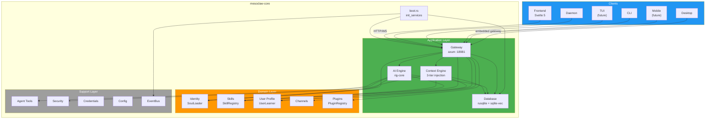
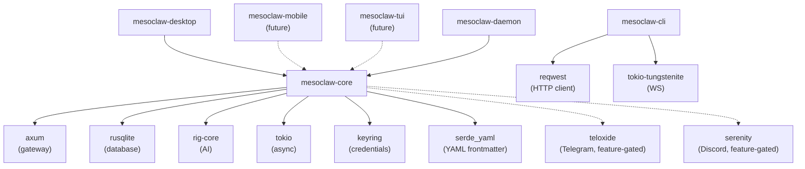
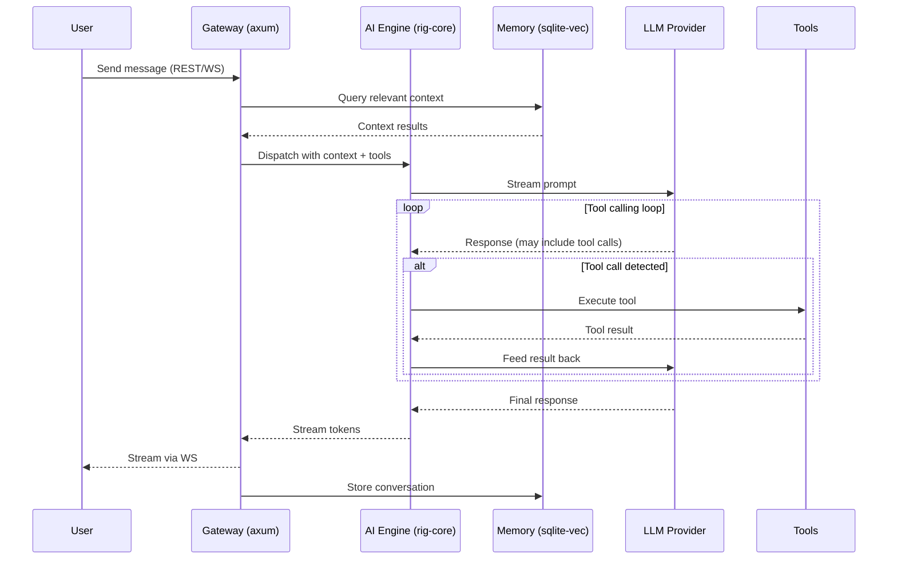
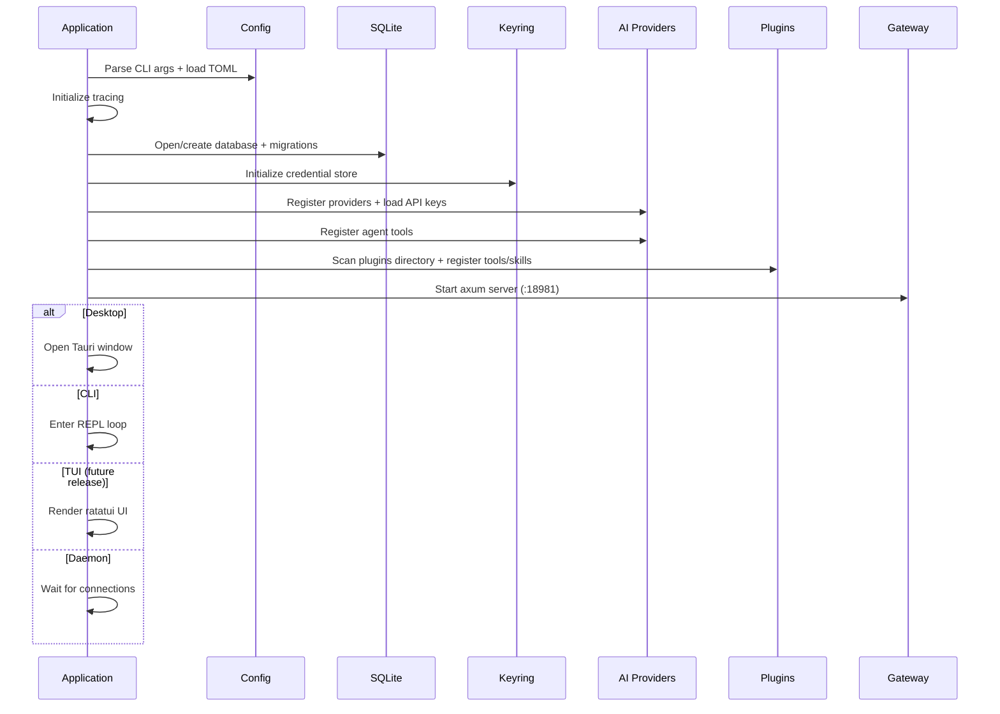
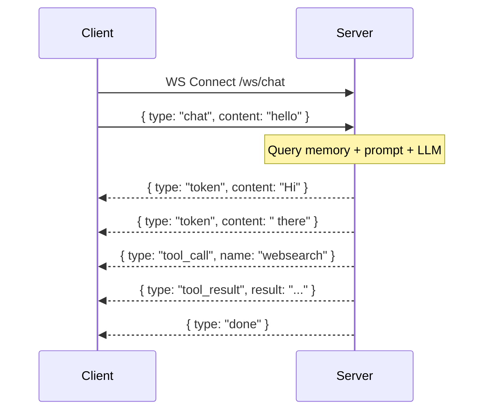
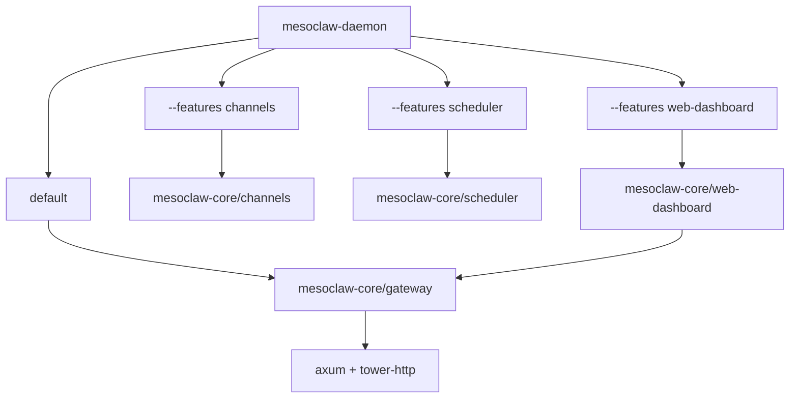

# MesoClaw

<p align="center">
  
</p>

<h1 align="center">A lightweight, secure, local-first AI agent for desktop, CLI, and daemon.</h1>

<p align="center">
  Built with Rust + Tauri 2. Privacy-first alternative to <a href="https://github.com/openclaw/openclaw">OpenClaw</a>. &lt;20MB native binary.<br>
  <a href="https://mesoclaw.sprklai.com">https://mesoclaw.sprklai.com</a>
</p>

<!-- Row 1: CI & Release -->
<p align="center">
  <a href="https://github.com/sprklai/mesoclaw/actions/workflows/release.yml">
    
  </a>
  <a href="https://github.com/sprklai/mesoclaw/actions/workflows/ci.yml">
    
  </a>
  <a href="https://github.com/sprklai/mesoclaw/releases/latest">
    
  </a>
  <a href="LICENSE">
    
  </a>
</p>

<!-- Row 2: Tech Stack -->
<p align="center">
  
  
  
  
  
</p>

<!-- Row 3: App Modes & Platform -->
<p align="center">
  
  
  
  
  
  
  
</p>

<!-- Row 4: Quality & i18n -->
<p align="center">
  
  
</p>

<!-- Row 5: Community -->
<p align="center">
  <a href="https://github.com/sprklai/mesoclaw/stargazers">
    
  </a>
  <a href="https://github.com/sprklai/mesoclaw/issues">
    
  </a>
  <a href="https://github.com/sprklai/mesoclaw/pulls">
    
  </a>
</p>

---

## Why MesoClaw?

- **Native desktop app** -- Tauri 2 + Svelte 5 GUI, not a browser tab or Electron wrapper
- **<20MB binary** with full GUI -- no Node.js runtime, no JVM, just a native Rust binary
- **Plugin system in ANY language** -- JSON-RPC protocol, write plugins in Python, Go, JS, or anything that speaks stdio
- **Self-evolving skills** -- agent learns your preferences and proposes skill changes with human-in-the-loop approval
- **Semantic memory** -- SQLite FTS5 + vector embeddings for intelligent recall across conversations
- **Scheduled autonomy** -- cron-driven agent tasks that run unattended
- **Autonomous reasoning** -- multi-step agent loops with configurable continuation strategies
- **Privacy-first** -- zero telemetry, all data local, OS keyring for credentials

---

## How It Compares

| Category | MesoClaw | OpenClaw | ZeroClaw |
|----------|----------|----------|----------|
| **Language** | Rust | TypeScript | Rust |
| **Desktop GUI** | Tauri 2 + Svelte 5 | -- | -- |
| **CLI** | clap | -- | -- |
| **Headless Daemon** | axum (88 routes) | Node.js | 3.4MB daemon |
| **AI Providers** | 18 via rig-core | Multi-model | 22+ |
| **Built-in Tools** | 15 | 100+ AgentSkills | Tool orchestration |
| **Plugin System** | JSON-RPC (any language) | AgentSkills | Trait-based adapters |
| **Memory** | SQLite FTS5 + vectors | File-based | Built-in |
| **Embeddings** | OpenAI + local FastEmbed | -- | -- |
| **Self-Evolution** | LearnTool + SkillProposals | -- | -- |
| **Autonomous Reasoning** | ReasoningEngine | -- | -- |
| **Scheduler** | Cron + one-shot | -- | -- |
| **Channels** | Telegram, Slack, Discord | WhatsApp, Signal, Telegram, Discord | Telegram, Discord, WhatsApp |
| **Binary Size** | <20MB (native w/ GUI) | Node.js runtime | 3.4MB |
| **Privacy** | 100% local, zero telemetry | Local, model-agnostic | 100% local |
| **License** | MIT | Open source | Open source |
| **Tests** | 962 Rust + 37 TS | -- | -- |

---

## Features

- **18 AI providers** via rig-core (OpenAI, Anthropic, Google, Ollama, and more)
- **Tool calling** with 15 built-in tools (13 base + 2 feature-gated) via DashMap-backed ToolRegistry: websearch, sysinfo, shell, file read/write/list/search, patch, process, learn, skill_proposal, memory, config + feature-gated channel_send, scheduler
- **Plugin system** -- external process plugins via JSON-RPC 2.0 protocol, installable from git or local paths, with automatic tool and skill registration
- **Autonomous reasoning** -- ReasoningEngine with ContinuationStrategy for multi-step autonomous agent loops
- **Context-aware agent** -- 3-tier adaptive context injection (Full/Minimal/Summary) with hash-based cache invalidation
- **Self-evolving framework** -- agent learns user preferences and proposes skill changes with human-in-the-loop approval
- **Streaming responses** via WebSocket
- **Semantic memory** with SQLite FTS5 + vector embeddings (sqlite-vec), OpenAI and local FastEmbed embedding providers
- **Soul / Persona system** -- 3 identity files (SOUL/IDENTITY/USER.md) with dynamic prompt composition
- **Skills system** -- bundled + user markdown skills loaded into agent context (Claude Code model)
- **Progressive user learning** -- SQLite-backed observations with category filtering, confidence scoring, and privacy controls
- **Secure credentials** via OS keyring with zeroize memory protection
- **Messaging channels** -- Telegram, Slack, Discord with lifecycle hooks (typing indicators, status messages) and end-to-end channel router pipeline (feature-gated, trait-based with DashMap registry)
- **Cron scheduler** -- automated recurring tasks with real payload execution (Notify, AgentTurn, Heartbeat, SendViaChannel)
- **Notifications** -- desktop OS notifications (tauri-plugin-notification) + web toast notifications (svelte-sonner) via WebSocket push
- **Cross-platform** -- Linux, macOS, Windows, ARM (Raspberry Pi)

## Tech Stack

| Layer | Technology |
|-------|-----------|
| Language | Rust 2024 edition |
| Async | Tokio |
| AI | rig-core |
| Database | rusqlite + sqlite-vec |
| Gateway | axum (HTTP + WebSocket) |
| Frontend | Svelte 5 + SvelteKit + shadcn-svelte + Tailwind CSS |
| Desktop | Tauri 2 |
| CLI | clap |
| Plugins | JSON-RPC 2.0 external processes |
| Channels | Telegram (teloxide), Slack, Discord (serenity) -- feature-gated |
| Content | serde_yaml (YAML frontmatter parsing) |
| i18n | paraglide-js (compile-time, tree-shakeable) |
| Mobile | Tauri 2 (iOS + Android) -- future release |
| TUI | ratatui -- future release |

---

## Architecture

### System Architecture



### Crate Dependency Graph



### Chat Request Flow



### Startup Sequence



### WebSocket Message Flow



### Feature Flag Composition



---

## Project Structure

```
mesoclaw/
├── Cargo.toml              # Workspace root (5 members)
├── CLAUDE.md               # AI assistant instructions
├── README.md               # This file
├── scripts/
│   └── build.sh            # Cross-platform build script
├── docs/
│   ├── architecture.md     # Detailed architecture diagrams
│   ├── phases.md           # Implementation phase details
│   ├── processes.md        # Process flow diagrams
│   ├── api-reference.md    # All 88 REST/WS routes
│   ├── configuration.md    # All 60+ config fields
│   ├── cli-reference.md    # CLI command reference
│   ├── deployment.md       # Deployment guide
│   └── development.md      # Development guide
├── plans/
│   ├── phase1_core_foundation.md  # Phase 1 implementation plan
│   ├── phase2_ai_integration.md   # Phase 2 implementation plan
│   ├── phase3_gateway_server.md   # Phase 3 implementation plan
│   ├── phase4_agent_intelligence.md # Phase 4 implementation plan
│   ├── phase5_combined.md         # Phase 5 implementation plan
│   ├── phase6_frontend.md         # Phase 6 implementation plan
│   └── phase9_plugin_architecture.md # Phase 9 plugin plan
├── tests/
│   ├── phase1_core_foundation.md  # Phase 1 test plan + results
│   ├── phase2_ai_integration.md   # Phase 2 test plan + results
│   ├── phase3_gateway_server.md   # Phase 3 test plan + results
│   ├── phase4_agent_intelligence.md # Phase 4 test plan + results
│   ├── phase5_combined.md         # Phase 5 test plan + results
│   ├── phase6_frontend.md         # Phase 6 test plan + results
│   └── phase9_plugin_architecture.md # Phase 9 test plan
├── crates/
│   ├── mesoclaw-core/      # Shared library (NO Tauri dependency)
│   ├── mesoclaw-desktop/   # Tauri 2.10 shell (macOS, Windows, Linux)
│   ├── mesoclaw-mobile/    # Tauri 2 shell (iOS, Android) (future release)
│   ├── mesoclaw-cli/       # clap CLI
│   ├── mesoclaw-tui/       # ratatui TUI (future release)
│   └── mesoclaw-daemon/    # Headless daemon
└── web/                    # Svelte 5 SPA frontend (shared by desktop + mobile)
```

---

## Getting Started

### Prerequisites

- **Rust** 1.85+ (2024 edition support)
- **Bun** (for frontend development)
- **SQLite3** development libraries

#### Platform-specific

**Linux (Debian/Ubuntu):**
```bash
sudo apt install libsqlite3-dev libwebkit2gtk-4.1-dev libappindicator3-dev \
  librsvg2-dev patchelf libssl-dev
```

**macOS:**
```bash
brew install sqlite3
```

**Windows:**
```powershell
# SQLite is bundled via rusqlite's "bundled" feature -- no extra install needed
```

### Build & Run

```bash
# Check everything compiles
cargo check --workspace

# Run tests
cargo test --workspace

# Lint
cargo clippy --workspace

# Start the daemon
cargo run -p mesoclaw-daemon

# Start the CLI
cargo run -p mesoclaw-cli -- chat

# Start the TUI
cargo run -p mesoclaw-tui

# Start the desktop app (dev mode with hot reload)
cd crates/mesoclaw-desktop && cargo tauri dev

# Start the desktop app connecting to external daemon
MESOCLAW_GATEWAY_URL=http://localhost:18981 cd crates/mesoclaw-desktop && cargo tauri dev

# Frontend dev server (hot reload)
cd web && bun run dev
```

### Building Executables

#### Native builds (current platform)

```bash
./scripts/build.sh --target native                  # Debug build
./scripts/build.sh --target native --release         # Release (optimized, smallest binary)
./scripts/build.sh --target native --release --crates "mesoclaw-daemon mesoclaw-cli"  # Specific crates only
./scripts/build.sh --target native --release --all-features  # With all features
```

Output goes to `dist/native/release/`.

#### Tauri desktop app (with GUI)

```bash
./scripts/build.sh --tauri --release                 # Release bundle (.deb/.AppImage, .dmg, .msi)
./scripts/build.sh --tauri --release --bundle deb,appimage  # Specific bundle formats
./scripts/build.sh --dev                             # Dev mode (Vite + Tauri hot reload)
```

#### Cross-compilation

```bash
./scripts/build.sh --list-targets                    # Show all available targets

# Linux targets
./scripts/build.sh --target linux-x86 --release --install-toolchain
./scripts/build.sh --target linux-arm64 --release --install-toolchain
./scripts/build.sh --target linux-armv7 --release --install-toolchain   # Raspberry Pi
./scripts/build.sh --target linux-musl --release --install-toolchain    # Static binary

# macOS (must run on macOS)
./scripts/build.sh --target macos-x86 --release      # Intel
./scripts/build.sh --target macos-arm --release       # Apple Silicon
./scripts/build.sh --target macos-universal --release  # Universal (x86_64 + ARM via lipo)

# Windows (from Linux)
./scripts/build.sh --target windows --release --install-toolchain

# All targets at once
./scripts/build.sh --target all --release --install-toolchain
```

**Cross-compilation prerequisites (Linux):**

```bash
sudo apt install gcc-aarch64-linux-gnu      # ARM64
sudo apt install gcc-arm-linux-gnueabihf    # ARMv7
sudo apt install gcc-mingw-w64-x86-64       # Windows
```

#### Docker-based cross-compilation (no local cross-compilers needed)

```bash
./scripts/build.sh --target linux-arm64 --release --docker
./scripts/build.sh --target windows --release --docker
```

#### Build profiles

| Profile | Flag | Use Case |
|---------|------|----------|
| `debug` | *(default)* | Development |
| `release` | `--release` | Production (full LTO, smallest binary) |
| `ci-release` | `--profile ci-release` | CI builds (thin LTO, faster compile) |
| `release-fast` | `--profile release-fast` | Profiling (thin LTO + debug info) |

> **Note:** Tauri desktop builds cannot cross-compile -- each platform must build on its native OS. Use the [GitHub Actions CI workflow](.github/workflows/ci.yml) for automated multi-platform Tauri builds.

See [scripts/build.sh](scripts/build.sh) for full options.

---

## Feature Flags

```bash
cargo build -p mesoclaw-daemon                          # Core only (gateway + ai + keyring)
cargo build -p mesoclaw-daemon --features local-embeddings  # + local FastEmbed ONNX embeddings
cargo build -p mesoclaw-daemon --features channels      # + channel core traits + registry
cargo build -p mesoclaw-daemon --features channels-telegram  # + Telegram (teloxide)
cargo build -p mesoclaw-daemon --features channels-slack     # + Slack
cargo build -p mesoclaw-daemon --features channels-discord   # + Discord (serenity)
cargo build -p mesoclaw-daemon --features scheduler     # + cron jobs
cargo build -p mesoclaw-daemon --features web-dashboard # + embedded web UI
cargo build -p mesoclaw-daemon --all-features           # Everything
```

---

## Testing

```bash
cargo test --workspace                    # All tests
cargo test -p mesoclaw-core               # Core only
cargo test -p mesoclaw-core -- memory     # Memory module
cargo test -p mesoclaw-core -- db         # Database module
cd web && bun run test                    # Frontend tests
```

---

## Configuration

MesoClaw uses a TOML configuration file. Paths are resolved via `directories::ProjectDirs::from("com", "sprklai", "mesoclaw")`:

| OS | Config File | Database File |
|---|---|---|
| **Linux** | `~/.config/mesoclaw/config.toml` | `~/.local/share/mesoclaw/mesoclaw.db` |
| **macOS** | `~/Library/Application Support/com.sprklai.mesoclaw/config.toml` | `~/Library/Application Support/com.sprklai.mesoclaw/mesoclaw.db` |
| **Windows** | `%APPDATA%\sprklai\mesoclaw\config\config.toml` | `%APPDATA%\sprklai\mesoclaw\data\mesoclaw.db` |

Example `config.toml` (flat structure, all fields optional with defaults):

```toml
gateway_host = "127.0.0.1"
gateway_port = 18981
log_level = "info"
# data_dir = "/custom/data/path"       # Override default data directory
# db_path = "/custom/path/mesoclaw.db" # Override database file path
identity_name = "MesoClaw"
identity_description = "AI-powered assistant"
default_provider = "openai"
default_model = "gpt-4o"
security_autonomy_level = "supervised"  # supervised | autonomous | strict
max_tool_retries = 3
# gateway_auth_token = "your-secret-token"  # Optional bearer token for auth
# agent_max_turns = 20                       # Max tool-calling turns per request
# agent_max_continuations = 5               # Max autonomous reasoning turns
# embedding_provider = "none"               # none | openai | local
# plugins_dir = "/custom/plugins/path"      # Override default plugins directory
# plugin_auto_update = false                # Auto-update git-sourced plugins
```

## CLI Commands

```bash
mesoclaw daemon start|stop|status     # Manage the daemon process
mesoclaw chat [--session ID] [--model M]  # Interactive WS streaming chat
mesoclaw run "prompt" [--session] [--model]  # Single prompt, print response
mesoclaw memory search "query" [--limit N] [--offset N]  # Search memories
mesoclaw memory add <key> <content>   # Add memory entry
mesoclaw memory remove <key>          # Remove memory entry
mesoclaw config show                  # Show current config
mesoclaw config set <key> <value>     # Set a config value
mesoclaw key set <provider> <key>     # Set API key
mesoclaw key remove <provider>        # Remove API key
mesoclaw key list                     # List stored keys
mesoclaw provider list                # List AI providers
mesoclaw provider test <id>           # Test provider connection
mesoclaw provider add <id> <name> <base_url>  # Add custom provider
mesoclaw provider remove <id>         # Remove user-defined provider
mesoclaw provider default <provider> <model>  # Set default model
mesoclaw embedding activate <provider>       # Activate embeddings (openai/local)
mesoclaw embedding deactivate                # Deactivate embeddings
mesoclaw embedding status                    # Show embedding provider status
mesoclaw embedding test                      # Test embedding generation
mesoclaw embedding reindex                   # Re-embed all memories
mesoclaw plugin list                         # List installed plugins
mesoclaw plugin install <source> [--local]   # Install from git URL or local path
mesoclaw plugin remove <name>                # Remove a plugin
mesoclaw plugin update <name>                # Update a plugin
mesoclaw plugin enable <name>                # Enable a plugin
mesoclaw plugin disable <name>               # Disable a plugin
mesoclaw plugin info <name>                  # Show plugin details
```

Global options: `--host`, `--port`, `--token` (or `MESOCLAW_TOKEN` env var)

## Gateway Routes (73 base + 15 feature-gated = 88 total)

| Group | Routes | Description |
|-------|--------|-------------|
| Health | `GET /health` | Health check (no auth) |
| Sessions & Chat | `POST /sessions`, `GET /sessions`, `GET/PUT/DELETE /sessions/{id}`, `POST /sessions/{id}/generate-title`, `GET/POST /sessions/{id}/messages`, `POST /chat` | Chat sessions and messaging |
| Memory | `POST /memory`, `GET /memory`, `GET/PUT/DELETE /memory/{key}` | Semantic memory CRUD |
| Config | `GET /config`, `PUT /config` | Configuration management |
| Credentials | `POST/GET /credentials`, `DELETE /credentials/{key}`, `GET /credentials/{key}/value`, `GET /credentials/{key}/exists` | Credential management (keyring) |
| Providers & Models | `GET/POST /providers`, `GET /providers/with-key-status`, `GET/PUT /providers/default`, `GET/PUT/DELETE /providers/{id}`, `POST /providers/{id}/test`, `POST /providers/{id}/models`, `DELETE /providers/{id}/models/{model_id}`, `GET /models` | Multi-provider AI management |
| Tools | `GET /tools`, `POST /tools/{name}/execute` | Tool listing and execution |
| System | `GET /system/info` | System information |
| Identity | `GET /identity`, `GET/PUT /identity/{name}`, `POST /identity/reload` | Persona management |
| Skills | `GET /skills`, `GET/PUT/DELETE /skills/{id}`, `POST /skills`, `POST /skills/reload` | Skill CRUD |
| Skill Proposals | `GET /skills/proposals`, `POST /skills/proposals/{id}/approve`, `POST /skills/proposals/{id}/reject`, `DELETE /skills/proposals/{id}` | Self-evolving skill management |
| User | `GET/POST/DELETE /user/observations`, `GET/DELETE /user/observations/{key}`, `GET /user/profile` | User learning + privacy |
| Embeddings | `GET /embeddings/status`, `POST /embeddings/test`, `POST /embeddings/embed`, `POST /embeddings/download`, `POST /embeddings/reindex` | Semantic memory embedding management |
| Plugins | `GET /plugins`, `POST /plugins/install`, `GET/DELETE /plugins/{name}`, `PUT /plugins/{name}/toggle`, `POST /plugins/{name}/update`, `GET/PUT /plugins/{name}/config` | Plugin management (install, remove, enable/disable, config) |
| Channels | `POST /channels/{name}/test` (always), `GET /channels`, `GET /channels/{name}/status`, `POST /channels/{name}/send`, `POST /channels/{name}/connect/disconnect`, `GET /channels/{name}/health`, `POST /channels/{name}/message`, `GET /channels/sessions`, `GET /channels/sessions/{id}/messages` (feature-gated) | Messaging channels |
| Scheduler | `GET/POST /scheduler/jobs`, `PUT /scheduler/jobs/{id}/toggle`, `DELETE /scheduler/jobs/{id}`, `GET /scheduler/jobs/{id}/history`, `GET /scheduler/status` (feature-gated) | Cron job management |
| WebSocket | `GET /ws/chat`, `GET /ws/notifications` | Streaming chat + notification push |

---

## Documentation

Detailed documentation lives in the `docs/` directory:

- [CLI Reference](docs/cli-reference.md) -- All commands, options, shell completions, recipes
- [API Reference](docs/api-reference.md) -- All 88 REST/WS routes with request/response schemas
- [Configuration](docs/configuration.md) -- All 60+ config.toml fields with types and defaults
- [Deployment Guide](docs/deployment.md) -- Native, Docker, systemd, Raspberry Pi, reverse proxy
- [Development Guide](docs/development.md) -- Prerequisites, building, testing, how-to guides
- [Architecture](docs/architecture.md) -- System diagrams, crate dependencies, project structure
- [Implementation Phases](docs/phases.md) -- Phase gate protocol, checklist, phase details
- [Process Flows](docs/processes.md) -- Chat request, startup, error handling, WebSocket flows
- [Changelog](CHANGELOG.md) -- Release history

---

## Contributing

See [CONTRIBUTING.md](CONTRIBUTING.md) for detailed guidelines. Quick summary:

1. Fork the repository
2. Create a feature branch: `git checkout -b feature/my-feature`
3. Write tests first, then implement
4. Ensure `cargo test --workspace` and `cargo clippy --workspace -- -D warnings` pass
5. Submit a pull request

---

## License

MIT
