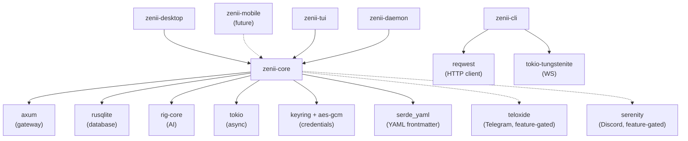
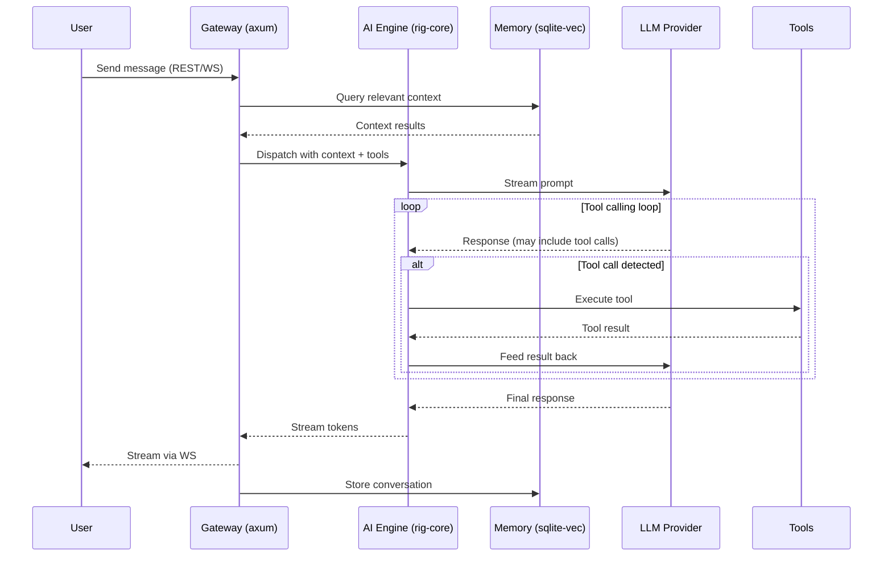
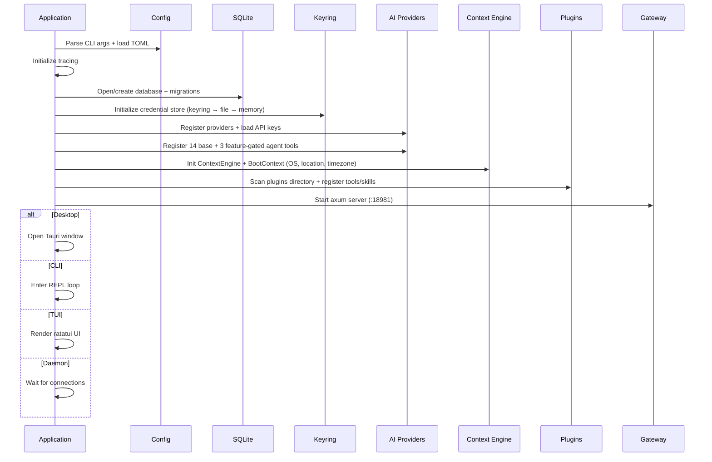
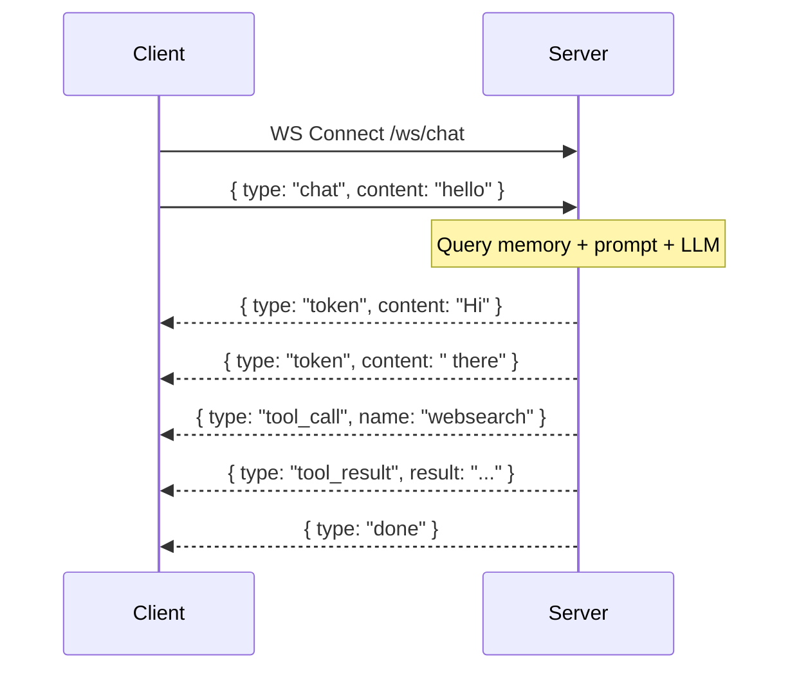
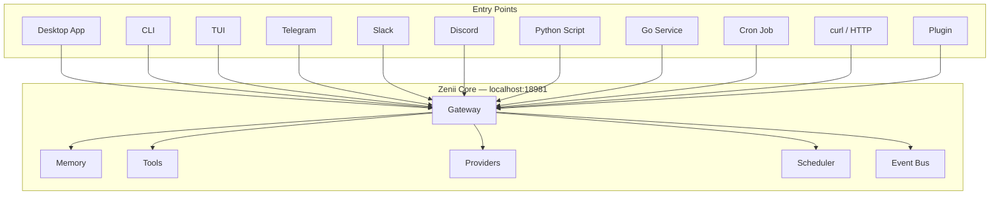

# Zenii

<p align="center">
  
</p>

<h1 align="center">20 megabytes. AI everywhere.</h1>

<p align="center">
  Install <strong>one binary</strong>. Now your scripts have <strong>AI memory</strong>. Your cron jobs <strong>reason</strong>. Your Telegram bot <strong>thinks</strong>.<br>
  And they all share the same brain — same memory, same tools, one address.<br>
  A private AI backend for everything on your machine — native desktop app, plugins in <strong>any language</strong>, and an API your <code>curl</code> can call. Powered by Rust.<br>
  <a href="https://zenii.sprklai.com">https://zenii.sprklai.com</a><br>
  <a href="https://docs.zenii.sprklai.com">https://docs.zenii.sprklai.com</a>
</p>

<!-- Row 1: CI & Release -->
<p align="center">
  <a href="https://github.com/sprklai/zenii/actions/workflows/release.yml">
    
  </a>
  <a href="https://github.com/sprklai/zenii/actions/workflows/ci.yml">
    
  </a>
  <a href="https://github.com/sprklai/zenii/releases/latest">
    
  </a>
  <a href="LICENSE">
    
  </a>
  <a href="https://docs.zenii.sprklai.com">
    
  </a>
</p>

<!-- Row 2: Tech Stack -->
<p align="center">
  
  
  
  
  
</p>

<!-- Row 3: App Modes & Platform -->
<p align="center">
  
  
  
  
  
  
  
</p>

<!-- Row 4: Quality & i18n -->
<p align="center">
  
  
</p>

<!-- Row 5: Community -->
<p align="center">
  <a href="https://github.com/sprklai/zenii/stargazers">
    
  </a>
  <a href="https://github.com/sprklai/zenii/issues">
    
  </a>
  <a href="https://github.com/sprklai/zenii/pulls">
    
  </a>
</p>

---

> *"ChatGPT is a tab you open. Zenii is a capability your machine gains."*
>
> If Zenii looks useful, consider giving it a [star on GitHub](https://github.com/sprklai/zenii) — it helps others discover the project.

<!-- DEMO GIF HERE — 30-second terminal recording showing:
  1. curl health check
  2. Create session
  3. Send chat message with tool call
  4. Response streams back
  See go2market/Mar17_Launch/04_demo_scripts.md for exact script
-->
<p align="center">
  
</p>

> *"Every tool you use is smart in isolation. Zenii makes them smart together."*

## Quick Start

**Download the latest installer** for your platform from [**GitHub Releases**](https://github.com/sprklai/zenii/releases/latest):

| Platform | Desktop App | CLI + Daemon + TUI |
|----------|------------|---------------------|
| **Linux** | `.deb` `.rpm` `.AppImage` | `zenii-linux` `zenii-daemon-linux` `zenii-tui-linux` |
| **macOS** | `.dmg` | `zenii-macos-arm64` `zenii-daemon-macos-arm64` `zenii-tui-macos-arm64` |
| **Windows** | `.msi` `.exe` (NSIS) | `zenii.exe` `zenii-daemon.exe` `zenii-tui.exe` |
| **ARM** | -- | `zenii-arm64` `zenii-daemon-arm64` `zenii-tui-arm64` |

Or install via script (Linux/macOS):

```bash
# Download & install CLI + daemon + TUI
curl -fsSL https://raw.githubusercontent.com/sprklai/zenii/main/install.sh | bash

# Start the daemon
zenii-daemon &

# Your first AI request
curl -X POST http://localhost:18981/chat \
  -H "Content-Type: application/json" \
  -d '{"session_id": "hello", "prompt": "What can you do?"}'
```

Or use the desktop app, CLI, or TUI — they all talk to the same backend.

---

## Why Zenii?

| Your pain | How Zenii fixes it |
|-----------|-------------------|
| **AI tools are islands — ChatGPT, Telegram, scripts, cron all have separate memory and context** | **One shared brain: every interface, channel, and script shares the same memory, tools, and intelligence via `localhost:18981`** |
| Context resets every AI session | Semantic memory persists across sessions and survives restarts |
| AI can't do things, only talk | 14 built-in tools: web search, file ops, shell, memory, config, and more. Workflow pipelines and parallel delegation for complex tasks |
| Locked into one AI provider | 6 built-in providers, switch with one config change |
| AI tools are cloud-only | 100% local, zero telemetry, encrypted credential storage |
| "Works on my machine" for AI | Same binary on macOS, Linux, Windows — desktop, CLI, or daemon |
| Plugin systems require learning a framework | JSON-RPC over stdio — write plugins in Python, Go, JS, or anything |
| AI doesn't learn your patterns | Self-evolving skills with human-in-the-loop approval |
| AI can't run tasks while you sleep | Built-in cron scheduler for autonomous recurring tasks |

## One Address. Everything Connects.

Every AI tool you use today is an island. ChatGPT doesn't know what your Telegram bot discussed.
Your Python scripts can't access the memory your CLI built. Your cron jobs reason in isolation.

Zenii changes that. One address — `localhost:18981` — serves every interface, every channel,
every automation, every language. Desktop app, CLI, TUI, Telegram, Slack, Discord,
your Python scripts, your Go services, your shell one-liners — all sharing the same memory,
same tools, same AI providers, same learned behaviors.

Write a memory from Telegram. Recall it from Python. Schedule a task from the CLI.
Get notified on Discord. **Nothing is siloed. Everything converges.**

## What Zenii is NOT

- Not a chatbot wrapper — it's a full API backend with 114 routes
- Not Electron — native Tauri 2, under 20 MB
- Not a framework you learn — it's infrastructure you call via `curl`
- Not cloud-dependent — runs fully offline with Ollama
- Not opinionated about your stack — any language, any tool, JSON over HTTP

---

## What Can I Automate?

```bash
# Schedule a daily morning briefing
curl -X POST http://localhost:18981/scheduler/jobs \
  -H "Content-Type: application/json" \
  -d '{"name":"briefing","schedule":{"Cron":{"expr":"0 9 * * *"}},"payload":{"AgentTurn":{"prompt":"Summarize system status and news"}}}'

# Store knowledge the AI should remember
curl -X POST http://localhost:18981/memory \
  -H "Content-Type: application/json" \
  -d '{"key":"deploy", "content":"Production DB is on port 5433, deploy via ssh prod"}'

# Ask a question that uses stored memory
curl -X POST http://localhost:18981/chat \
  -H "Content-Type: application/json" \
  -d '{"session_id":"ops", "prompt":"How do I deploy to production?"}'

# List what tools the agent has
curl http://localhost:18981/tools | jq '.[].name'

# Send a message via Telegram
curl -X POST http://localhost:18981/channels/telegram/send \
  -H "Content-Type: application/json" \
  -d '{"content":"Deploy complete", "recipient":"123456"}'
```

### Follow the Memory

```bash
# 9 AM — Store from desktop/CLI
curl -X POST localhost:18981/memory \
  -H "Content-Type: application/json" \
  -d '{"key":"deploy","content":"Prod DB moved to port 5434"}'

# 10 AM — Your Python deploy script asks
curl -X POST localhost:18981/chat \
  -H "Content-Type: application/json" \
  -d '{"session_id":"deploy","prompt":"What port is prod DB on?"}'
# → "5434"

# 2 PM — Teammate asks via Telegram → same answer

# 3 PM — Cron job generates status report → includes the update
# One memory. Four interfaces. Zero configuration.
```

---

## How It Compares

| | **Zenii** | OpenClaw | NemoClaw | ZeroClaw | PicoClaw | Open Interpreter | Khoj | Gemini CLI |
|---|---|---|---|---|---|---|---|---|
| **Category** | **AI backend** | Chat agent | Enterprise security wrapper | Minimal daemon | Edge AI assistant | Code REPL | Document brain | Terminal AI |
| **Stars** | New | 210k+ | New (NVIDIA-backed) | 20k+ | 24.8k | 62.6k | 32.8k | 97.8k |
| **Language** | **Rust** | TypeScript | TypeScript + Python | Rust | Go | Python | Python/TS | TypeScript |
| **Binary** | **<20 MB (w/ GUI)** | ~100 MB+ | Docker container (~500 MB+) | ~3.4 MB | <10 MB RAM | N/A (Python) | N/A (Docker) | N/A (npm) |
| **Desktop GUI** | **Native (Tauri 2)** | -- | -- | -- | Web console | -- | Browser | -- |
| **API Routes** | **109 REST+WS** | Chat endpoint | Inherits OpenClaw | Daemon endpoint | Webhook gateway | -- | -- | -- |
| **Plugins** | **Any language** | JS only | Inherits OpenClaw (JS) | Rust only | Tool-based | -- | -- | -- |
| **Memory** | **FTS5 + vectors** | File-based | Inherits OpenClaw (file) | Basic | Workspace logs | -- | Doc search | -- |
| **Self-Evolution** | **Human-approved** | Autonomous | Inherits OpenClaw (sandboxed) | -- | Agent-generated | -- | -- | -- |
| **Scheduling** | **Cron + one-shot** | Cron | Inherits OpenClaw | -- | Built-in | -- | Automations | -- |
| **Offline** | **Ollama** | Ollama | NVIDIA Nemotron primary | Ollama | DuckDuckGo | LiteLLM | Optional | No |
| **License** | **MIT** | Open source | Apache 2.0 | Open source | MIT | AGPL-3.0 | AGPL-3.0 | Apache 2.0 |

**No other project has ALL of these simultaneously**: native desktop GUI, 109-route REST/WS API where any language, any tool, any channel connects to the same shared intelligence, plugins in any language, semantic vector memory, self-evolution with human approval, under 20 MB binary, cross-system coherence where memory stored from any interface is instantly available everywhere, and MIT licensed. NemoClaw brings the strongest kernel-level sandboxing (Landlock + seccomp + netns) but requires Linux + Docker (~500 MB+) — Zenii delivers built-in 6-layer security natively on macOS, Windows, and Linux in under 20 MB.

---

## The Self-Evolution Story

Most AI tools are static — they do exactly what they did on day one. OpenClaw self-modifies without asking. Zenii takes a third path:

1. **Zenii observes** your patterns and preferences over time
2. **Zenii proposes** skill modifications ("I notice you always want code reviews on Fridays. Want me to schedule that?")
3. **You approve or reject** — like a PR from your AI
4. **Zenii learns** — approved changes become permanent skills

Your AI gets smarter. You stay in control. No surprises.

---

## Features

- **Self-evolving agent** — proposes skill changes based on your patterns, learns only with your approval
- **Plugin system** — write plugins in Python, Go, JS, or any language. A plugin is any program that speaks JSON-RPC 2.0 over stdio (~15 lines of Python)
- **114 API routes** — full REST + WebSocket gateway. Interactive docs at `localhost:18981/api-docs`
- **6 AI providers** built-in (OpenAI, Anthropic, Google Gemini, OpenRouter, Vercel AI Gateway, Ollama) + custom providers
- **14 built-in tools** — websearch, sysinfo, shell, file ops, memory, config, learn, skill proposal, agent self, patch, process
- **Semantic memory** — SQLite FTS5 + vector embeddings, persists across sessions and restarts
- **Native desktop app** — Tauri 2 + Svelte 5, under 20 MB, not Electron
- **Compact prompts** — plugin-based prompt strategy with ~65% token reduction
- **Unified diagnostic logging** — all binaries write daily-rotated logs to OS-appropriate directories with auto-cleanup
- **Token usage tracking** — date-rotated JSONL logs for cost visibility
- **Messaging channels** — Telegram, Slack, Discord (feature-gated)
- **Workflow engine** — TOML-defined multi-step automation pipelines with DAG execution, inter-step templates, retry/timeout, DB-persisted history (feature-gated)
- **Agent delegation** — parallel sub-agents for complex tasks with dependency waves, tool filtering, cancellation
- **Cron scheduler** — automated recurring AI tasks
- **6-layer security** — OS keyring with encrypted file fallback, autonomy levels, FS sandbox, injection detection (9 blocked commands + pipe patterns), rate limits, audit trail, agent timeout + abort on disconnect
- **Cross-platform** — Linux, macOS, Windows, ARM (Raspberry Pi)

<!-- Detailed feature descriptions below for SEO / deep readers -->

<details>
<summary><strong>Full feature details</strong> (click to expand)</summary>

- **Tool calling** with 14 built-in tools via DashMap-backed ToolRegistry: websearch, sysinfo, shell, file read/write/list/search, patch, process, learn, skill_proposal, memory, config, agent_self
- **Workflow engine** -- TOML-defined multi-step automation pipelines with 5 step types (Tool, LLM, Condition, Parallel, Delay), petgraph DAG execution, minijinja inter-step templates, retry/timeout policies, failure policies (Stop/Continue/Fallback), DB-persisted run history. Feature-gated behind `workflows`
- **Agent delegation** -- Coordinator decomposes complex tasks into parallel sub-agents via LLM, executes in dependency waves with JoinSet, aggregates results. Each sub-agent gets an isolated session with tool allowlist filtering and per-agent timeout. Cancellation via `POST /agents/{id}/cancel`
- **Plugin system** -- external process plugins via JSON-RPC 2.0 protocol, installable from git or local paths, with automatic tool and skill registration. Managed via CLI, Web/Desktop UI, and TUI. See [zenii-plugins](https://github.com/sprklai/zenii-plugins) for official community plugins
- **Autonomous reasoning** -- ReasoningEngine with tool-aware ContinuationStrategy and per-request tool call deduplication cache
- **Context-driven auto-discovery** -- keyword-based domain detection (Channels/Scheduler/Skills/Tools) filters context injection and agent rules to only relevant domains per query
- **Self-evolving agent** -- AgentSelfTool (`agent_notes`) for agent-writable behavioral rules by category, stored in DB and auto-injected into context; SkillProposalTool for human-in-the-loop skill evolution
- **Model capability validation** -- `supports_tools` pre-check prevents tool-calling errors with incompatible models
- **Context-aware agent** -- 3-tier adaptive context injection (Full/Minimal/Summary) with hash-based cache invalidation
- **Efficient prompt system** -- plugin-based prompt strategy with CompactStrategy (~65% token reduction), 6 built-in plugins, and token budget trimming
- **Onboarding wizard** -- multi-step first-run setup across Desktop (2-step wizard), CLI (`zenii setup` interactive flow), and TUI (4-step overlay modal) collecting AI provider selection, API key, default model, and user profile (name, location, timezone)
- **LLM-based auto fact extraction** -- automatically extracts structured facts (preferences, knowledge, context, workflow) from conversations via a configurable LLM, persisted to user observations for progressive learning
- **User location awareness** -- timezone and location injected into agent context for location-sensitive queries (weather, events, news)
- **OpenAPI interactive docs** -- Scalar UI at `/api-docs` + OpenAPI 3.1 JSON spec (feature-gated `api-docs`, built with utoipa)
- **Streaming responses** via WebSocket
- **Semantic memory** with SQLite FTS5 + vector embeddings (sqlite-vec), OpenAI and local FastEmbed embedding providers
- **Soul / Persona system** -- 3 identity files (SOUL/IDENTITY/USER.md) with dynamic prompt composition
- **Skills system** -- bundled + user markdown skills loaded into agent context (Claude Code model)
- **Progressive user learning** -- SQLite-backed observations with category filtering, confidence scoring, and privacy controls
- **Tool permission system** -- per-surface, risk-based tool permissions with 3 risk levels (Low/Medium/High), surface-specific overrides, and settings UI
- **Secure credentials** via OS keyring with AES-256-GCM encrypted file fallback and zeroize memory protection. Fallback chain: KeyringStore → FileCredentialStore → InMemoryCredentialStore. Credentials persist even when the OS keyring is unavailable (macOS code-signature revocation, Linux without Secret Service, headless boards)
- **Messaging channels** -- Telegram, Slack, Discord with lifecycle hooks (typing indicators, status messages) and end-to-end channel router pipeline (feature-gated, trait-based with DashMap registry)
- **Cron scheduler** -- automated recurring tasks with real payload execution (Notify, AgentTurn, Heartbeat, SendViaChannel)
- **Notifications** -- desktop OS notifications (tauri-plugin-notification) + web toast notifications (svelte-sonner) via WebSocket push
- **Cross-platform** -- Linux, macOS, Windows, ARM (Raspberry Pi)

</details>

## Tech Stack

| Layer | Technology |
|-------|-----------|
| Language | Rust 2024 edition |
| Async | Tokio |
| AI | rig-core |
| Database | rusqlite + sqlite-vec |
| Gateway | axum (HTTP + WebSocket) |
| Frontend | Svelte 5 + SvelteKit + shadcn-svelte + Tailwind CSS |
| Desktop | Tauri 2 |
| CLI | clap |
| Plugins | JSON-RPC 2.0 external processes |
| Channels | Telegram (teloxide), Slack, Discord (serenity) -- feature-gated |
| Content | serde_yaml (YAML frontmatter parsing) |
| i18n | paraglide-js (compile-time, tree-shakeable) |
| Mobile | Tauri 2 (iOS + Android) -- future release |
| TUI | ratatui |

---

<details>
<summary><strong>Architecture</strong> (click to expand)</summary>

### System Architecture

<p align="center">
  
</p>

### 6 Layers of Defense

<p align="center">
  
</p>

### Crate Dependency Graph



### Chat Request Flow



### Startup Sequence



### WebSocket Message Flow



### How Everything Connects



### Feature Flag Composition

```mermaid
graph TD
    Daemon[zenii-daemon] --> Default[default]
    Daemon --> Ch["--features channels"]
    Daemon --> Sc["--features scheduler"]
    Daemon --> Wf["--features workflows"]
    Daemon --> Wd["--features web-dashboard"]

    Default --> GW["zenii-core/gateway"]
    GW --> Axum[axum + tower-http]
    Ch --> ChCore[zenii-core/channels]
    Sc --> ScCore[zenii-core/scheduler]
    Wf --> WfCore[zenii-core/workflows]
    Wd --> WdCore[zenii-core/web-dashboard]
    WdCore --> GW
```



</details>

---

## Project Structure

```
zenii/
├── Cargo.toml              # Workspace root (5 members)
├── CLAUDE.md               # AI assistant instructions
├── README.md               # This file
├── scripts/
│   └── build.sh            # Cross-platform build script
├── docs/
│   ├── architecture.md     # Detailed architecture diagrams
│   ├── processes.md        # Process flow diagrams
│   ├── api-reference.md    # All 114 REST/WS routes
│   ├── configuration.md    # All 70+ config fields
│   ├── cli-reference.md    # CLI command reference
│   ├── deployment.md       # Deployment guide
│   └── development.md      # Development guide
├── crates/
│   ├── zenii-core/      # Shared library (NO Tauri dependency)
│   ├── zenii-desktop/   # Tauri 2.10 shell (macOS, Windows, Linux)
│   ├── zenii-mobile/    # Tauri 2 shell (iOS, Android) (future release)
│   ├── zenii-cli/       # clap CLI
│   ├── zenii-tui/       # ratatui TUI
│   └── zenii-daemon/    # Headless daemon
└── web/                    # Svelte 5 SPA frontend (shared by desktop + mobile)
```

---

## Building from Source

### Prerequisites

- **Rust** 1.85+ (2024 edition support)
- **Bun** (for frontend development)
- **SQLite3** development libraries

#### Platform-specific

**Linux (Debian/Ubuntu):**
```bash
sudo apt install libsqlite3-dev libwebkit2gtk-4.1-dev libappindicator3-dev \
  librsvg2-dev patchelf libssl-dev
```

**macOS:**
```bash
brew install sqlite3
```

**Windows:**
```powershell
# SQLite is bundled via rusqlite's "bundled" feature -- no extra install needed
```

### Build & Run

```bash
# Check everything compiles
cargo check --workspace

# Run tests
cargo test --workspace

# Lint
cargo clippy --workspace

# Start the daemon
cargo run -p zenii-daemon

# Start the CLI
cargo run -p zenii-cli -- chat

# Start the TUI
cargo run -p zenii-tui

# Start the desktop app (dev mode with hot reload)
cd crates/zenii-desktop && cargo tauri dev

# Start the desktop app connecting to external daemon
ZENII_GATEWAY_URL=http://localhost:18981 cd crates/zenii-desktop && cargo tauri dev

# Frontend dev server (hot reload)
cd web && bun run dev
```

### Building Executables

#### Native builds (current platform)

```bash
./scripts/build.sh --target native                  # Debug build
./scripts/build.sh --target native --release         # Release (optimized, smallest binary)
./scripts/build.sh --target native --release --crates "zenii-daemon zenii-cli"  # Specific crates only
./scripts/build.sh --target native --release --all-features  # With all features
```

Output goes to `dist/native/release/`.

#### Tauri desktop app (with GUI)

```bash
./scripts/build.sh --tauri --release                 # Release bundle (.deb/.AppImage, .dmg, .msi)
./scripts/build.sh --tauri --release --bundle deb,appimage  # Specific bundle formats
./scripts/build.sh --dev                             # Dev mode (Vite + Tauri hot reload)
```

#### Cross-compilation

```bash
./scripts/build.sh --list-targets                    # Show all available targets

# Linux targets
./scripts/build.sh --target linux-x86 --release --install-toolchain
./scripts/build.sh --target linux-arm64 --release --install-toolchain
./scripts/build.sh --target linux-armv7 --release --install-toolchain   # Raspberry Pi
./scripts/build.sh --target linux-musl --release --install-toolchain    # Static binary

# macOS (must run on macOS)
./scripts/build.sh --target macos-x86 --release      # Intel
./scripts/build.sh --target macos-arm --release       # Apple Silicon
./scripts/build.sh --target macos-universal --release  # Universal (x86_64 + ARM via lipo)

# Windows (from Linux)
./scripts/build.sh --target windows --release --install-toolchain

# All targets at once
./scripts/build.sh --target all --release --install-toolchain
```

**Cross-compilation prerequisites (Linux):**

```bash
sudo apt install gcc-aarch64-linux-gnu      # ARM64
sudo apt install gcc-arm-linux-gnueabihf    # ARMv7
sudo apt install gcc-mingw-w64-x86-64       # Windows
```

#### Docker-based cross-compilation (no local cross-compilers needed)

```bash
./scripts/build.sh --target linux-arm64 --release --docker
./scripts/build.sh --target windows --release --docker
```

#### Build profiles

| Profile | Flag | Use Case |
|---------|------|----------|
| `debug` | *(default)* | Development |
| `release` | `--release` | Production (full LTO, smallest binary) |
| `ci-release` | `--profile ci-release` | CI builds (thin LTO, faster compile) |
| `release-fast` | `--profile release-fast` | Profiling (thin LTO + debug info) |

> **Note:** Tauri desktop builds cannot cross-compile -- each platform must build on its native OS. Use the [GitHub Actions CI workflow](.github/workflows/ci.yml) for automated multi-platform Tauri builds.

See [scripts/build.sh](scripts/build.sh) for full options.

---

## Feature Flags

```bash
cargo build -p zenii-daemon                          # Core only (gateway + ai + keyring)
cargo build -p zenii-daemon --features local-embeddings  # + local FastEmbed ONNX embeddings
cargo build -p zenii-daemon --features channels      # + channel core traits + registry
cargo build -p zenii-daemon --features channels-telegram  # + Telegram (teloxide)
cargo build -p zenii-daemon --features channels-slack     # + Slack
cargo build -p zenii-daemon --features channels-discord   # + Discord (serenity)
cargo build -p zenii-daemon --features scheduler     # + cron jobs
cargo build -p zenii-daemon --features workflows     # + workflow engine (DAG pipelines)
cargo build -p zenii-daemon --features api-docs      # + Scalar UI + OpenAPI spec at /api-docs
cargo build -p zenii-daemon --features web-dashboard # + embedded web UI
cargo build -p zenii-daemon --all-features           # Everything
```

---

## Testing

```bash
cargo test --workspace                    # All tests
cargo test -p zenii-core               # Core only
cargo test -p zenii-core -- memory     # Memory module
cargo test -p zenii-core -- db         # Database module
cd web && bun run test                    # Frontend tests
```

---

## Configuration

Zenii uses a TOML configuration file. Paths are resolved via `directories::ProjectDirs::from("com", "sprklai", "zenii")`:

| OS | Config File | Database File | Log Directory |
|---|---|---|---|
| **Linux** | `~/.config/zenii/config.toml` | `~/.local/share/zenii/zenii.db` | `~/.local/share/zenii/logs/` |
| **macOS** | `~/Library/Application Support/com.sprklai.zenii/config.toml` | `~/Library/Application Support/com.sprklai.zenii/zenii.db` | `~/Library/Application Support/com.sprklai.zenii/logs/` |
| **Windows** | `%APPDATA%\sprklai\zenii\config\config.toml` | `%APPDATA%\sprklai\zenii\data\zenii.db` | `%APPDATA%\sprklai\zenii\data\logs\` |

Example `config.toml` (flat structure, all fields optional with defaults):

```toml
gateway_host = "127.0.0.1"
gateway_port = 18981
log_level = "info"
# log_dir = ""                         # Override log directory (default: {data_dir}/logs/)
# log_keep_days = 30                   # Days to keep log files before auto-cleanup
# data_dir = "/custom/data/path"       # Override default data directory
# db_path = "/custom/path/zenii.db" # Override database file path
identity_name = "Zenii"
identity_description = "AI-powered assistant"
default_provider = "anthropic"
default_model = "claude-sonnet-4-6"
security_autonomy_level = "supervised"  # supervised | autonomous | strict
max_tool_retries = 3
# gateway_auth_token = "your-secret-token"  # Optional bearer token for auth
# agent_max_turns = 4                        # Max tool-calling turns per request
# agent_max_continuations = 1               # Max autonomous reasoning turns
# tool_dedup_enabled = true                 # Deduplicate identical tool calls per request
# embedding_provider = "none"               # none | openai | local
# user_name = "John"                        # Display name for greetings
# user_timezone = "America/New_York"        # IANA timezone (auto-detected on first run)
# user_location = "New York, US"            # User location for context-aware queries
# credential_file_path = "/custom/path/credentials.enc"  # Override encrypted credential file location
# plugins_dir = "/custom/plugins/path"      # Override default plugins directory
# plugin_auto_update = false                # Auto-update git-sourced plugins
```

## CLI Commands

```bash
zenii setup                        # First-run onboarding wizard (provider, API key, model, channels, profile)
zenii daemon start|stop|status     # Manage the daemon process
zenii chat [--session ID] [--model M]  # Interactive WS streaming chat
zenii run "prompt" [--session] [--model]  # Single prompt, print response
zenii memory search "query" [--limit N] [--offset N]  # Search memories
zenii memory add <key> <content>   # Add memory entry
zenii memory remove <key>          # Remove memory entry
zenii config show                  # Show current config
zenii config set <key> <value>     # Set a config value
zenii key set <provider> <key>     # Set API key
zenii key remove <provider>        # Remove API key
zenii key list                     # List stored keys
zenii provider list                # List AI providers
zenii provider test <id>           # Test provider connection
zenii provider add <id> <name> <base_url>  # Add custom provider
zenii provider remove <id>         # Remove user-defined provider
zenii provider default <provider> <model>  # Set default model
zenii embedding activate <provider>       # Activate embeddings (openai/local)
zenii embedding deactivate                # Deactivate embeddings
zenii embedding status                    # Show embedding provider status
zenii embedding test                      # Test embedding generation
zenii embedding reindex                   # Re-embed all memories
zenii plugin list                         # List installed plugins
zenii plugin install <source> [--local] [--all]  # Install from git, monorepo subdir, or local path
zenii plugin remove <name>                # Remove a plugin
zenii plugin update <name>                # Update a plugin
zenii plugin enable <name>                # Enable a plugin
zenii plugin disable <name>               # Disable a plugin
zenii plugin info <name>                  # Show plugin details
zenii workflow list                       # List all workflows
zenii workflow create <file>              # Create workflow from TOML file
zenii workflow run <id>                   # Run a workflow
zenii workflow get <id>                   # Show workflow details
zenii workflow show <id>                  # Print raw TOML definition
zenii workflow history <id>               # Show execution history
zenii workflow delete <id>                # Delete a workflow
zenii workflow cancel <id>                # Cancel a running workflow
```

Global options: `--host`, `--port`, `--token` (or `ZENII_TOKEN` env var)

## Gateway Routes (79 base + 24 feature-gated = 103 total)

| Group | Routes | Description |
|-------|--------|-------------|
| Health | `GET /health` | Health check (no auth) |
| Sessions & Chat | `POST /sessions`, `GET /sessions`, `GET/PUT/DELETE /sessions/{id}`, `POST /sessions/{id}/generate-title`, `GET/POST /sessions/{id}/messages`, `POST /chat` | Chat sessions and messaging |
| Memory | `POST /memory`, `GET /memory`, `GET/PUT/DELETE /memory/{key}` | Semantic memory CRUD |
| Config | `GET /config`, `PUT /config`, `GET /config/file` | Configuration management |
| Setup | `GET /setup/status` | First-run onboarding status |
| Credentials | `POST/GET /credentials`, `DELETE /credentials/{key}`, `GET /credentials/{key}/value`, `GET /credentials/{key}/exists` | Credential management (keyring → encrypted file → memory) |
| Providers & Models | `GET/POST /providers`, `GET /providers/with-key-status`, `GET/PUT /providers/default`, `GET/PUT/DELETE /providers/{id}`, `POST /providers/{id}/test`, `POST /providers/{id}/models`, `DELETE /providers/{id}/models/{model_id}`, `GET /models` | Multi-provider AI management |
| Tools | `GET /tools`, `POST /tools/{name}/execute` | Tool listing and execution |
| Permissions | `GET /permissions`, `GET /permissions/{surface}`, `PUT/DELETE /permissions/{surface}/{tool}` | Per-surface tool permissions |
| System | `GET /system/info` | System information |
| Identity | `GET /identity`, `GET/PUT /identity/{name}`, `POST /identity/reload` | Persona management |
| Skills | `GET /skills`, `GET/PUT/DELETE /skills/{id}`, `POST /skills`, `POST /skills/reload` | Skill CRUD |
| Skill Proposals | `GET /skills/proposals`, `POST /skills/proposals/{id}/approve`, `POST /skills/proposals/{id}/reject`, `DELETE /skills/proposals/{id}` | Self-evolving skill management |
| User | `GET/POST/DELETE /user/observations`, `GET/DELETE /user/observations/{key}`, `GET /user/profile` | User learning + privacy |
| Embeddings | `GET /embeddings/status`, `POST /embeddings/test`, `POST /embeddings/embed`, `POST /embeddings/download`, `POST /embeddings/reindex` | Semantic memory embedding management |
| Plugins | `GET /plugins`, `POST /plugins/install`, `GET/DELETE /plugins/{name}`, `PUT /plugins/{name}/toggle`, `POST /plugins/{name}/update`, `GET/PUT /plugins/{name}/config` | Plugin management (install, remove, enable/disable, config) |
| Agent Delegation | `GET /agents/active`, `POST /agents/{id}/cancel` | Multi-agent task delegation |
| Workflows | `POST /workflows`, `GET /workflows`, `GET/DELETE /workflows/{id}`, `GET /workflows/{id}/raw`, `POST /workflows/{id}/run`, `POST /workflows/{id}/cancel`, `GET /workflows/{id}/history`, `GET /workflows/{id}/runs/{run_id}` (feature-gated: `workflows`) | TOML workflow engine |
| Channels | `POST /channels/{name}/test` (always); `GET /channels`, `GET /channels/{name}/status`, `POST /channels/{name}/send`, `POST /channels/{name}/connect`, `POST /channels/{name}/disconnect`, `GET /channels/{name}/health`, `POST /channels/{name}/message`, `GET /channels/sessions`, `GET /channels/sessions/{id}/messages` (feature-gated) | Messaging channels |
| Scheduler | `GET/POST /scheduler/jobs`, `PUT /scheduler/jobs/{id}/toggle`, `DELETE /scheduler/jobs/{id}`, `GET /scheduler/jobs/{id}/history`, `GET /scheduler/status` (feature-gated) | Cron job management |
| WebSocket | `GET /ws/chat`, `GET /ws/notifications` | Streaming chat + notification push |
| API Docs | `GET /api-docs`, `GET /api-docs/openapi.json` | Interactive Scalar UI + OpenAPI 3.1 spec (feature-gated: `api-docs`) |

---

## Documentation

**[docs.zenii.sprklai.com](https://docs.zenii.sprklai.com)** -- Full documentation site

- [Installation & Usage](https://docs.zenii.sprklai.com/installation-and-usage) -- Get up and running
- [CLI Reference](https://docs.zenii.sprklai.com/cli-reference) -- All commands, options, shell completions, recipes
- [API Reference](https://docs.zenii.sprklai.com/api-reference) -- All 114 REST/WS routes with request/response schemas
- [Configuration](https://docs.zenii.sprklai.com/configuration) -- All 70+ config.toml fields with types and defaults
- [Deployment Guide](https://docs.zenii.sprklai.com/deployment) -- Native, Docker, systemd, Raspberry Pi, reverse proxy
- [Development Guide](https://docs.zenii.sprklai.com/development) -- Prerequisites, building, testing, how-to guides
- [Architecture](https://docs.zenii.sprklai.com/architecture) -- System diagrams, crate dependencies, project structure
- [Process Flows](https://docs.zenii.sprklai.com/processes) -- Chat request, startup, error handling, WebSocket flows
- [Changelog](CHANGELOG.md) -- Release history

---

## Contributing

See [CONTRIBUTING.md](CONTRIBUTING.md) for detailed guidelines. Quick summary:

1. Fork the repository
2. Create a feature branch: `git checkout -b feature/my-feature`
3. Write tests first, then implement
4. Ensure `cargo test --workspace` and `cargo clippy --workspace -- -D warnings` pass
5. Submit a pull request

---

## Star History

[](https://star-history.com/#sprklai/zenii&Date)

---

## Disclaimer

Zenii uses large language models (LLMs) to generate responses and can execute system-level actions (shell commands, file operations) on your behalf. LLM outputs may be inaccurate, incomplete, or inappropriate. System actions run with your user permissions. Always review AI-suggested actions before confirming. Use at your own risk.

## License

MIT
