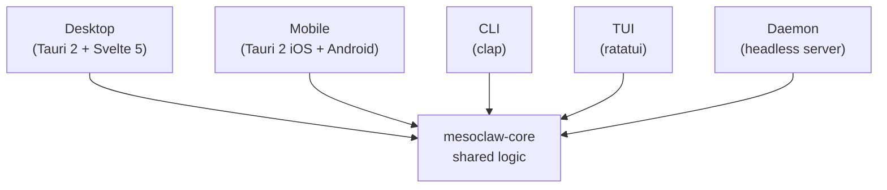
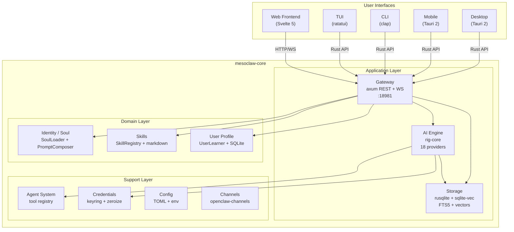
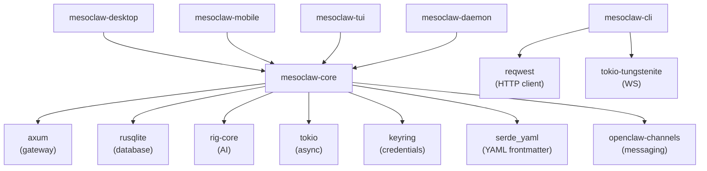
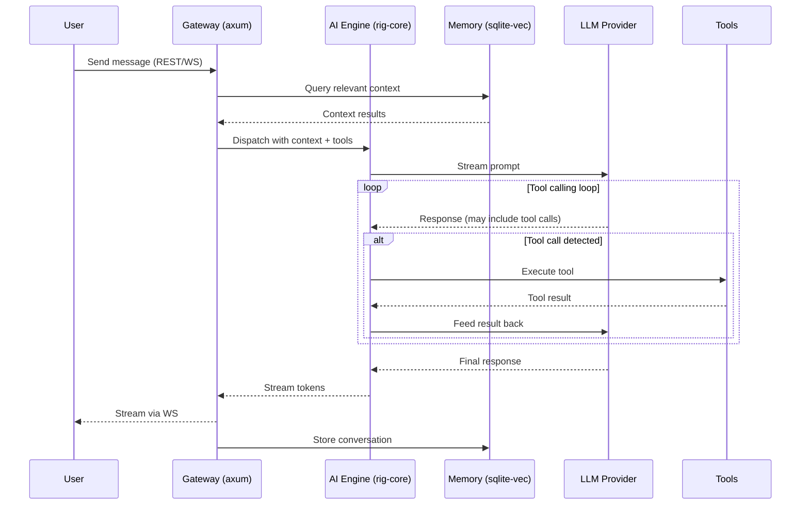
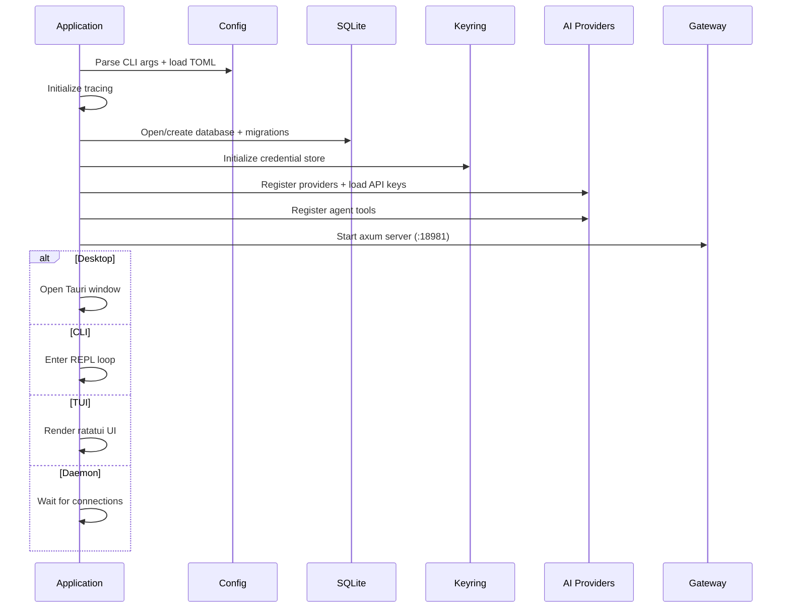
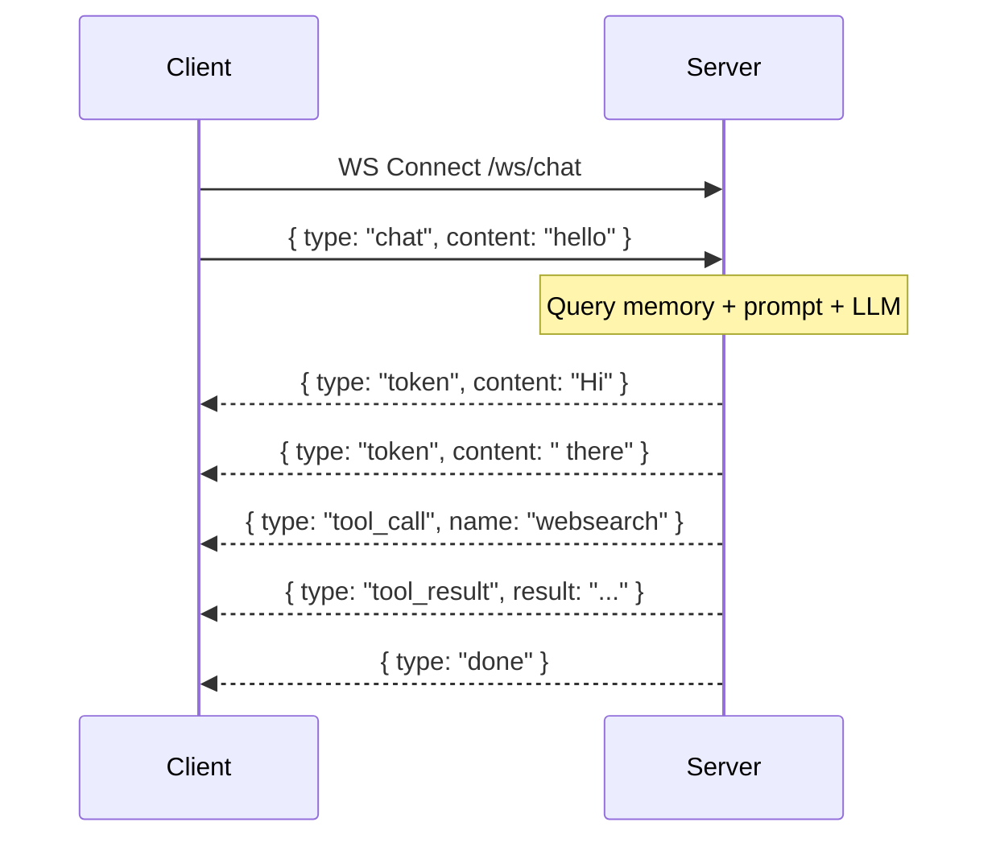
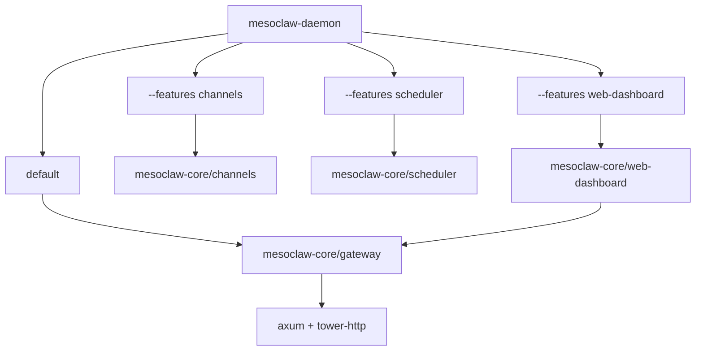

# MesoClaw

An AI-powered multi-interface application built with Rust, producing five binaries from a single codebase: Desktop, Mobile, CLI, TUI, and Daemon.

---

## Overview

MesoClaw is a Rust workspace that delivers AI assistant capabilities across multiple interfaces. All business logic lives in a shared core library (`mesoclaw-core`), while each binary crate is a thin shell that adapts the core to its specific interface.



## Features

- **18 AI providers** via rig-core (OpenAI, Anthropic, Google, Ollama, and more)
- **Tool calling** with 9 built-in tools (websearch, sysinfo, shell, file read/write/list/search, patch, process) via DashMap-backed ToolRegistry
- **Streaming responses** via WebSocket
- **Semantic memory** with SQLite FTS5 + vector embeddings (sqlite-vec)
- **Soul / Persona system** -- 3 identity files (SOUL/IDENTITY/USER.md) with dynamic prompt composition
- **Skills system** -- bundled + user markdown skills loaded into agent context (Claude Code model)
- **Progressive user learning** -- SQLite-backed observations with category filtering, confidence scoring, and privacy controls
- **Secure credentials** via OS keyring with zeroize memory protection
- **Messaging channels** -- Telegram, Discord, Slack, Matrix, Signal, WhatsApp (openclaw-channels)
- **Cron scheduler** -- automated recurring tasks
- **Cross-platform** -- Linux, macOS, Windows, ARM (Raspberry Pi), iOS, Android

## Tech Stack

| Layer | Technology |
|-------|-----------|
| Language | Rust 2024 edition |
| Async | Tokio |
| AI | rig-core |
| Database | rusqlite + sqlite-vec |
| Gateway | axum (HTTP + WebSocket) |
| Frontend | Svelte 5 + SvelteKit + shadcn-svelte + Tailwind CSS |
| Desktop | Tauri 2 |
| Mobile | Tauri 2 (iOS + Android) |
| CLI | clap |
| TUI | ratatui |
| Channels | openclaw-channels (6 adapters) |
| Content | serde_yaml (YAML frontmatter parsing) |
| i18n | paraglide-js (compile-time, tree-shakeable) |

---

## Architecture

### System Architecture



### Crate Dependency Graph



### Chat Request Flow



### Startup Sequence



### WebSocket Message Flow



### Feature Flag Composition



---

## Project Structure

```
mesoclaw/
├── Cargo.toml              # Workspace root (7 members)
├── CLAUDE.md               # AI assistant instructions
├── README.md               # This file
├── scripts/
│   └── build.sh            # Cross-platform build script
├── docs/
│   ├── architecture.md     # Detailed architecture diagrams
│   ├── phases.md           # Implementation phase details
│   └── processes.md        # Process flow diagrams
├── plans/
│   ├── phase1_core_foundation.md  # Phase 1 implementation plan
│   ├── phase2_ai_integration.md   # Phase 2 implementation plan
│   ├── phase3_gateway_server.md   # Phase 3 implementation plan
│   ├── phase4_agent_intelligence.md # Phase 4 implementation plan
│   ├── phase5_combined.md         # Phase 5 implementation plan
│   └── phase6_frontend.md         # Phase 6 implementation plan
├── tests/
│   ├── phase1_core_foundation.md  # Phase 1 test plan + results
│   ├── phase2_ai_integration.md   # Phase 2 test plan + results (105 tests)
│   ├── phase3_gateway_server.md    # Phase 3 test plan + results (96 tests)
│   ├── phase4_agent_intelligence.md # Phase 4 test plan + results (94 tests)
│   ├── phase5_combined.md           # Phase 5 test plan + results (20 tests)
│   └── phase6_frontend.md           # Phase 6 test plan + results (26 tests)
├── crates/
│   ├── mesoclaw-core/      # Shared library (NO Tauri dependency)
│   ├── mesoclaw-desktop/   # Tauri 2 shell (macOS, Windows, Linux)
│   ├── mesoclaw-mobile/    # Tauri 2 shell (iOS, Android)
│   ├── mesoclaw-cli/       # clap CLI
│   ├── mesoclaw-tui/       # ratatui TUI
│   └── mesoclaw-daemon/    # Headless daemon
└── web/                    # Svelte 5 SPA frontend (shared by desktop + mobile)
```

---

## Getting Started

### Prerequisites

- **Rust** 1.85+ (2024 edition support)
- **Bun** (for frontend development)
- **SQLite3** development libraries

#### Platform-specific

**Linux (Debian/Ubuntu):**
```bash
sudo apt install libsqlite3-dev libwebkit2gtk-4.1-dev libappindicator3-dev \
  librsvg2-dev patchelf libssl-dev
```

**macOS:**
```bash
brew install sqlite3
```

**Windows:**
```powershell
# SQLite is bundled via rusqlite's "bundled" feature -- no extra install needed
```

### Build & Run

```bash
# Check everything compiles
cargo check --workspace

# Run tests
cargo test --workspace

# Lint
cargo clippy --workspace

# Start the daemon
cargo run -p mesoclaw-daemon

# Start the CLI
cargo run -p mesoclaw-cli -- chat

# Start the TUI
cargo run -p mesoclaw-tui

# Start the desktop app
cd web && bun install && bun run build && cd ..
cd crates/mesoclaw-desktop && cargo tauri dev

# Frontend dev server (hot reload)
cd web && bun run dev
```

### Cross-Platform Builds

```bash
./scripts/build.sh --target native            # Current OS
./scripts/build.sh --target native --release   # Release mode
./scripts/build.sh --target linux-x86          # Linux x86_64
./scripts/build.sh --target linux-arm          # Linux aarch64 (RPi)
./scripts/build.sh --target macos-x86          # macOS Intel
./scripts/build.sh --target macos-arm          # macOS Apple Silicon
./scripts/build.sh --target windows            # Windows x86_64
./scripts/build.sh --target all                # All platforms
./scripts/build.sh --list-targets              # Show available targets
```

See [scripts/build.sh](scripts/build.sh) for full options.

---

## Feature Flags

```bash
cargo build -p mesoclaw-daemon                          # Core only
cargo build -p mesoclaw-daemon --features channels      # + messaging channels
cargo build -p mesoclaw-daemon --features scheduler     # + cron jobs
cargo build -p mesoclaw-daemon --features web-dashboard # + embedded web UI
cargo build -p mesoclaw-daemon --all-features           # Everything
```

---

## Testing

```bash
cargo test --workspace                    # All tests
cargo test -p mesoclaw-core               # Core only
cargo test -p mesoclaw-core -- memory     # Memory module
cargo test -p mesoclaw-core -- db         # Database module
cd web && bun run test                    # Frontend tests
```

---

## Configuration

MesoClaw uses a TOML configuration file. Paths are resolved via `directories::ProjectDirs::from("com", "sprklai", "mesoclaw")`:

| OS | Config File | Database File |
|---|---|---|
| **Linux** | `~/.config/mesoclaw/config.toml` | `~/.local/share/mesoclaw/mesoclaw.db` |
| **macOS** | `~/Library/Application Support/com.sprklai.mesoclaw/config.toml` | `~/Library/Application Support/com.sprklai.mesoclaw/mesoclaw.db` |
| **Windows** | `%APPDATA%\sprklai\mesoclaw\config\config.toml` | `%APPDATA%\sprklai\mesoclaw\data\mesoclaw.db` |

Example `config.toml` (flat structure, all fields optional with defaults):

```toml
gateway_host = "127.0.0.1"
gateway_port = 18981
log_level = "info"
# data_dir = "/custom/data/path"       # Override default data directory
# db_path = "/custom/path/mesoclaw.db" # Override database file path
identity_name = "MesoClaw"
identity_description = "AI-powered assistant"
default_provider = "openai"
default_model = "gpt-4o"
security_autonomy_level = "supervised"  # supervised | autonomous | strict
max_tool_retries = 3
# gateway_auth_token = "your-secret-token"  # Optional bearer token for auth
# agent_max_turns = 20                       # Max tool-calling turns per request
```

## CLI Commands

```bash
mesoclaw daemon start|stop|status     # Manage the daemon process
mesoclaw chat [--session ID] [--model M]  # Interactive WS streaming chat
mesoclaw run "prompt" [--session] [--model]  # Single prompt, print response
mesoclaw memory search "query" [--limit N] [--offset N]  # Search memories
mesoclaw memory add <key> <content>   # Add memory entry
mesoclaw memory remove <key>          # Remove memory entry
mesoclaw config show                  # Show current config
mesoclaw config set <key> <value>     # Set a config value
mesoclaw key set <provider> <key>     # Set API key
mesoclaw key remove <provider>        # Remove API key
```

Global options: `--host`, `--port`, `--token` (or `MESOCLAW_TOKEN` env var)

## Gateway Routes (36 implemented)

| Group | Routes | Description |
|-------|--------|-------------|
| Health | `GET /health` | Health check (no auth) |
| Sessions & Chat | `POST /sessions`, `GET /sessions`, `GET/PUT/DELETE /sessions/{id}`, `GET/POST /sessions/{id}/messages`, `POST /chat` | Chat sessions and messaging |
| Memory | `POST /memory`, `GET /memory`, `GET/PUT/DELETE /memory/{key}` | Semantic memory CRUD |
| Config | `GET /config`, `PUT /config` | Configuration management |
| Providers & Models | `GET /providers`, `GET /providers/{id}`, `GET /models` | AI provider info |
| Tools | `GET /tools`, `POST /tools/{name}/execute` | Tool listing and execution |
| System | `GET /system/info` | System information |
| Identity | `GET /identity`, `GET/PUT /identity/{name}`, `POST /identity/reload` | Persona management |
| Skills | `GET /skills`, `GET/PUT/DELETE /skills/{id}`, `POST /skills`, `POST /skills/reload` | Skill CRUD |
| User | `GET/POST/DELETE /user/observations`, `GET/DELETE /user/observations/{key}`, `GET /user/profile` | User learning + privacy |
| WebSocket | `GET /ws/chat` | Streaming chat |

---

## Documentation

Detailed documentation lives in the `docs/` and `plans/` directories:

- [Architecture](docs/architecture.md) -- System diagrams, crate dependencies, project structure
- [Implementation Phases](docs/phases.md) -- Phase gate protocol, checklist, phase details
- [Process Flows](docs/processes.md) -- Chat request, startup, error handling, WebSocket flows
- [Phase 1 Plan](plans/phase1_core_foundation.md) -- Detailed implementation plan for core foundation
- [Phase 2 Plan](plans/phase2_ai_integration.md) -- Memory, security, credentials, and tools
- [Phase 3 Plan](plans/phase3_gateway_server.md) -- Gateway server, AI agent, boot sequence
- [Phase 4 Plan](plans/phase4_agent_intelligence.md) -- Identity, skills, user learning
- [Phase 5 Plan](plans/phase5_combined.md) -- ToolRegistry, memory enhancements, CLI binary
- [Phase 6 Plan](plans/phase6_frontend.md) -- Svelte 5 SPA frontend

### Implementation Status

| Phase | Steps | Status | Tests |
|-------|-------|--------|-------|
| Phase 1: Core Foundation | 1-4 | Complete | 16/16 passing |
| Phase 2: AI Integration | 5-7 | Complete | 137/137 passing |
| Phase 3: Gateway Server | 8-10 | Complete | 233/233 passing |
| Phase 4: Agent Intelligence | 10a-10c | Complete | 327/327 passing |
| Phase 5: Binary Shells + Tools + Memory | 11-12 | Complete | 347/347 passing |
| Phase 6: Frontend | 13 | Complete | 347 Rust + 26 JS passing |
| Phase 7: Desktop & Mobile | 14, 14b | Not started | -- |
| Phase 8: Channels & Scheduler | 15-16 | Not started | -- |
| Phase 9: TUI & Cross-Compilation | 17-18 | Not started | -- |
| Phase 10: CI/CD & Quality | 19-20 | Not started | -- |
| Phase 11: Documentation & Community | 21-22 | Not started | -- |

---

## Contributing

1. Fork the repository
2. Create a feature branch: `git checkout -b feature/my-feature`
3. Follow the phase gate protocol in [docs/phases.md](docs/phases.md)
4. Write tests first, then implement
5. Ensure `cargo test --workspace` and `cargo clippy --workspace` pass
6. Submit a pull request

---

## License

MIT
