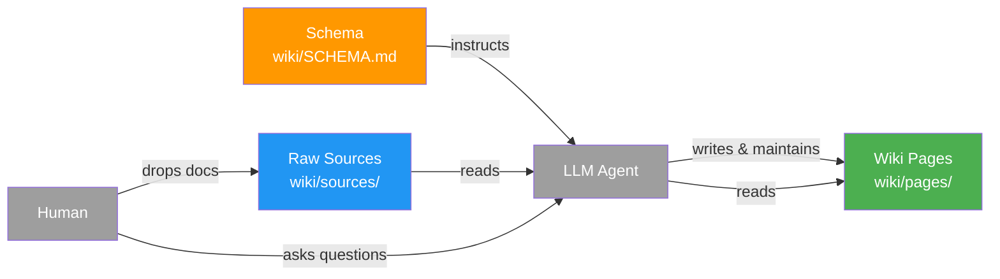

# LLM Wiki

Zenii includes a Karpathy-pattern LLM wiki: a persistent, structured knowledge base that an AI
agent maintains from raw sources. Unlike RAG (which re-synthesizes from raw docs on every query),
the wiki **compiles knowledge at ingestion time** — the LLM reads a document once, writes
structured pages, and maintains cross-references. Future queries draw on pre-built, interlinked
knowledge.



## Structure

```
wiki/
  SCHEMA.md      ← operating manual for the LLM agent
  index.md       ← catalog of all pages (LLM-maintained)
  log.md         ← append-only operation history
  sources/       ← drop raw input documents here
  pages/
    concepts/    ← ideas, techniques, frameworks
    entities/    ← people, orgs, projects, products
    topics/      ← subject areas
    comparisons/ ← side-by-side analyses
    queries/     ← saved answers to important questions
```

## Quick Start: Claude Code

Claude Code reads `CLAUDE.md` which points to `wiki/SCHEMA.md`, so it already knows how to
operate the wiki.

**1. Drop a source document**

```bash
cp ~/Downloads/paper.pdf wiki/sources/
```

**2. Ingest it**

```
ingest wiki/sources/paper.pdf
```

Claude Code reads the document, creates/updates wiki pages, updates `index.md`, and appends to
`log.md`.

**3. Ask questions**

```
what does the wiki say about transformer attention mechanisms?
```

**4. Run a health check**

```
lint the wiki
```

## Quick Start: Zenii Agent

Zenii's built-in agent has `FileReadTool`, `FileWriteTool`, `FileListTool`, and `FileSearchTool`
built in — no new routes or configuration needed.

**Via curl**

```bash
SESSION=$(curl -s -X POST http://localhost:18981/sessions \
  -H "Authorization: Bearer $ZENII_TOKEN" \
  -H "Content-Type: application/json" \
  -d '{"title":"wiki session"}' | jq -r '.id')

curl -X POST http://localhost:18981/sessions/$SESSION/messages \
  -H "Authorization: Bearer $ZENII_TOKEN" \
  -H "Content-Type: application/json" \
  -d '{"content":"Read wiki/SCHEMA.md then ingest wiki/sources/my-article.md","role":"user"}'
```

**Via WebSocket (streaming)**

```javascript
const ws = new WebSocket('ws://localhost:18981/ws');
ws.send(JSON.stringify({
  type: "chat",
  session_id: "...",
  content: "Read wiki/SCHEMA.md then ingest wiki/sources/my-article.md"
}));
```

## Operations

| Operation | Trigger | What happens |
|-----------|---------|-------------|
| **Ingest** | `ingest wiki/sources/X` | LLM reads doc, creates/updates 5-15 pages, updates index, appends to log |
| **Query** | Ask any question about the wiki | LLM searches index, reads relevant pages, answers with citations |
| **Lint** | `lint the wiki` | LLM scans all pages for contradictions, stale claims, orphans, missing links |

## Supported Source Formats

Anything the LLM agent can read:

- **Markdown** (`.md`) — best format, no conversion needed
- **Plain text** (`.txt`)
- **Code files** (`.rs`, `.ts`, etc.) — useful for technical wikis
- **PDF** (`.pdf`) — Claude Code reads these natively
- **HTML** — paste as `.html` or convert to markdown first

:::tip
[Obsidian Web Clipper](https://obsidian.md/clipper) converts web articles to clean markdown with
one click.
:::

## Example Session

```
You: ingest wiki/sources/attention-is-all-you-need.md

Agent: Key takeaways:
- Introduces Transformer architecture (encoder-decoder with self-attention)
- Eliminates recurrence entirely — enables parallelization
- Multi-head attention allows attending to multiple positions simultaneously
- Positional encodings substitute for recurrence to track sequence order
- SOTA on WMT 2014 EN-DE and EN-FR translation at time of publication

Creating/updating pages:
- pages/concepts/transformer-architecture.md (new)
- pages/concepts/self-attention.md (new)
- pages/concepts/multi-head-attention.md (new)
- pages/entities/vaswani-et-al-2017.md (new)
- pages/topics/sequence-to-sequence.md (updated)

Updated index.md (5 new entries). Appended to log.md.

You: what does the wiki say about positional encodings?

Agent: From wiki/pages/concepts/transformer-architecture.md:
Positional encodings are fixed sine/cosine vectors added to token embeddings to inject
sequence position information, since the Transformer has no recurrence or convolution.
[source: attention-is-all-you-need.md]

See also: [[self-attention]], [[multi-head-attention]]
```

## Tips

- **Commit after each ingest**: `git add wiki/ && git commit -m "wiki: ingest <source-name>"`
- **Obsidian graph view**: open `wiki/` in Obsidian to visualize page relationships
- **Dataview plugin**: query frontmatter metadata across pages with SQL-like syntax
- **Keep sources focused**: split large documents into focused chunks for better page granularity

## LLM Compatibility

The wiki works with any LLM that has file read/write tools — no embeddings or vector databases
required.

| Interface | Works | Notes |
|-----------|-------|-------|
| Claude Code | Yes | Native — reads CLAUDE.md → SCHEMA.md automatically |
| Zenii agent | Yes | Uses existing file tools, no config needed |
| Codex CLI | Yes | Point it at `wiki/SCHEMA.md` as the instruction file |
| Any agent with filesystem tools | Yes | Tell it to read `wiki/SCHEMA.md` first |
