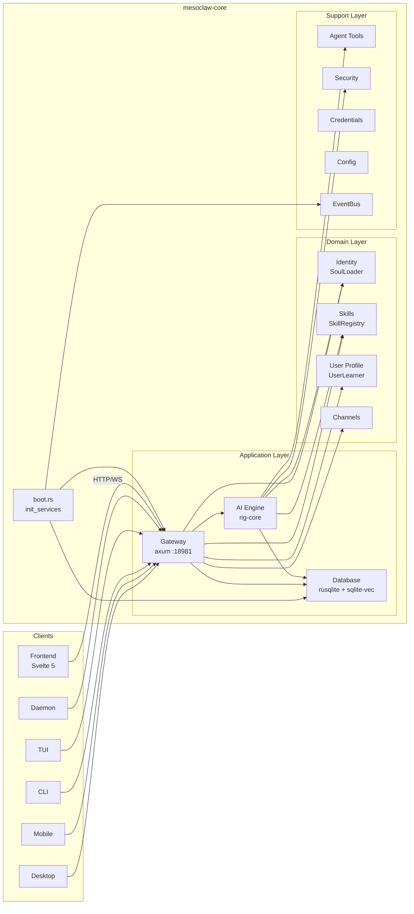
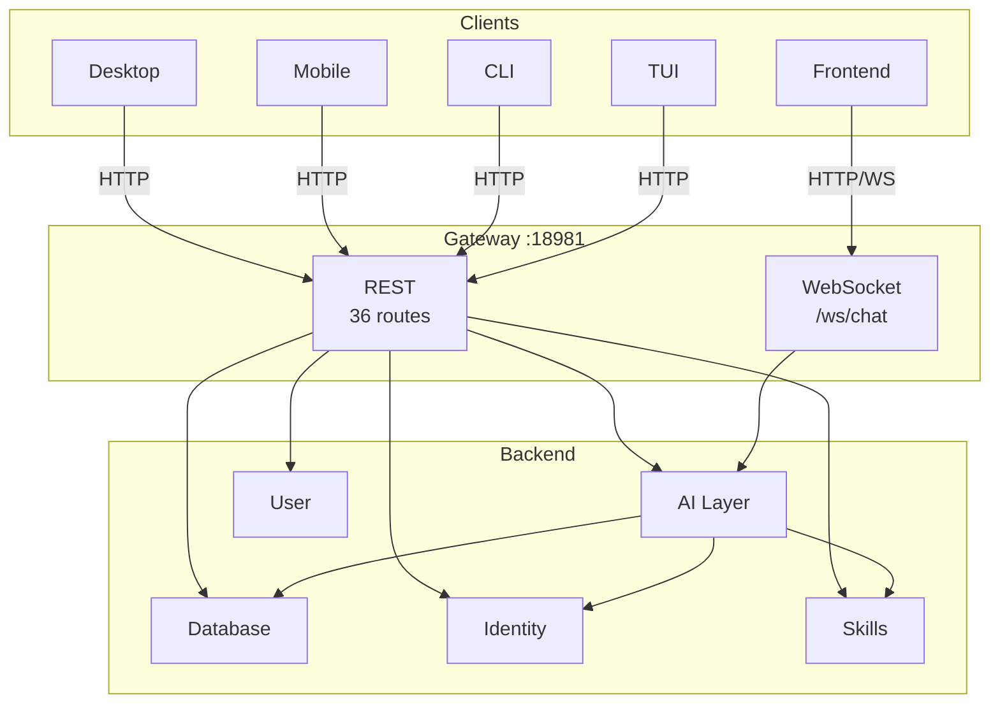
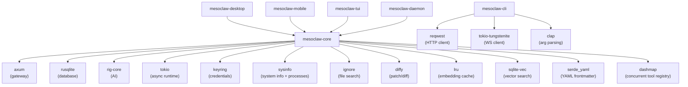
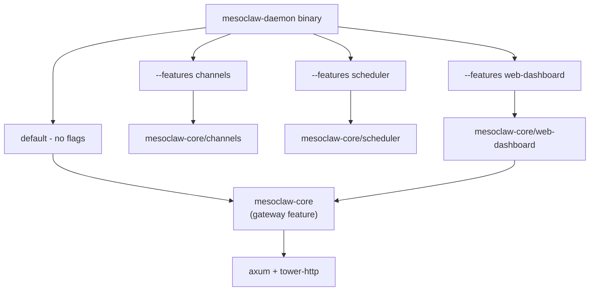
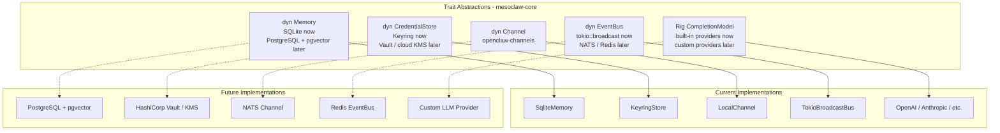
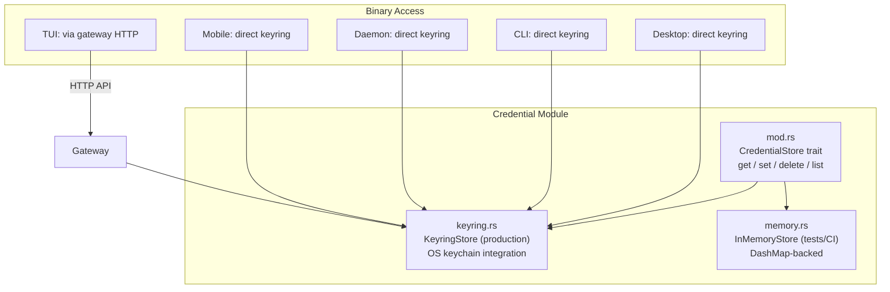
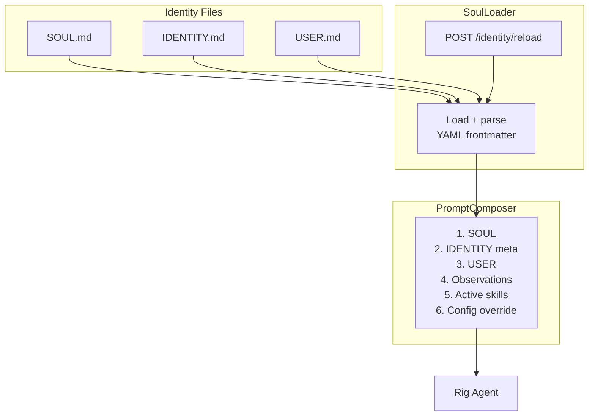
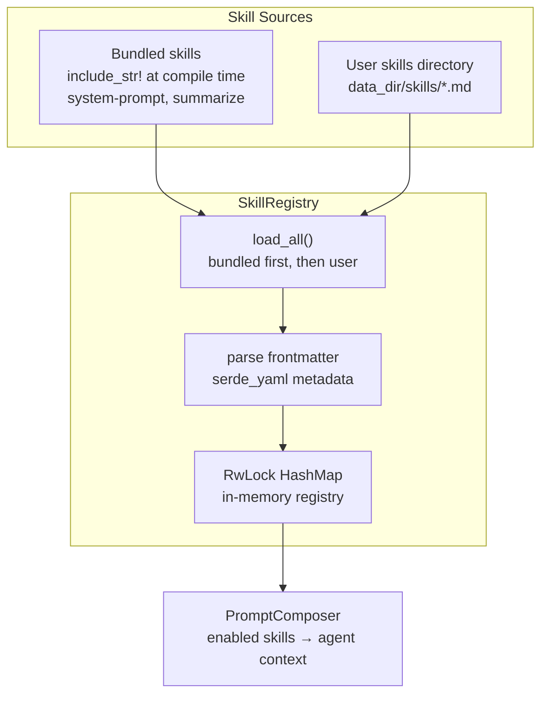
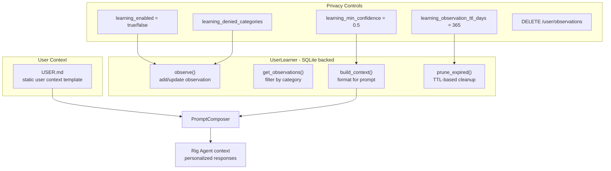

# MesoClaw Architecture

## Table of Contents

- [System Architecture](#system-architecture)
- [Data Flow](#data-flow)
- [Crate Dependency Graph](#crate-dependency-graph)
- [Project Structure](#project-structure)
- [Default Paths by OS](#default-paths-by-os)
- [Feature Flag Composition](#feature-flag-composition)
- [Trait-Driven Architecture](#trait-driven-architecture)
- [Credential System](#credential-system)
- [Identity / Soul System](#identity--soul-system)
- [Skills System](#skills-system)
- [User Profile + Progressive Learning](#user-profile--progressive-learning)
- [Gateway Routes](#gateway-routes)
- [Concurrency Rules](#concurrency-rules)
- [Lessons Learned from v1](#lessons-learned-from-v1)

---

## System Architecture



## Data Flow



## Crate Dependency Graph



## Project Structure

```
mesoclaw/
├── Cargo.toml              # Workspace root (7 members)
├── CLAUDE.md               # AI assistant instructions
├── README.md               # Project documentation
├── scripts/
│   └── build.sh            # Cross-platform build script
├── docs/
│   ├── architecture.md     # This file
│   ├── phases.md           # Implementation phases
│   └── processes.md        # Process flow diagrams
├── plans/
│   ├── phase1_core_foundation.md  # Detailed implementation plan
│   └── migration_plan.md          # v1 → v2 migration strategy
├── tests/
│   ├── phase1_core_foundation.md  # Test plan + results
│   ├── phase2_ai_integration.md   # (planned)
│   └── ...
├── crates/
│   ├── mesoclaw-core/      # Shared library (NO Tauri dependency)
│   │   ├── src/
│   │   │   ├── lib.rs      # Module exports + Result<T> alias
│   │   │   ├── error.rs    # MesoError enum (23 variants, thiserror)
│   │   │   ├── boot.rs     # init_services() -> Services -> AppState, single boot entry point
│   │   │   ├── config/     # TOML config (schema + load/save + OS paths)
│   │   │   ├── db/         # rusqlite pool + WAL + migrations + spawn_blocking
│   │   │   ├── event_bus/  # EventBus trait + TokioBroadcastBus (12 events)
│   │   │   ├── memory/     # Memory trait + SqliteMemoryStore (FTS5 + vectors) + InMemoryStore
│   │   │   ├── credential/ # CredentialStore trait + InMemoryCredentialStore
│   │   │   ├── security/   # SecurityPolicy + AutonomyLevel + rate limiter + audit log
│   │   │   ├── tools/      # Tool trait + ToolRegistry (DashMap) + 9 tools (shell, file ops, web search, sysinfo, patch, process)
│   │   │   ├── ai/         # AI agent (rig-core), providers, session manager, tool adapter
│   │   │   ├── gateway/    # axum HTTP+WS gateway (36 routes, auth middleware, error mapping, MESO_VALIDATION)
│   │   │   ├── identity/   # SoulLoader + PromptComposer + defaults (SOUL/IDENTITY/USER.md)
│   │   │   ├── skills/     # SkillRegistry + bundled/user skills (markdown + YAML frontmatter)
│   │   │   ├── user/       # UserLearner + SQLite observations + privacy controls
│   │   │   ├── channels/   # Channel trait + implementations (Phase 8)
│   │   │   └── scheduler/  # Cron + scheduled tasks, feature-gated (Phase 8)
│   │   └── tests/          # Integration tests
│   ├── mesoclaw-desktop/   # Tauri 2 shell (desktop)
│   ├── mesoclaw-mobile/    # Tauri 2 shell (iOS + Android)
│   ├── mesoclaw-cli/       # clap CLI
│   ├── mesoclaw-tui/       # ratatui TUI
│   └── mesoclaw-daemon/    # Headless daemon (full gateway server)
└── web/                    # Svelte 5 frontend (SPA)
    ├── src/
    │   ├── app.css          # Tailwind v4 + shadcn theme tokens
    │   ├── app.html         # SPA shell
    │   ├── lib/
    │   │   ├── api/         # HTTP client + WebSocket manager
    │   │   ├── components/
    │   │   │   ├── ai-elements/  # svelte-ai-elements (9 component sets)
    │   │   │   ├── ui/      # shadcn-svelte primitives (14 component sets)
    │   │   │   ├── AuthGate.svelte
    │   │   │   ├── ChatView.svelte
    │   │   │   ├── Markdown.svelte
    │   │   │   ├── SessionList.svelte
    │   │   │   └── ThemeToggle.svelte
    │   │   ├── stores/      # 6 Svelte 5 rune stores ($state)
    │   │   ├── paraglide/   # i18n (paraglide-js, EN only, 24 keys)
    │   │   └── utils.ts     # shadcn utility helpers
    │   └── routes/          # 8 SPA routes
    │       ├── +page.svelte           # Home
    │       ├── chat/+page.svelte      # New chat
    │       ├── chat/[id]/+page.svelte # Existing session
    │       ├── memory/+page.svelte    # Memory browser
    │       ├── schedule/+page.svelte  # Placeholder (Phase 8)
    │       ├── settings/+page.svelte  # General settings
    │       ├── settings/providers/    # Provider config
    │       └── settings/persona/      # Identity + skills editor
    ├── package.json
    └── vitest.config.ts     # 26 unit tests (vitest)
```

## Default Paths by OS

Resolved via `directories::ProjectDirs::from("com", "sprklai", "mesoclaw")`.

Source: `crates/mesoclaw-core/src/config/mod.rs`

| OS | Config Path | Data Dir / DB Path |
|---|---|---|
| **Linux** | `~/.config/mesoclaw/config.toml` | `~/.local/share/mesoclaw/mesoclaw.db` |
| **macOS** | `~/Library/Application Support/com.sprklai.mesoclaw/config.toml` | `~/Library/Application Support/com.sprklai.mesoclaw/mesoclaw.db` |
| **Windows** | `%APPDATA%\sprklai\mesoclaw\config\config.toml` | `%APPDATA%\sprklai\mesoclaw\data\mesoclaw.db` |

Override in `config.toml`:
```toml
data_dir = "/custom/data/path"        # overrides default data directory
db_path = "/custom/path/mesoclaw.db"  # overrides database file directly
```

## Feature Flag Composition



## Trait-Driven Architecture

All major subsystems are abstracted behind traits, allowing swappable implementations for testing, migration, and scaling.



All binary crates receive these traits via `AppState` (Clone + Arc\<T\>), never concrete types.

## Credential System



### Per-Binary Keyring Access

| Binary | Keyring Access | Notes |
|---|---|---|
| **Desktop** | Direct | Tauri 2 has full OS access |
| **Mobile** | Direct | Tauri 2 mobile has keychain access |
| **CLI** | Direct | Runs as user process |
| **TUI** | Via gateway | Connects to daemon over HTTP |
| **Daemon** | Direct | Headless, runs as service |

All credential values are wrapped with `zeroize` for secure memory cleanup.

## Identity / Soul System

Identity defines the AI assistant's personality, tone, and behavior through 3 markdown files with YAML frontmatter. All prompt content comes from `.md` files — zero hardcoded prompt strings in Rust code.



### Identity File Format (IDENTITY.md)

```markdown
---
name: MesoClaw
version: "2.0"
description: AI-powered assistant
---

# Identity details...
```

- **Storage**: `data_dir/identity/` (configurable via `identity_dir` in config.toml)
- **Bundled defaults**: embedded via `include_str!()` at compile time, written to disk on first run
- **Reload**: manual via `POST /identity/reload` endpoint (no `notify` dependency)
- **API**: `GET /identity`, `GET /identity/{name}`, `PUT /identity/{name}`, `POST /identity/reload`

## Skills System

Skills are instructional markdown documents loaded into the agent's context. They follow the Claude Code model — pure markdown with YAML frontmatter metadata, no parameter substitution.



### Skill File Format (Claude Code model)

```markdown
---
name: system-prompt
description: Generates effective system prompts for AI agents
category: meta
---

# System Prompt Generator

When creating system prompts, follow these principles:
...
```

- **No Tera/comrak**: Skills are pure markdown context documents, not parameterized templates
- **2 tiers**: Bundled (compile-time) + User (disk). User skills with same id override bundled.
- **API**: `GET /skills`, `GET /skills/{id}`, `POST /skills`, `PUT /skills/{id}`, `DELETE /skills/{id}`, `POST /skills/reload`
- **Bundled skills cannot be deleted** — only user skills support DELETE

## User Profile + Progressive Learning

MesoClaw learns user preferences over time via explicit observation API. Observations are stored in SQLite with category-based organization and confidence scoring.



- **USER.md**: static user context template (part of identity system)
- **UserLearner**: SQLite-backed observation store with CRUD operations
- **Observations**: stored in `user_observations` table with category, key, value, confidence, timestamps
- **Privacy**: learning toggled via config, denied categories block specific observation types, TTL auto-expires old observations
- **API**: `GET /user/observations`, `POST /user/observations`, `GET /user/observations/{key}`, `DELETE /user/observations/{key}`, `DELETE /user/observations`, `GET /user/profile`

## Gateway Routes

All clients communicate via the HTTP+WebSocket gateway at `127.0.0.1:18981`. Routes are grouped by subsystem (36 implemented through Phase 4).

### Health (1 route, no auth)

| Method | Path | Description |
|---|---|---|
| GET | `/health` | Health check |

### Sessions & Chat (7 routes)

| Method | Path | Description |
|---|---|---|
| POST | `/sessions` | Create new chat session |
| GET | `/sessions` | List all sessions |
| GET | `/sessions/{id}` | Get session details |
| PUT | `/sessions/{id}` | Update session |
| DELETE | `/sessions/{id}` | Delete session |
| GET | `/sessions/{id}/messages` | Get messages for a session |
| POST | `/sessions/{id}/messages` | Send message to session |

### Chat (1 route)

| Method | Path | Description |
|---|---|---|
| POST | `/chat` | Chat with AI agent |

### Memory (5 routes)

| Method | Path | Description |
|---|---|---|
| POST | `/memory` | Create memory entry |
| GET | `/memory` | Recall/search memories |
| GET | `/memory/{key}` | Get memory by key |
| PUT | `/memory/{key}` | Update memory by key |
| DELETE | `/memory/{key}` | Delete memory by key |

### Configuration (2 routes)

| Method | Path | Description |
|---|---|---|
| GET | `/config` | Get current configuration (auth token redacted) |
| PUT | `/config` | Update configuration |

### Providers & Models (3 routes)

| Method | Path | Description |
|---|---|---|
| GET | `/providers` | List configured AI providers |
| GET | `/providers/{id}` | Get provider details |
| GET | `/models` | List available models |

### Tools (2 routes)

| Method | Path | Description |
|---|---|---|
| GET | `/tools` | List available tools |
| POST | `/tools/{name}/execute` | Execute a tool by name |

### System (1 route)

| Method | Path | Description |
|---|---|---|
| GET | `/system/info` | System information |

### WebSocket Channels (1 route)

| Path | Description |
|---|---|
| `/ws/chat` | Streaming chat responses |

### Identity (4 routes)

| Method | Path | Description |
|---|---|---|
| GET | `/identity` | List all identity files |
| GET | `/identity/{name}` | Get identity file content |
| PUT | `/identity/{name}` | Update identity file content |
| POST | `/identity/reload` | Force reload all identity files |

### Skills (6 routes)

| Method | Path | Description |
|---|---|---|
| GET | `/skills` | List all skills (optional `?category=` filter) |
| GET | `/skills/{id}` | Get full skill definition |
| POST | `/skills` | Create user skill |
| PUT | `/skills/{id}` | Update skill content |
| DELETE | `/skills/{id}` | Delete user skill (bundled cannot be deleted) |
| POST | `/skills/reload` | Force reload all skills |

### User Profile + Learning (6 routes)

| Method | Path | Description |
|---|---|---|
| GET | `/user/observations` | List observations (optional `?category=` filter) |
| POST | `/user/observations` | Add observation |
| GET | `/user/observations/{key}` | Get observation by key |
| DELETE | `/user/observations/{key}` | Delete observation by key |
| DELETE | `/user/observations` | Clear all observations |
| GET | `/user/profile` | Get computed user context string |

### Future Phases (not yet implemented)

| Group | Routes | Phase |
|---|---|---|
| Scheduler | 4 routes (feature-gated) | Phase 8 |
| WebSocket `/ws/events`, `/ws/agents` | 2 channels | Phase 8+ |

## Concurrency Rules

These rules are enforced across the entire codebase to prevent async runtime issues.

| Rule | Rationale |
|---|---|
| No `std::sync::Mutex` in async paths | Blocks the tokio runtime; use `tokio::sync::Mutex` or `DashMap` |
| No `block_on()` anywhere | Panics inside tokio runtime; use `tokio::spawn` or `.await` |
| All SQLite ops via `spawn_blocking` | `rusqlite` is synchronous; blocking in async context starves tasks |
| All errors are `MesoError` | No `Result<T, String>`; use `thiserror` enum with typed variants |
| `AppState` is `Clone + Arc<T>` | Shared across axum handlers without lifetime issues |
| `EventBus` uses `tokio::sync::broadcast` | Lock-free fan-out to all subscribers |
| Never hold async locks across `.await` | Prevents deadlocks; acquire, use, drop before yielding |

## Lessons Learned from v1

Key architectural mistakes from MesoClaw v1 and how v2 prevents them.

| v1 Mistake | v2 Prevention |
|---|---|
| `std::sync::Mutex` in async code | `tokio::sync::Mutex` or `DashMap` exclusively |
| `block_on()` in event loop | Zero `block_on()` calls; `tokio::spawn` for sync work |
| `Result<T, String>` everywhere | `MesoError` enum with `thiserror` |
| Custom AI layer (1400 LOC) | `rig-core` (battle-tested, 18 providers) |
| 21 Zustand stores | 6 Svelte 5 rune stores ($state), single WS connection |
| 165 IPC commands (Tauri v1) | Gateway-only architecture (~40 HTTP routes) |
| OKLCH color functions in CSS | Pre-computed hex values only |
| useEffect soup (React) | Single `$effect` per Svelte component, reactive stores |
| 13-phase boot sequence | Single `init_services()` in `boot.rs` |