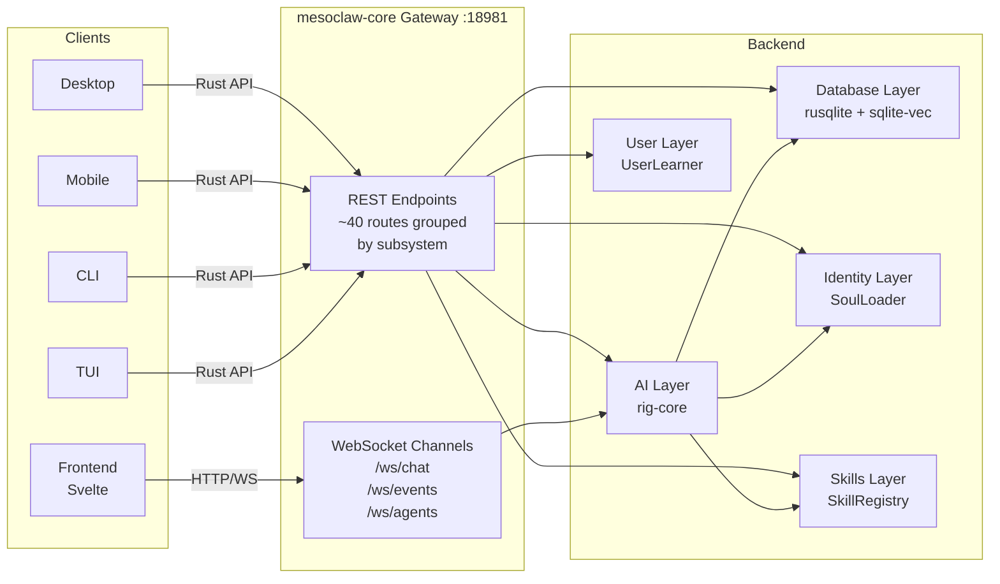
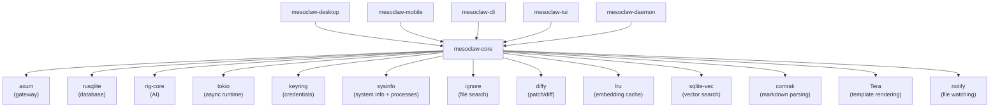
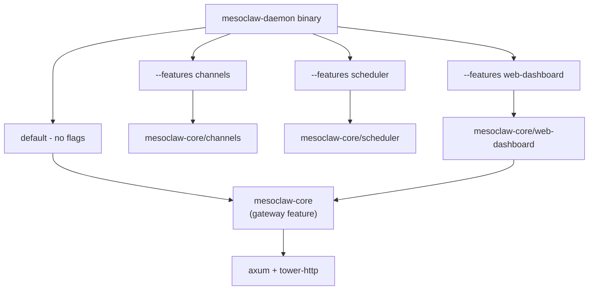
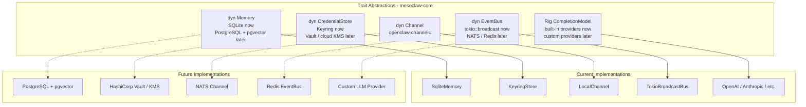
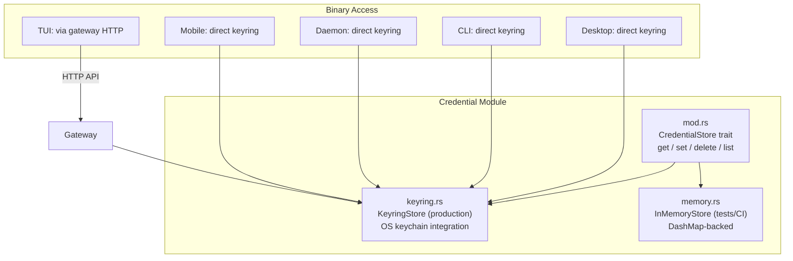
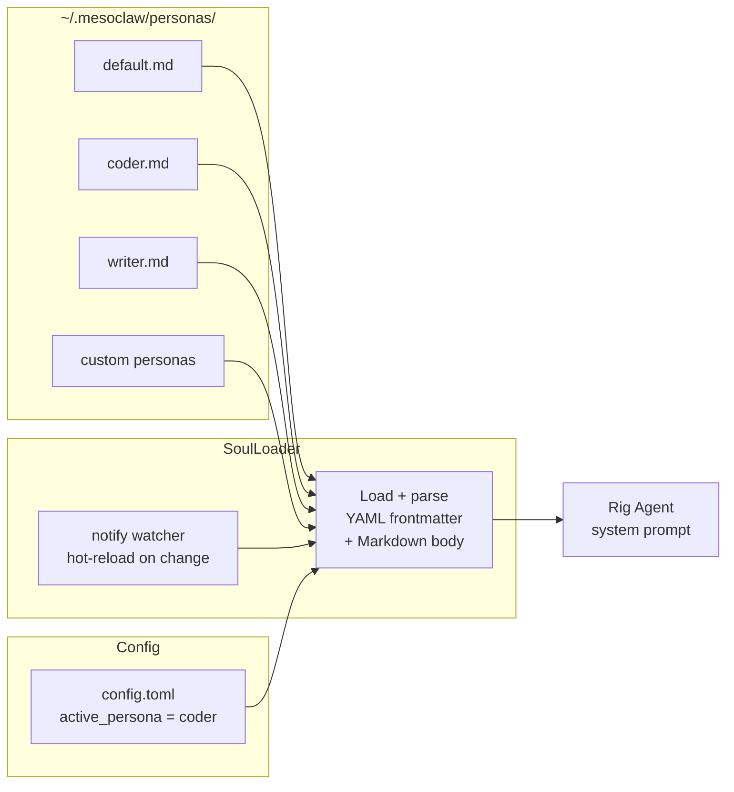
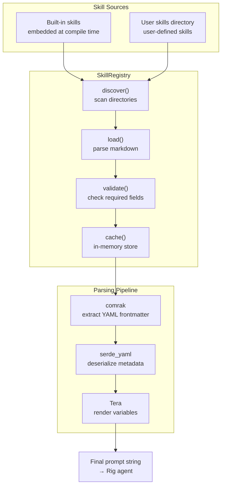
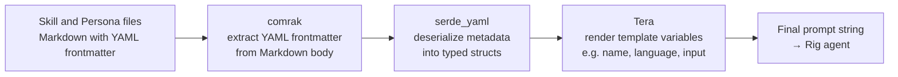
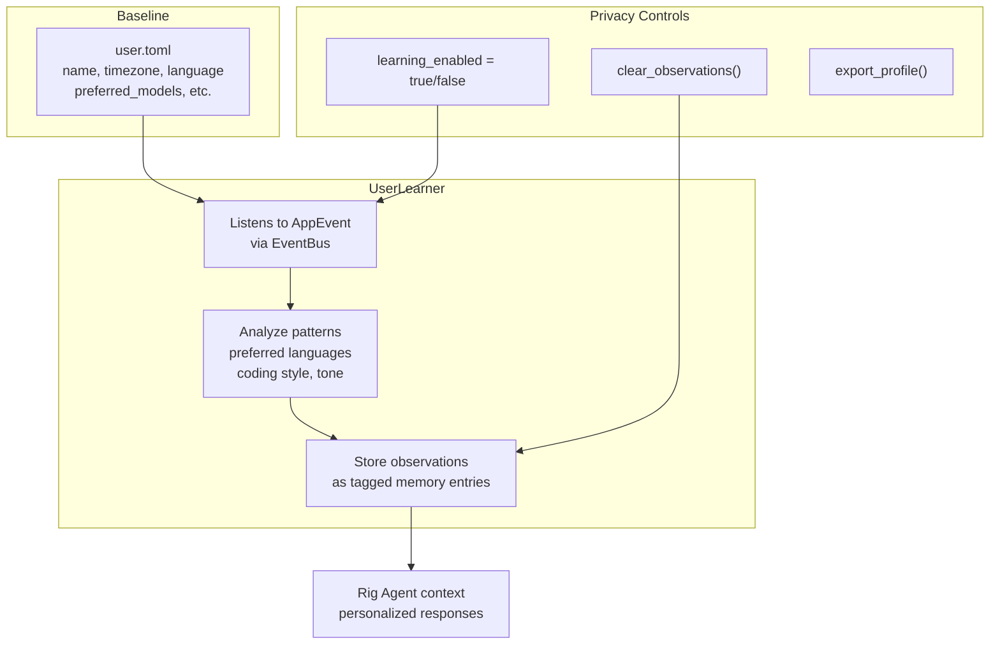

# MesoClaw Architecture

## System Architecture

```mermaid
graph TB
    subgraph "Binary Crates - Thin Shells"
        Desktop["Desktop<br>#40;Tauri 2#41;"]
        Mobile["Mobile<br>#40;Tauri 2 iOS + Android#41;"]
        CLI["CLI<br>#40;clap#41;"]
        TUI["TUI<br>#40;ratatui#41;"]
        Daemon["Daemon<br>#40;axum#41;"]
    end

    subgraph "mesoclaw-core - Shared Library"
        subgraph "Application Layer"
            AI["AI / LLM Layer<br>rig-core<br>18 providers<br>tool calling + streaming"]
            Gateway["Gateway<br>axum REST + WS<br>127.0.0.1:18981"]
            DB["Database<br>rusqlite + sqlite-vec<br>FTS5 + vectors"]
        end
        subgraph "Domain Layer"
            Identity["Identity / Soul<br>Personas + SoulLoader<br>hot-reload #40;notify#41;"]
            Skills["Skills System<br>SkillRegistry<br>comrak + Tera"]
            User["User Profile<br>user.toml + UserLearner<br>progressive learning"]
            Channels["Channels<br>dyn Channel<br>openclaw-channels"]
        end
        subgraph "Support Layer"
            Tools["Agent Tools<br>8 tools: shell, file ops<br>websearch, sysinfo, patch<br>file search, process"]
            Security["Security<br>SecurityPolicy + AutonomyLevel<br>rate limiter + audit log"]
            Creds2["Credentials<br>dyn CredentialStore<br>InMemory + Keyring"]
            Config["Config<br>TOML + serde"]
            EventBus["EventBus<br>dyn EventBus<br>tokio::broadcast"]
        end
        subgraph "Boot"
            Boot["boot.rs<br>init_services#40;#41;<br>single entry point"]
        end
    end

    subgraph "Frontend"
        Web["Svelte 5 + SvelteKit<br>shadcn-svelte + Tailwind"]
    end

    Desktop --> AI
    Mobile --> AI
    CLI --> AI
    TUI --> AI
    Daemon --> Gateway
    Web -->|HTTP/WS| Gateway
    Gateway --> AI
    Gateway --> DB
    Gateway --> Identity
    Gateway --> Skills
    Gateway --> User
    Gateway --> Channels
    AI --> Tools
    AI --> Security
    AI --> DB
    AI --> Identity
    AI --> Skills
    Boot --> Gateway
    Boot --> DB
    Boot --> EventBus
```

## Data Flow



## Crate Dependency Graph



## Project Structure

```
mesoclaw/
├── Cargo.toml              # Workspace root (7 members)
├── CLAUDE.md               # AI assistant instructions
├── README.md               # Project documentation
├── scripts/
│   └── build.sh            # Cross-platform build script
├── docs/
│   ├── architecture.md     # This file
│   ├── phases.md           # Implementation phases
│   └── processes.md        # Process flow diagrams
├── plans/
│   ├── phase1_core_foundation.md  # Detailed implementation plan
│   └── migration_plan.md          # v1 → v2 migration strategy
├── tests/
│   ├── phase1_core_foundation.md  # Test plan + results
│   ├── phase2_ai_integration.md   # (planned)
│   └── ...
├── crates/
│   ├── mesoclaw-core/      # Shared library (NO Tauri dependency)
│   │   ├── src/
│   │   │   ├── lib.rs      # Module exports + Result<T> alias
│   │   │   ├── error.rs    # MesoError enum (16 variants, thiserror)
│   │   │   ├── boot.rs     # init_services() -- single boot entry point
│   │   │   ├── config/     # TOML config (schema + load/save + OS paths)
│   │   │   ├── db/         # rusqlite pool + WAL + migrations + spawn_blocking
│   │   │   ├── event_bus/  # EventBus trait + TokioBroadcastBus (12 events)
│   │   │   ├── memory/     # Memory trait + SqliteMemoryStore (FTS5 + vectors) + InMemoryStore
│   │   │   ├── credential/ # CredentialStore trait + InMemoryCredentialStore
│   │   │   ├── security/   # SecurityPolicy + AutonomyLevel + rate limiter + audit log
│   │   │   ├── tools/      # Tool trait + 8 tools (shell, file ops, web search, sysinfo, etc.)
│   │   │   ├── ai/         # AI providers + models (Phase 3)
│   │   │   ├── gateway/    # axum HTTP + WS server (Phase 3)
│   │   │   ├── identity/   # SoulLoader + personas + hot-reload (Phase 4)
│   │   │   ├── skills/     # SkillRegistry + markdown parsing + Tera (Phase 4)
│   │   │   ├── user/       # UserProfile + UserLearner + progressive learning (Phase 4)
│   │   │   ├── channels/   # Channel trait + implementations (Phase 8)
│   │   │   └── scheduler/  # Cron + scheduled tasks, feature-gated (Phase 8)
│   │   └── tests/          # Integration tests
│   ├── mesoclaw-desktop/   # Tauri 2 shell (desktop)
│   ├── mesoclaw-mobile/    # Tauri 2 shell (iOS + Android)
│   ├── mesoclaw-cli/       # clap CLI
│   ├── mesoclaw-tui/       # ratatui TUI
│   └── mesoclaw-daemon/    # Headless daemon (config + DB + tracing wired)
└── web/                    # Svelte 5 frontend (Phase 7)
    ├── src/
    └── package.json
```

## Default Paths by OS

Resolved via `directories::ProjectDirs::from("com", "sprklai", "mesoclaw")`.

Source: `crates/mesoclaw-core/src/config/mod.rs`

| OS | Config Path | Data Dir / DB Path |
|---|---|---|
| **Linux** | `~/.config/mesoclaw/config.toml` | `~/.local/share/mesoclaw/mesoclaw.db` |
| **macOS** | `~/Library/Application Support/com.sprklai.mesoclaw/config.toml` | `~/Library/Application Support/com.sprklai.mesoclaw/mesoclaw.db` |
| **Windows** | `%APPDATA%\sprklai\mesoclaw\config\config.toml` | `%APPDATA%\sprklai\mesoclaw\data\mesoclaw.db` |

Override in `config.toml`:
```toml
data_dir = "/custom/data/path"        # overrides default data directory
db_path = "/custom/path/mesoclaw.db"  # overrides database file directly
```

## Feature Flag Composition



## Trait-Driven Architecture

All major subsystems are abstracted behind traits, allowing swappable implementations for testing, migration, and scaling.



All binary crates receive these traits via `GatewayState` (Clone + Arc\<T\>), never concrete types.

## Credential System



### Per-Binary Keyring Access

| Binary | Keyring Access | Notes |
|---|---|---|
| **Desktop** | Direct | Tauri 2 has full OS access |
| **Mobile** | Direct | Tauri 2 mobile has keychain access |
| **CLI** | Direct | Runs as user process |
| **TUI** | Via gateway | Connects to daemon over HTTP |
| **Daemon** | Direct | Headless, runs as service |

All credential values are wrapped with `zeroize` for secure memory cleanup.

## Identity / Soul System

Personas define the AI assistant's personality, tone, and behavior. They are stored as Markdown files with YAML frontmatter.



### Persona File Format

```markdown
---
name: coder
description: "Technical coding assistant"
temperature: 0.3
tags: [code, technical, rust]
---

You are a precise technical assistant specializing in Rust development...
```

- **Storage**: `~/.mesoclaw/personas/*.md`
- **Active persona**: set in `config.toml` via `active_persona` key
- **Hot-reload**: `notify` crate watches the personas directory; changes are picked up without restart
- **Multiple personas**: users can create unlimited custom personas

## Skills System

Skills are reusable prompt templates stored as Markdown with YAML frontmatter and Tera template variables.



### Skill File Format

```markdown
---
name: code-review
description: "Review code for bugs and improvements"
parameters:
  - name: language
    type: string
    required: true
  - name: focus
    type: string
    default: "bugs,performance,readability"
---

Review the following {{language}} code, focusing on {{focus}}:

{{input}}
```

## Content Format Pipeline

All persona and skill files flow through the same parsing pipeline:



## User Profile + Progressive Learning

MesoClaw learns user preferences over time without explicit configuration.



- **user.toml**: baseline profile with explicit user preferences
- **UserLearner**: subscribes to `AppEvent` stream via `EventBus`, extracts patterns from conversations
- **Observations**: stored as tagged memory entries in SQLite (searchable via FTS5)
- **Privacy**: learning can be toggled off, observations can be cleared or exported at any time

## Gateway Routes

All clients communicate via the HTTP+WebSocket gateway at `127.0.0.1:18981`. Routes are grouped by subsystem (~40 total).

### Sessions & Chat (5 routes)

| Method | Path | Description |
|---|---|---|
| POST | `/api/sessions` | Create new chat session |
| GET | `/api/sessions` | List all sessions |
| GET | `/api/sessions/:id` | Get session with messages |
| DELETE | `/api/sessions/:id` | Delete session |
| POST | `/api/sessions/:id/messages` | Send message (streaming SSE) |

### Providers (2 routes)

| Method | Path | Description |
|---|---|---|
| GET | `/api/providers` | List configured AI providers |
| GET | `/api/providers/:name/models` | List models for a provider |

### Memory (5 routes)

| Method | Path | Description |
|---|---|---|
| POST | `/api/memory` | Store memory entry |
| GET | `/api/memory/search` | Full-text + vector search |
| GET | `/api/memory/:id` | Get memory entry |
| PUT | `/api/memory/:id` | Update memory entry |
| DELETE | `/api/memory/:id` | Delete memory entry |

### Identity / Soul (3 routes)

| Method | Path | Description |
|---|---|---|
| GET | `/api/personas` | List available personas |
| GET | `/api/personas/:name` | Get persona details |
| PUT | `/api/personas/active` | Set active persona |

### Skills (5 routes)

| Method | Path | Description |
|---|---|---|
| GET | `/api/skills` | List available skills |
| GET | `/api/skills/:name` | Get skill details + parameters |
| POST | `/api/skills/:name/execute` | Execute skill with parameters |
| POST | `/api/skills/reload` | Reload skills from disk |
| POST | `/api/skills/validate` | Validate a skill file |

### User Profile + Learning (5 routes)

| Method | Path | Description |
|---|---|---|
| GET | `/api/user/profile` | Get user profile |
| PUT | `/api/user/profile` | Update user profile |
| GET | `/api/user/observations` | Get learned observations |
| DELETE | `/api/user/observations` | Clear all observations |
| PUT | `/api/user/learning` | Toggle learning on/off |

### Scheduler (4 routes, feature-gated)

| Method | Path | Description |
|---|---|---|
| POST | `/api/scheduler/tasks` | Create scheduled task |
| GET | `/api/scheduler/tasks` | List scheduled tasks |
| PUT | `/api/scheduler/tasks/:id` | Update scheduled task |
| DELETE | `/api/scheduler/tasks/:id` | Delete scheduled task |

### System (4 routes)

| Method | Path | Description |
|---|---|---|
| GET | `/api/health` | Health check |
| GET | `/api/config` | Get current configuration |
| PUT | `/api/config` | Update configuration |
| GET | `/api/version` | Version + build info |

### Web Dashboard (1 route, feature-gated)

| Method | Path | Description |
|---|---|---|
| GET | `/` | Serve Svelte SPA (static files) |

### WebSocket Channels

| Path | Description |
|---|---|
| `/ws/chat` | Streaming chat responses |
| `/ws/events` | Real-time AppEvent stream |
| `/ws/agents` | Agent tool-call progress |

## Concurrency Rules

These rules are enforced across the entire codebase to prevent async runtime issues.

| Rule | Rationale |
|---|---|
| No `std::sync::Mutex` in async paths | Blocks the tokio runtime; use `tokio::sync::Mutex` or `DashMap` |
| No `block_on()` anywhere | Panics inside tokio runtime; use `tokio::spawn` or `.await` |
| All SQLite ops via `spawn_blocking` | `rusqlite` is synchronous; blocking in async context starves tasks |
| All errors are `MesoError` | No `Result<T, String>`; use `thiserror` enum with typed variants |
| `GatewayState` is `Clone + Arc<T>` | Shared across axum handlers without lifetime issues |
| `EventBus` uses `tokio::sync::broadcast` | Lock-free fan-out to all subscribers |
| Never hold async locks across `.await` | Prevents deadlocks; acquire, use, drop before yielding |

## Lessons Learned from v1

Key architectural mistakes from MesoClaw v1 and how v2 prevents them.

| v1 Mistake | v2 Prevention |
|---|---|
| `std::sync::Mutex` in async code | `tokio::sync::Mutex` or `DashMap` exclusively |
| `block_on()` in event loop | Zero `block_on()` calls; `tokio::spawn` for sync work |
| `Result<T, String>` everywhere | `MesoError` enum with `thiserror` |
| Custom AI layer (1400 LOC) | `rig-core` (battle-tested, 18 providers) |
| 21 Zustand stores | Max 7 Svelte stores, single WS connection |
| 165 IPC commands (Tauri v1) | Gateway-only architecture (~40 HTTP routes) |
| OKLCH color functions in CSS | Pre-computed hex values only |
| useEffect soup (React) | Single `$effect` per Svelte component, reactive stores |
| 13-phase boot sequence | Single `init_services()` in `boot.rs` |
