# MesoClaw Architecture

## Table of Contents

- [System Architecture](#system-architecture)
- [Data Flow](#data-flow)
- [Crate Dependency Graph](#crate-dependency-graph)
- [Project Structure](#project-structure)
- [Default Paths by OS](#default-paths-by-os)
- [Feature Flag Composition](#feature-flag-composition)
- [Trait-Driven Architecture](#trait-driven-architecture)
- [Credential System](#credential-system)
- [Provider Registry](#provider-registry)
- [Messaging Channels System](#messaging-channels-system)
- [Identity / Soul System](#identity--soul-system)
- [Skills System](#skills-system)
- [User Profile + Progressive Learning](#user-profile--progressive-learning)
- [Gateway Routes](#gateway-routes)
- [Desktop App Architecture](#desktop-app-architecture)
- [Context-Aware Agent System](#context-aware-agent-system)
- [Self-Evolving Framework](#self-evolving-framework)
- [Concurrency Rules](#concurrency-rules)
- [Lessons Learned from v1](#lessons-learned-from-v1)

---

## System Architecture

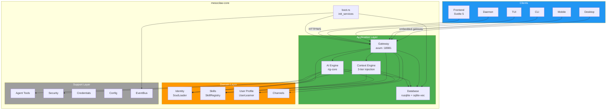

## Data Flow


## Crate Dependency Graph

```mermaid
graph TD
    desktop[mesoclaw-desktop] --> core[mesoclaw-core]
    desktop --> tauri["tauri 2.10<br>#40;app framework#41;"]
    desktop --> winstate["tauri-plugin-window-state<br>#40;persist size/position#41;"]
    desktop --> singleinst["tauri-plugin-single-instance<br>#40;enforce one instance#41;"]
    desktop --> opnr["tauri-plugin-opener<br>#40;open data dir#41;"]
    desktop -.-> devtools["tauri-plugin-devtools<br>#40;feature-gated#41;"]

    mobile[mesoclaw-mobile] --> core
    cli[mesoclaw-cli]
    tui[mesoclaw-tui] --> core
    daemon[mesoclaw-daemon] --> core

    core --> axum["axum<br>#40;gateway#41;"]
    core --> rusqlite["rusqlite<br>#40;database#41;"]
    core --> rigcore["rig-core<br>#40;AI#41;"]
    core --> tokio["tokio<br>#40;async runtime#41;"]
    core --> keyring["keyring<br>#40;credentials#41;"]
    core --> sysinfo["sysinfo<br>#40;system info + processes#41;"]
    core --> ignore["ignore<br>#40;file search#41;"]
    core --> diffy["diffy<br>#40;patch/diff#41;"]
    core --> lru["lru<br>#40;embedding cache#41;"]
    core --> sqlitevec["sqlite-vec<br>#40;vector search#41;"]
    core --> serdeyaml["serde_yaml<br>#40;YAML frontmatter#41;"]
    core --> dashmap["dashmap<br>#40;concurrent registries#41;"]
    core --> websearch["websearch<br>#40;web search providers#41;"]
    core -.-> teloxide["teloxide<br>#40;Telegram, feature-gated#41;"]
    core -.-> serenity["serenity<br>#40;Discord, feature-gated#41;"]

    cli --> reqwest["reqwest<br>#40;HTTP client#41;"]
    cli --> tungstenite["tokio-tungstenite<br>#40;WS client#41;"]
    cli --> clap["clap<br>#40;arg parsing#41;"]
```

## Project Structure

```
mesoclaw/
├── Cargo.toml              # Workspace root (5 members)
├── CLAUDE.md               # AI assistant instructions
├── README.md               # Project documentation
├── scripts/
│   └── build.sh            # Cross-platform build script
├── docs/
│   ├── architecture.md     # This file
│   ├── phases.md           # Implementation phases
│   └── processes.md        # Process flow diagrams
├── plans/
│   ├── phase1_core_foundation.md  # Detailed implementation plan
│   └── migration_plan.md          # v1 → v2 migration strategy
├── tests/
│   ├── phase1_core_foundation.md  # Test plan + results
│   ├── phase2_ai_integration.md   # (planned)
│   └── ...
├── crates/
│   ├── mesoclaw-core/      # Shared library (NO Tauri dependency)
│   │   ├── src/
│   │   │   ├── lib.rs      # Module exports + Result<T> alias
│   │   │   ├── error.rs    # MesoError enum (28 variants, thiserror)
│   │   │   ├── boot.rs     # init_services() -> Services -> AppState, single boot entry point
│   │   │   ├── config/     # TOML config (schema + load/save + OS paths)
│   │   │   ├── db/         # rusqlite pool + WAL + migrations + spawn_blocking
│   │   │   ├── event_bus/  # EventBus trait + TokioBroadcastBus (12 events)
│   │   │   ├── memory/     # Memory trait + SqliteMemoryStore (FTS5 + vectors) + InMemoryStore
│   │   │   ├── credential/ # CredentialStore trait + KeyringStore + InMemoryCredentialStore
│   │   │   ├── security/   # SecurityPolicy + AutonomyLevel + rate limiter + audit log
│   │   │   ├── tools/      # Tool trait + ToolRegistry (DashMap) + 11 tools (shell, file ops, web search, sysinfo, patch, process, learn, skill_proposal)
│   │   │   ├── ai/         # AI agent (rig-core), providers, session manager, tool adapter, context engine
│   │   │   ├── gateway/    # axum HTTP+WS gateway (59+6 routes, auth middleware, error mapping, MESO_VALIDATION)
│   │   │   ├── identity/   # SoulLoader + PromptComposer + defaults (SOUL/IDENTITY/USER.md)
│   │   │   ├── skills/     # SkillRegistry + bundled/user skills (markdown + YAML frontmatter)
│   │   │   ├── user/       # UserLearner + SQLite observations + privacy controls
│   │   │   ├── channels/   # Channel traits + registry + 3 adapters (Telegram/Slack/Discord, feature-gated)
│   │   │   │   ├── mod.rs         # Module exports with feature gates
│   │   │   │   ├── traits.rs      # Channel, ChannelLifecycle, ChannelSender traits
│   │   │   │   ├── message.rs     # ChannelMessage with builder pattern
│   │   │   │   ├── registry.rs    # ChannelRegistry (DashMap-backed)
│   │   │   │   ├── protocol.rs    # ConnectorFrame wire protocol
│   │   │   │   ├── telegram/      # TelegramChannel + config + formatting
│   │   │   │   ├── slack/         # SlackChannel + API helpers + formatting
│   │   │   │   └── discord/       # DiscordChannel + config
│   │   │   └── scheduler/  # Cron + scheduled tasks, feature-gated (Phase 8)
│   │   └── tests/          # Integration tests
│   ├── mesoclaw-desktop/   # Tauri 2.10 shell (desktop)
│   │   ├── Cargo.toml      # tauri 2.10, 4 plugins, devtools feature
│   │   ├── build.rs         # tauri_build::build()
│   │   ├── tauri.conf.json  # 1280x720, CSP, com.sprklai.mesoclaw
│   │   ├── capabilities/default.json
│   │   ├── icons/           # 7 icon files
│   │   └── src/
│   │       ├── main.rs      # Entry + Linux WebKit DMA-BUF fix
│   │       ├── lib.rs       # Builder: plugins, tray, IPC, close-to-tray
│   │       ├── commands.rs  # 4 IPC + boot_gateway() + 7 tests
│   │       └── tray.rs      # Show/Hide/Quit menu + 1 test
│   ├── mesoclaw-mobile/    # Tauri 2 shell (iOS + Android, deferred to Phase 12)
│   ├── mesoclaw-cli/       # clap CLI
│   ├── mesoclaw-tui/       # ratatui TUI
│   └── mesoclaw-daemon/    # Headless daemon (full gateway server)
└── web/                    # Svelte 5 frontend (SPA)
    ├── src/
    │   ├── app.css          # Tailwind v4 + shadcn theme tokens
    │   ├── app.html         # SPA shell
    │   ├── lib/
    │   │   ├── api/         # HTTP client + WebSocket manager
│   │   ├── tauri.ts     # isTauri detection + 4 invoke wrappers
    │   │   ├── components/
    │   │   │   ├── ai-elements/  # svelte-ai-elements (9 component sets)
    │   │   │   ├── ui/      # shadcn-svelte primitives (14 component sets)
    │   │   │   ├── AuthGate.svelte
    │   │   │   ├── ChatView.svelte
    │   │   │   ├── Markdown.svelte
    │   │   │   ├── SessionList.svelte
    │   │   │   └── ThemeToggle.svelte
    │   │   ├── stores/      # 7 Svelte 5 rune stores ($state, includes channels)
    │   │   ├── paraglide/   # i18n (paraglide-js, EN only, 24 keys)
    │   │   └── utils.ts     # shadcn utility helpers
    │   └── routes/          # 9 SPA routes
    │       ├── +page.svelte           # Home
    │       ├── chat/+page.svelte      # New chat
    │       ├── chat/[id]/+page.svelte # Existing session
    │       ├── memory/+page.svelte    # Memory browser
    │       ├── schedule/+page.svelte  # Placeholder (Phase 8)
    │       ├── settings/+page.svelte  # General settings
    │       ├── settings/providers/    # Provider config
    │       ├── settings/channels/     # Channel credential + connection management
    │       └── settings/persona/      # Identity + skills editor
    ├── package.json
    └── vitest.config.ts     # 26 unit tests (vitest)
```

## Default Paths by OS

Resolved via `directories::ProjectDirs::from("com", "sprklai", "mesoclaw")`.

Source: `crates/mesoclaw-core/src/config/mod.rs`

| OS | Config Path | Data Dir / DB Path |
|---|---|---|
| **Linux** | `~/.config/mesoclaw/config.toml` | `~/.local/share/mesoclaw/mesoclaw.db` |
| **macOS** | `~/Library/Application Support/com.sprklai.mesoclaw/config.toml` | `~/Library/Application Support/com.sprklai.mesoclaw/mesoclaw.db` |
| **Windows** | `%APPDATA%\sprklai\mesoclaw\config\config.toml` | `%APPDATA%\sprklai\mesoclaw\data\mesoclaw.db` |

Override in `config.toml`:
```toml
data_dir = "/custom/data/path"        # overrides default data directory
db_path = "/custom/path/mesoclaw.db"  # overrides database file directly
```

## Feature Flag Composition

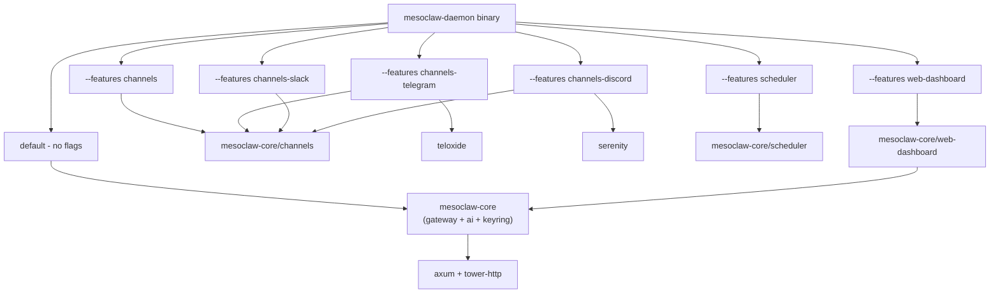

## Trait-Driven Architecture

All major subsystems are abstracted behind traits, allowing swappable implementations for testing, migration, and scaling.

```mermaid
graph TB
    subgraph TraitAbstractions["Trait Abstractions - mesoclaw-core"]
        Memory["dyn Memory<br>SQLite now<br>PostgreSQL + pgvector later"]
        CredStore["dyn CredentialStore<br>Keyring now<br>Vault / cloud KMS later"]
        Channel["dyn Channel<br>openclaw-channels"]
        EvBus["dyn EventBus<br>tokio::broadcast now<br>NATS / Redis later"]
        CompModel["Rig CompletionModel<br>built-in providers now<br>custom providers later"]
    end

    subgraph CurrentImpl["Current Implementations"]
        SQLite["SqliteMemory"]
        Keyring["KeyringStore"]
        TGCh["TelegramChannel"]
        SlackCh["SlackChannel"]
        DiscordCh["DiscordChannel"]
        TokioBus["TokioBroadcastBus"]
        RigProviders["OpenAI / Anthropic / etc."]
    end

    subgraph FutureImpl["Future Implementations"]
        PgVec["PostgreSQL + pgvector"]
        Vault["HashiCorp Vault / KMS"]
        NatsCh["NATS Channel"]
        RedisBus["Redis EventBus"]
        CustomProv["Custom LLM Provider"]
    end

    Memory --> SQLite
    Memory -.-> PgVec
    CredStore --> Keyring
    CredStore -.-> Vault
    Channel --> TGCh
    Channel --> SlackCh
    Channel --> DiscordCh
    Channel -.-> NatsCh
    EvBus --> TokioBus
    EvBus -.-> RedisBus
    CompModel --> RigProviders
    CompModel -.-> CustomProv

    style TraitAbstractions fill:#FF9800,color:#fff
    style CurrentImpl fill:#4CAF50,color:#fff
    style FutureImpl fill:#9E9E9E,color:#fff
```

All binary crates receive these traits via `AppState` (Clone + Arc\<T\>), never concrete types.

## Credential System

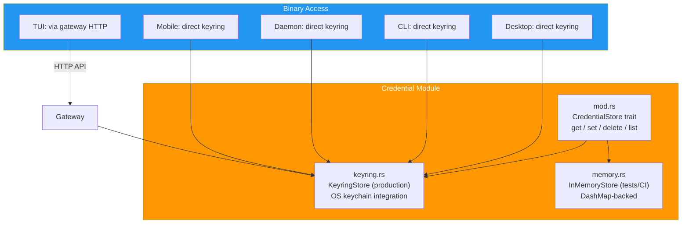

### Per-Binary Keyring Access

| Binary | Keyring Access | Notes |
|---|---|---|
| **Desktop** | Direct | Tauri 2 has full OS access |
| **Mobile** | Direct | Tauri 2 mobile has keychain access |
| **CLI** | Direct | Runs as user process |
| **TUI** | Via gateway | Connects to daemon over HTTP |
| **Daemon** | Direct | Headless, runs as service |

All credential values are wrapped with `zeroize` for secure memory cleanup.

## Provider Registry

The `ProviderRegistry` manages AI provider configurations (OpenAI, Anthropic, Gemini, OpenRouter, Vercel AI Gateway, Ollama, and custom providers). It is DB-backed with 6 built-in providers seeded on first boot.

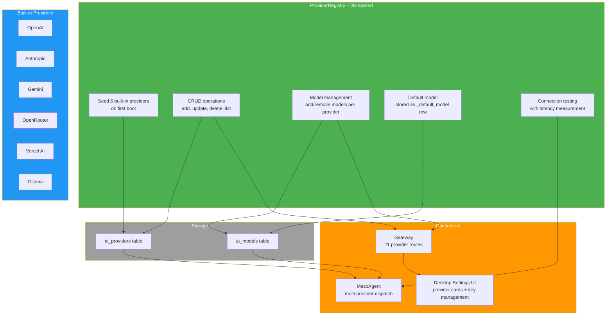

### Credential Key Naming Convention

| Scope | Pattern | Examples |
|---|---|---|
| AI Provider API Keys | `api_key:{provider_id}` | `api_key:openai`, `api_key:tavily`, `api_key:brave` |
| Channel Credentials | `channel:{channel_id}:{field}` | `channel:telegram:token`, `channel:slack:bot_token` |

## Messaging Channels System

The channels module provides trait-based messaging integration with external platforms. Each channel is feature-gated and managed through a concurrent `ChannelRegistry`.

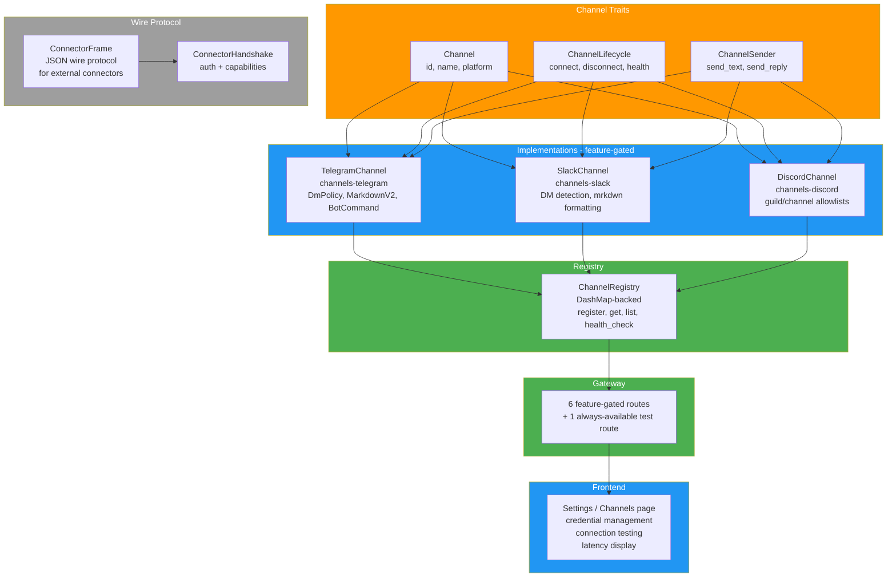

### Feature Flags

| Feature | Depends On | Adds |
|---|---|---|
| `channels` | (none) | Core channel traits + registry + gateway routes |
| `channels-telegram` | `channels` | TelegramChannel + teloxide dependency |
| `channels-slack` | `channels` | SlackChannel (uses existing reqwest/tungstenite) |
| `channels-discord` | `channels` | DiscordChannel + serenity dependency |

## Identity / Soul System

Identity defines the AI assistant's personality, tone, and behavior through 3 markdown files with YAML frontmatter. All prompt content comes from `.md` files — zero hardcoded prompt strings in Rust code.

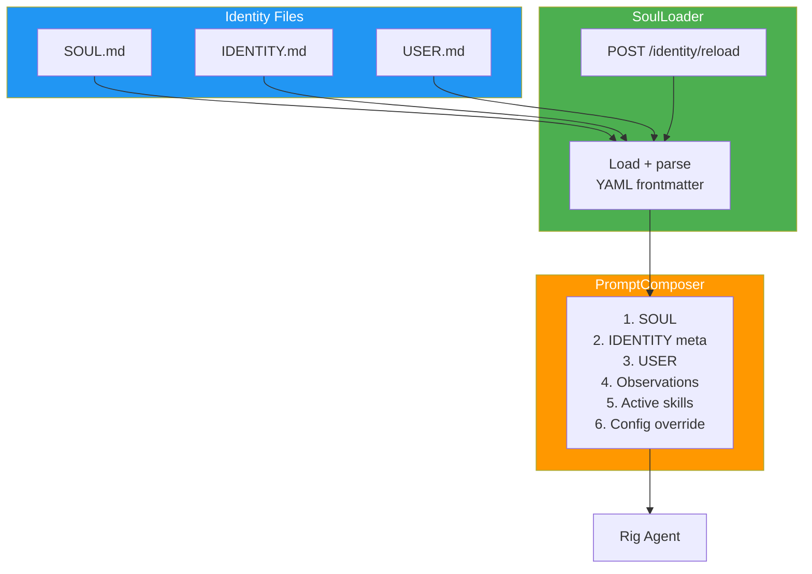

### Identity File Format (IDENTITY.md)

```markdown
---
name: MesoClaw
version: "2.0"
description: AI-powered assistant
---

# Identity details...
```

- **Storage**: `data_dir/identity/` (configurable via `identity_dir` in config.toml)
- **Bundled defaults**: embedded via `include_str!()` at compile time, written to disk on first run
- **Reload**: manual via `POST /identity/reload` endpoint (no `notify` dependency)
- **API**: `GET /identity`, `GET /identity/{name}`, `PUT /identity/{name}`, `POST /identity/reload`

## Skills System

Skills are instructional markdown documents loaded into the agent's context. They follow the Claude Code model — pure markdown with YAML frontmatter metadata, no parameter substitution.

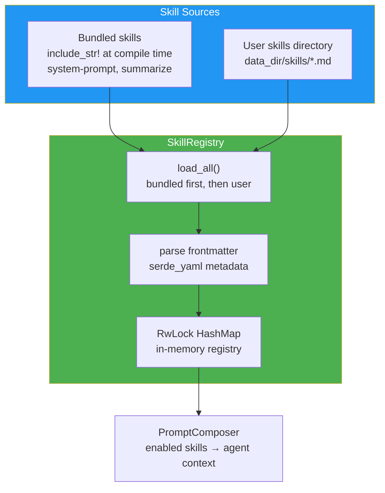

### Skill File Format (Claude Code model)

```markdown
---
name: system-prompt
description: Generates effective system prompts for AI agents
category: meta
---

# System Prompt Generator

When creating system prompts, follow these principles:
...
```

- **No Tera/comrak**: Skills are pure markdown context documents, not parameterized templates
- **2 tiers**: Bundled (compile-time) + User (disk). User skills with same id override bundled.
- **API**: `GET /skills`, `GET /skills/{id}`, `POST /skills`, `PUT /skills/{id}`, `DELETE /skills/{id}`, `POST /skills/reload`
- **Bundled skills cannot be deleted** — only user skills support DELETE

## User Profile + Progressive Learning

MesoClaw learns user preferences over time via explicit observation API. Observations are stored in SQLite with category-based organization and confidence scoring.

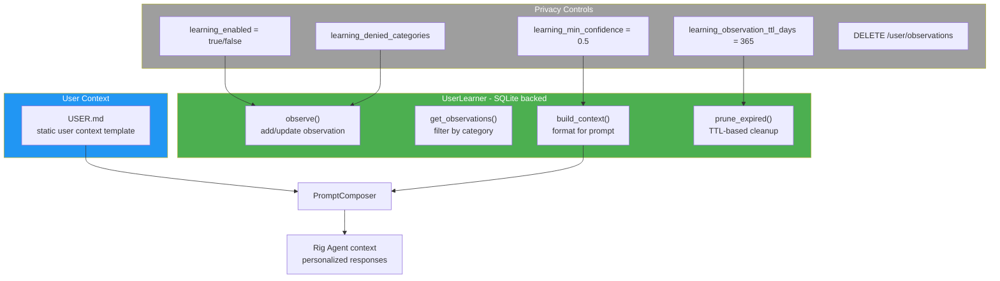

- **USER.md**: static user context template (part of identity system)
- **UserLearner**: SQLite-backed observation store with CRUD operations
- **Observations**: stored in `user_observations` table with category, key, value, confidence, timestamps
- **Privacy**: learning toggled via config, denied categories block specific observation types, TTL auto-expires old observations
- **API**: `GET /user/observations`, `POST /user/observations`, `GET /user/observations/{key}`, `DELETE /user/observations/{key}`, `DELETE /user/observations`, `GET /user/profile`

## Context-Aware Agent System

The context engine provides 3-tier adaptive context injection that reduces token usage while keeping the agent contextually grounded.

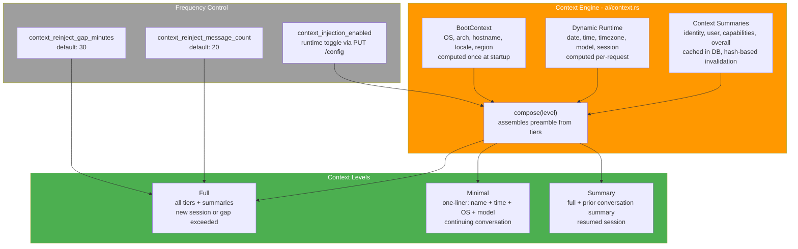

### Context Level Determination

| Condition | Level | Content |
|---|---|---|
| New session (0 messages) | Full | Boot + runtime + identity + user + capabilities |
| Continuing (recent messages, within gap) | Minimal | One-liner: "MesoClaw — AI assistant \| date \| OS \| model" |
| Gap exceeded (> N minutes since last msg) | Full | Same as new session |
| Message count threshold exceeded | Full | Same as new session |
| Resumed session with prior messages | Summary | Full + prior conversation summary |
| Toggle disabled | Fallback | Config `agent_system_prompt` or default preamble |

### DB Schema (migration v5)

- `context_summaries` — cached AI-generated summaries with hash-based change detection
- `skill_proposals` — human-in-the-loop skill change approval workflow
- `sessions.summary` — conversation summary column for session resume

## Self-Evolving Framework

The agent can learn user preferences and propose skill changes, all subject to human approval.

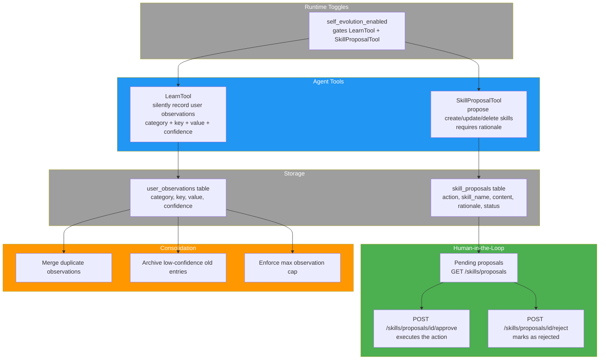

## Gateway Routes

All clients communicate via the HTTP+WebSocket gateway at `127.0.0.1:18981`. Routes are grouped by subsystem (59 base + 6 feature-gated = 65 total through Phase 8 Step 15.3b).

### Health (1 route, no auth)

| Method | Path | Description |
|---|---|---|
| GET | `/health` | Health check |

### Sessions & Chat (9 routes)

| Method | Path | Description |
|---|---|---|
| POST | `/sessions` | Create new chat session |
| GET | `/sessions` | List all sessions |
| GET | `/sessions/{id}` | Get session details |
| PUT | `/sessions/{id}` | Update session |
| DELETE | `/sessions/{id}` | Delete session |
| POST | `/sessions/{id}/generate-title` | Auto-generate session title via AI |
| GET | `/sessions/{id}/messages` | Get messages for a session |
| POST | `/sessions/{id}/messages` | Send message to session |

### Chat (1 route)

| Method | Path | Description |
|---|---|---|
| POST | `/chat` | Chat with AI agent |

### Memory (5 routes)

| Method | Path | Description |
|---|---|---|
| POST | `/memory` | Create memory entry |
| GET | `/memory` | Recall/search memories |
| GET | `/memory/{key}` | Get memory by key |
| PUT | `/memory/{key}` | Update memory by key |
| DELETE | `/memory/{key}` | Delete memory by key |

### Configuration (2 routes)

| Method | Path | Description |
|---|---|---|
| GET | `/config` | Get current configuration (auth token redacted) |
| PUT | `/config` | Update configuration |

### Credentials (5 routes)

| Method | Path | Description |
|---|---|---|
| POST | `/credentials` | Set a credential (key + value) |
| GET | `/credentials` | List all credential keys (values hidden) |
| DELETE | `/credentials/{key}` | Delete a credential |
| GET | `/credentials/{key}/value` | Get credential value (explicit retrieval) |
| GET | `/credentials/{key}/exists` | Check if credential exists |

### Providers & Models (12 routes)

| Method | Path | Description |
|---|---|---|
| GET | `/providers` | List all providers |
| POST | `/providers` | Create user-defined provider |
| GET | `/providers/with-key-status` | List providers with API key status |
| GET | `/providers/default` | Get default model |
| PUT | `/providers/default` | Set default model |
| GET | `/providers/{id}` | Get provider details |
| PUT | `/providers/{id}` | Update provider |
| DELETE | `/providers/{id}` | Delete user-defined provider |
| POST | `/providers/{id}/test` | Test provider connection (with latency) |
| POST | `/providers/{id}/models` | Add model to provider |
| DELETE | `/providers/{id}/models/{model_id}` | Delete model from provider |
| GET | `/models` | List all available models across providers |

### Tools (2 routes)

| Method | Path | Description |
|---|---|---|
| GET | `/tools` | List available tools |
| POST | `/tools/{name}/execute` | Execute a tool by name |

### System (1 route)

| Method | Path | Description |
|---|---|---|
| GET | `/system/info` | System information |

### WebSocket Channels (1 route)

| Path | Description |
|---|---|
| `/ws/chat` | Streaming chat responses |

### Identity (4 routes)

| Method | Path | Description |
|---|---|---|
| GET | `/identity` | List all identity files |
| GET | `/identity/{name}` | Get identity file content |
| PUT | `/identity/{name}` | Update identity file content |
| POST | `/identity/reload` | Force reload all identity files |

### Skills (6 routes)

| Method | Path | Description |
|---|---|---|
| GET | `/skills` | List all skills (optional `?category=` filter) |
| GET | `/skills/{id}` | Get full skill definition |
| POST | `/skills` | Create user skill |
| PUT | `/skills/{id}` | Update skill content |
| DELETE | `/skills/{id}` | Delete user skill (bundled cannot be deleted) |
| POST | `/skills/reload` | Force reload all skills |

### Skill Proposals (4 routes)

| Method | Path | Description |
|---|---|---|
| GET | `/skills/proposals` | List pending skill proposals |
| POST | `/skills/proposals/{id}/approve` | Approve and execute a proposal |
| POST | `/skills/proposals/{id}/reject` | Reject a proposal |
| DELETE | `/skills/proposals/{id}` | Delete a proposal |

### User Profile + Learning (6 routes)

| Method | Path | Description |
|---|---|---|
| GET | `/user/observations` | List observations (optional `?category=` filter) |
| POST | `/user/observations` | Add observation |
| GET | `/user/observations/{key}` | Get observation by key |
| DELETE | `/user/observations/{key}` | Delete observation by key |
| DELETE | `/user/observations` | Clear all observations |
| GET | `/user/profile` | Get computed user context string |

### Channels (7 routes, 6 feature-gated)

| Method | Path | Feature | Description |
|---|---|---|---|
| POST | `/channels/{name}/test` | always | Test channel credentials |
| GET | `/channels` | `channels` | List registered channels with status |
| GET | `/channels/{name}/status` | `channels` | Get channel status |
| POST | `/channels/{name}/send` | `channels` | Send message via channel |
| POST | `/channels/{name}/connect` | `channels` | Connect channel |
| POST | `/channels/{name}/disconnect` | `channels` | Disconnect channel |
| GET | `/channels/{name}/health` | `channels` | Health check |

### Future Phases (not yet implemented)

| Group | Routes | Phase |
|---|---|---|
| Scheduler | 4 routes (feature-gated) | Phase 8 |
| WebSocket `/ws/events`, `/ws/agents` | 2 channels | Phase 8+ |

## Desktop App Architecture

The desktop app is a Tauri 2.10 shell wrapping the SvelteKit SPA frontend. It embeds the gateway server by default, so no separate daemon process is required.

### Tauri Plugins

| Plugin | Version | Purpose |
|---|---|---|
| tray-icon | built-in | System tray with Show/Hide/Quit menu |
| window-state | 2.4.1 | Persist window size, position, maximized state |
| single-instance | 2.4.0 | Enforce single running instance, focus existing |
| opener | 2.5.3 | Open data directory in OS file manager |
| devtools | 2.0.1 | WebView inspector (feature-gated, dev only) |

### IPC Commands

| Command | Description |
|---|---|
| `close_to_tray` | Hide window to system tray |
| `show_window` | Show and focus the main window |
| `get_app_version` | Return app version string |
| `open_data_dir` | Open MesoClaw data directory in OS file manager |

### Desktop Boot Flow

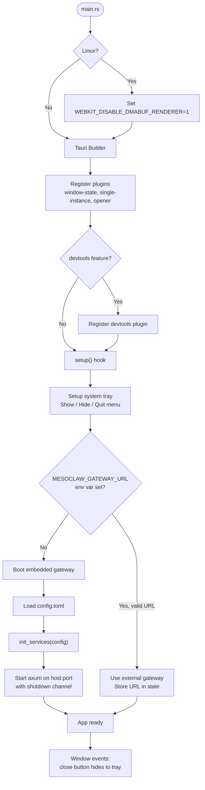

### Hybrid Gateway Architecture

The desktop app supports two gateway modes:

1. **Embedded** (default): The gateway server starts in a background Tokio task during `setup()`. A `oneshot` channel provides graceful shutdown. This is the zero-configuration path -- users launch the desktop app and everything works.

2. **External**: If `MESOCLAW_GATEWAY_URL` is set to a valid URL, the desktop app connects to an external daemon instead of starting its own gateway. Useful for multi-device setups or when running the daemon as a system service.

### Frontend Integration

The frontend detects the Tauri environment via `window.__TAURI__` and provides typed wrappers in `web/src/lib/tauri.ts`:

- `isTauri` -- boolean flag for environment detection
- `closeToTray()` -- invoke `close_to_tray` IPC command
- `showWindow()` -- invoke `show_window` IPC command
- `getAppVersion()` -- invoke `get_app_version` IPC command
- `openDataDir()` -- invoke `open_data_dir` IPC command

All wrappers are no-ops when running in a browser (non-Tauri) context, so the same frontend works for both desktop and web.

## Concurrency Rules

These rules are enforced across the entire codebase to prevent async runtime issues.

| Rule | Rationale |
|---|---|
| No `std::sync::Mutex` in async paths | Blocks the tokio runtime; use `tokio::sync::Mutex` or `DashMap` |
| No `block_on()` anywhere | Panics inside tokio runtime; use `tokio::spawn` or `.await` |
| All SQLite ops via `spawn_blocking` | `rusqlite` is synchronous; blocking in async context starves tasks |
| All errors are `MesoError` | No `Result<T, String>`; use `thiserror` enum with typed variants |
| `AppState` is `Clone + Arc<T>` | Shared across axum handlers without lifetime issues |
| `EventBus` uses `tokio::sync::broadcast` | Lock-free fan-out to all subscribers |
| Never hold async locks across `.await` | Prevents deadlocks; acquire, use, drop before yielding |

## Lessons Learned from v1

Key architectural mistakes from MesoClaw v1 and how v2 prevents them.

| v1 Mistake | v2 Prevention |
|---|---|
| `std::sync::Mutex` in async code | `tokio::sync::Mutex` or `DashMap` exclusively |
| `block_on()` in event loop | Zero `block_on()` calls; `tokio::spawn` for sync work |
| `Result<T, String>` everywhere | `MesoError` enum with `thiserror` |
| Custom AI layer (1400 LOC) | `rig-core` (battle-tested, 18 providers) |
| 21 Zustand stores | 6 Svelte 5 rune stores ($state), single WS connection |
| 165 IPC commands (Tauri v1) | Gateway-only architecture (~40 HTTP routes) |
| OKLCH color functions in CSS | Pre-computed hex values only |
| useEffect soup (React) | Single `$effect` per Svelte component, reactive stores |
| 13-phase boot sequence | Single `init_services()` in `boot.rs` |