# Zenii Architecture

## Table of Contents

- [System Architecture](#system-architecture)
- [Data Flow](#data-flow)
- [Crate Dependency Graph](#crate-dependency-graph)
- [Project Structure](#project-structure)
- [Default Paths by OS](#default-paths-by-os)
- [Feature Flag Composition](#feature-flag-composition)
- [Trait-Driven Architecture](#trait-driven-architecture)
- [Credential System](#credential-system)
- [Provider Registry](#provider-registry)
- [Messaging Channels System](#messaging-channels-system)
- [Identity / Soul System](#identity--soul-system)
- [Skills System](#skills-system)
- [User Profile + Progressive Learning](#user-profile--progressive-learning)
- [Gateway Routes](#gateway-routes)
- [Desktop App Architecture](#desktop-app-architecture)
- [Context-Aware Agent System](#context-aware-agent-system)
- [Self-Evolving Framework](#self-evolving-framework)
- [Scheduler Notification Flow](#scheduler-notification-flow-stage-861)
- [Channel Router Pipeline](#channel-router-pipeline-stage-87)
- [Channel Lifecycle Hooks](#channel-lifecycle-hooks-stage-88)
- [Test Debt and Hardening](#test-debt--hardening-stage-89)
- [Agent Action Tools](#agent-action-tools-phase-810)
- [Autonomous Reasoning Engine](#autonomous-reasoning-engine-phase-811)
- [Semantic Memory and Embeddings](#semantic-memory-and-embeddings-phase-811)
- [Phase 18 Hardening](#phase-18-hardening)
- [Plugin Architecture](#plugin-architecture-phase-9)
- [Context-Driven Auto-Discovery](#context-driven-auto-discovery)
- [AgentSelfTool](#agentselftool)
- [OpenAPI Documentation](#openapi-documentation)
- [Onboarding Flow](#onboarding-flow)
- [Tool Permission System](#tool-permission-system-phase-19)
- [Model Capability Validation](#model-capability-validation)
- [Concurrency Rules](#concurrency-rules)
- [Lessons Learned from v1](#lessons-learned-from-v1)

---

## System Architecture

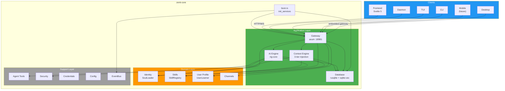

## Data Flow

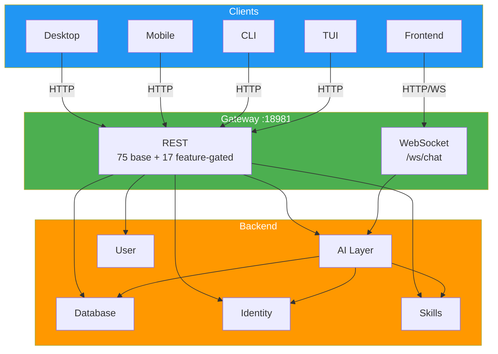

## Crate Dependency Graph

```mermaid
graph TD
    desktop[zenii-desktop] --> core[zenii-core]
    desktop --> tauri["tauri 2.10<br>#40;app framework#41;"]
    desktop --> winstate["tauri-plugin-window-state<br>#40;persist size/position#41;"]
    desktop --> singleinst["tauri-plugin-single-instance<br>#40;enforce one instance#41;"]
    desktop --> opnr["tauri-plugin-opener<br>#40;open data dir#41;"]
    desktop -.-> devtools["tauri-plugin-devtools<br>#40;feature-gated#41;"]

    mobile["zenii-mobile<br>#40;future#41;"] -.-> core
    cli[zenii-cli]
    tui["zenii-tui<br>#40;future#41;"] -.-> core
    daemon[zenii-daemon] --> core

    core --> axum["axum<br>#40;gateway#41;"]
    core --> rusqlite["rusqlite<br>#40;database#41;"]
    core --> rigcore["rig-core<br>#40;AI#41;"]
    core --> tokio["tokio<br>#40;async runtime#41;"]
    core --> keyring["keyring<br>#40;credentials#41;"]
    core --> sysinfo["sysinfo<br>#40;system info + processes#41;"]
    core --> ignore["ignore<br>#40;file search#41;"]
    core --> diffy["diffy<br>#40;patch/diff#41;"]
    core --> lru["lru<br>#40;embedding cache#41;"]
    core --> sqlitevec["sqlite-vec<br>#40;vector search#41;"]
    core --> serdeyaml["serde_yaml<br>#40;YAML frontmatter#41;"]
    core --> dashmap["dashmap<br>#40;concurrent registries#41;"]
    core --> websearch["websearch<br>#40;web search providers#41;"]
    core -.-> teloxide["teloxide<br>#40;Telegram, feature-gated#41;"]
    core -.-> serenity["serenity<br>#40;Discord, feature-gated#41;"]

    cli --> reqwest["reqwest<br>#40;HTTP client#41;"]
    cli --> tungstenite["tokio-tungstenite<br>#40;WS client#41;"]
    cli --> clap["clap<br>#40;arg parsing#41;"]
```

## Project Structure

```
zenii/
├── Cargo.toml              # Workspace root (5 members)
├── CLAUDE.md               # AI assistant instructions
├── README.md               # Project documentation
├── scripts/
│   └── build.sh            # Cross-platform build script
├── docs/
│   ├── architecture.md     # This file
│   └── processes.md        # Process flow diagrams
├── crates/
│   ├── zenii-core/      # Shared library (NO Tauri dependency)
│   │   ├── src/
│   │   │   ├── lib.rs      # Module exports + Result<T> alias
│   │   │   ├── error.rs    # ZeniiError enum (30 variants, thiserror)
│   │   │   ├── boot.rs     # init_services() -> Services -> AppState, single boot entry point
│   │   │   ├── config/     # TOML config (schema + load/save + OS paths)
│   │   │   ├── db/         # rusqlite pool + WAL + migrations + spawn_blocking
│   │   │   ├── event_bus/  # EventBus trait + TokioBroadcastBus (12 events)
│   │   │   ├── memory/     # Memory trait + SqliteMemoryStore (FTS5 + vectors) + InMemoryStore
│   │   │   ├── credential/ # CredentialStore trait + KeyringStore + InMemoryCredentialStore
│   │   │   ├── security/   # SecurityPolicy + AutonomyLevel + rate limiter + audit log
│   │   │   ├── tools/      # Tool trait + ToolRegistry (DashMap) + 16 tools (14 base + 2 feature-gated)
│   │   │   ├── ai/         # AI agent (rig-core), providers, session manager, tool adapter, context engine
│   │   │   ├── gateway/    # axum HTTP+WS gateway (75 base + 17 feature-gated routes, auth middleware, error mapping, ZENII_VALIDATION)
│   │   │   ├── identity/   # SoulLoader + PromptComposer + defaults (SOUL/IDENTITY/USER.md)
│   │   │   ├── skills/     # SkillRegistry + bundled/user skills (markdown + YAML frontmatter)
│   │   │   ├── user/       # UserLearner + SQLite observations + privacy controls
│   │   │   ├── channels/   # Channel traits + registry + 3 adapters (Telegram/Slack/Discord, feature-gated)
│   │   │   │   ├── mod.rs         # Module exports with feature gates
│   │   │   │   ├── traits.rs      # Channel, ChannelLifecycle, ChannelSender traits
│   │   │   │   ├── message.rs     # ChannelMessage with builder pattern
│   │   │   │   ├── registry.rs    # ChannelRegistry (DashMap-backed)
│   │   │   │   ├── protocol.rs    # ConnectorFrame wire protocol
│   │   │   │   ├── telegram/      # TelegramChannel + config + formatting
│   │   │   │   ├── slack/         # SlackChannel + API helpers + formatting
│   │   │   │   └── discord/       # DiscordChannel + config
│   │   │   └── scheduler/  # Cron + scheduled tasks, feature-gated (Phase 8)
│   │   └── tests/          # Integration tests
│   ├── zenii-desktop/   # Tauri 2.10 shell (desktop)
│   │   ├── Cargo.toml      # tauri 2.10, 4 plugins, devtools feature
│   │   ├── build.rs         # tauri_build::build()
│   │   ├── tauri.conf.json  # 1280x720, CSP, com.sprklai.zenii
│   │   ├── capabilities/default.json
│   │   ├── icons/           # 7 icon files
│   │   └── src/
│   │       ├── main.rs      # Entry + Linux WebKit DMA-BUF fix
│   │       ├── lib.rs       # Builder: plugins, tray, IPC, close-to-tray
│   │       ├── commands.rs  # 4 IPC + boot_gateway() + 7 tests
│   │       └── tray.rs      # Show/Hide/Quit menu + 1 test
│   ├── zenii-mobile/    # Tauri 2 shell (iOS + Android) (future release)
│   ├── zenii-cli/       # clap CLI
│   ├── zenii-tui/       # ratatui TUI
│   └── zenii-daemon/    # Headless daemon (full gateway server)
└── web/                    # Svelte 5 frontend (SPA)
    ├── src/
    │   ├── app.css          # Tailwind v4 + shadcn theme tokens
    │   ├── app.html         # SPA shell
    │   ├── lib/
    │   │   ├── api/         # HTTP client + WebSocket manager
│   │   ├── tauri.ts     # isTauri detection + 4 invoke wrappers
    │   │   ├── components/
    │   │   │   ├── ai-elements/  # svelte-ai-elements (9 component sets)
    │   │   │   ├── ui/      # shadcn-svelte primitives (14 component sets)
    │   │   │   ├── AuthGate.svelte
    │   │   │   ├── ChatView.svelte
    │   │   │   ├── Markdown.svelte
    │   │   │   ├── SessionList.svelte
    │   │   │   └── ThemeToggle.svelte
    │   │   ├── stores/      # 7 Svelte 5 rune stores ($state, includes channels)
    │   │   ├── paraglide/   # i18n (paraglide-js, EN only, 24 keys)
    │   │   └── utils.ts     # shadcn utility helpers
    │   └── routes/          # 9 SPA routes
    │       ├── +page.svelte           # Home
    │       ├── chat/+page.svelte      # New chat
    │       ├── chat/[id]/+page.svelte # Existing session
    │       ├── memory/+page.svelte    # Memory browser
    │       ├── schedule/+page.svelte  # Placeholder (Phase 8)
    │       ├── settings/+page.svelte  # General settings
    │       ├── settings/providers/    # Provider config
    │       ├── settings/channels/     # Channel credential + connection management
    │       └── settings/persona/      # Identity + skills editor
    ├── package.json
    └── vitest.config.ts     # 26 unit tests (vitest)
```

## Default Paths by OS

Resolved via `directories::ProjectDirs::from("com", "sprklai", "zenii")`.

Source: `crates/zenii-core/src/config/mod.rs`

| OS | Config Path | Data Dir / DB Path |
|---|---|---|
| **Linux** | `~/.config/zenii/config.toml` | `~/.local/share/zenii/zenii.db` |
| **macOS** | `~/Library/Application Support/com.sprklai.zenii/config.toml` | `~/Library/Application Support/com.sprklai.zenii/zenii.db` |
| **Windows** | `%APPDATA%\sprklai\zenii\config\config.toml` | `%APPDATA%\sprklai\zenii\data\zenii.db` |

Override in `config.toml`:
```toml
data_dir = "/custom/data/path"        # overrides default data directory
db_path = "/custom/path/zenii.db"  # overrides database file directly
```

## Feature Flag Composition

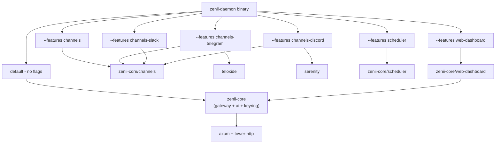

## Trait-Driven Architecture

All major subsystems are abstracted behind traits, allowing swappable implementations for testing, migration, and scaling.


All binary crates receive these traits via `AppState` (Clone + Arc\<T\>), never concrete types.

## Credential System

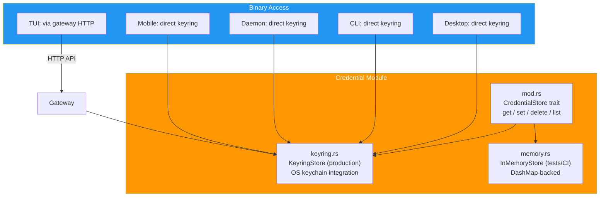

### Per-Binary Keyring Access

| Binary | Keyring Access | Notes |
|---|---|---|
| **Desktop** | Direct | Tauri 2 has full OS access |
| **Mobile** | Direct | Tauri 2 mobile has keychain access |
| **CLI** | Direct | Runs as user process |
| **TUI** | Via gateway | Connects to daemon over HTTP |
| **Daemon** | Direct | Headless, runs as service |

All credential values are wrapped with `zeroize` for secure memory cleanup.

## Provider Registry

The `ProviderRegistry` manages AI provider configurations (OpenAI, Anthropic, Gemini, OpenRouter, Vercel AI Gateway, Ollama, and custom providers). It is DB-backed with 6 built-in providers seeded on first boot.


### Credential Key Naming Convention

| Scope | Pattern | Examples |
|---|---|---|
| AI Provider API Keys | `api_key:{provider_id}` | `api_key:openai`, `api_key:tavily`, `api_key:brave` |
| Channel Credentials | `channel:{channel_id}:{field}` | `channel:telegram:token`, `channel:slack:bot_token` |

## Messaging Channels System

The channels module provides trait-based messaging integration with external platforms. Each channel is feature-gated and managed through a concurrent `ChannelRegistry`.

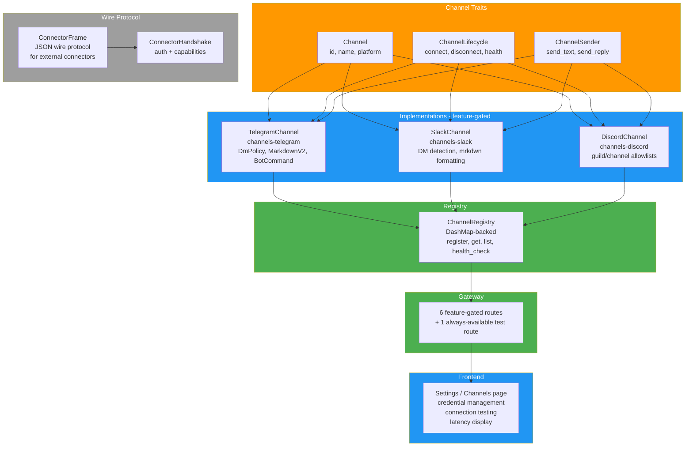

### Feature Flags

| Feature | Depends On | Adds |
|---|---|---|
| `channels` | (none) | Core channel traits + registry + gateway routes |
| `channels-telegram` | `channels` | TelegramChannel + teloxide dependency |
| `channels-slack` | `channels` | SlackChannel (uses existing reqwest/tungstenite) |
| `channels-discord` | `channels` | DiscordChannel + serenity dependency |

## Identity / Soul System

Identity defines the AI assistant's personality, tone, and behavior through 3 markdown files with YAML frontmatter. All prompt content comes from `.md` files — zero hardcoded prompt strings in Rust code.

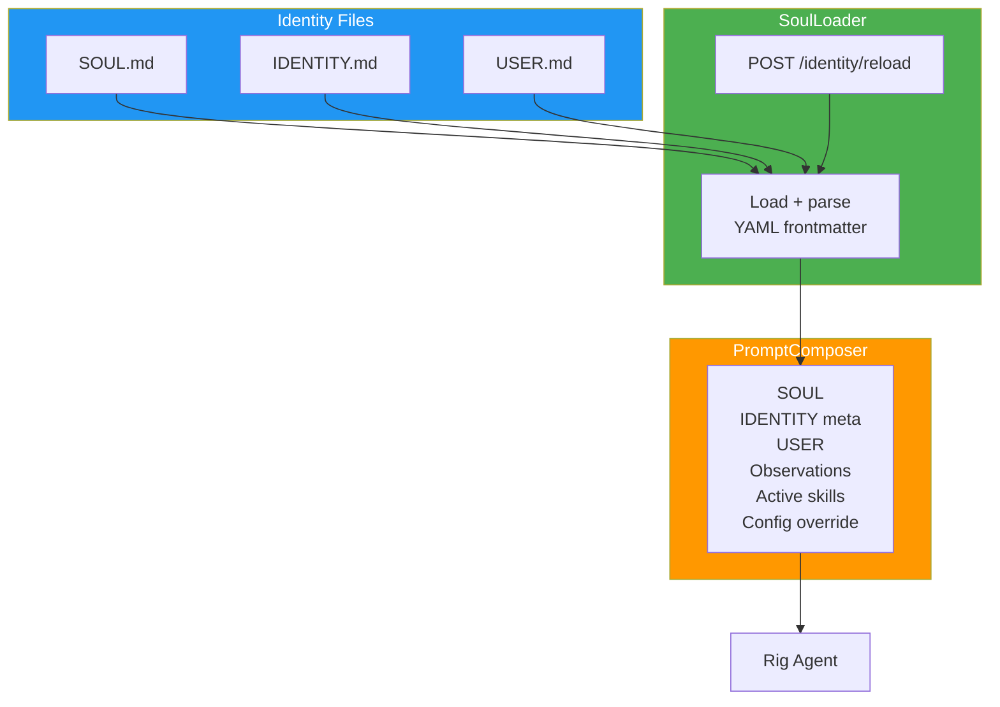

### Identity File Format (IDENTITY.md)

```markdown
---
name: Zenii
version: "2.0"
description: AI-powered assistant
---

# Identity details...
```

- **Storage**: `data_dir/identity/` (configurable via `identity_dir` in config.toml)
- **Bundled defaults**: embedded via `include_str!()` at compile time, written to disk on first run
- **Reload**: manual via `POST /identity/reload` endpoint (no `notify` dependency)
- **API**: `GET /identity`, `GET /identity/{name}`, `PUT /identity/{name}`, `POST /identity/reload`

## Skills System

Skills are instructional markdown documents loaded into the agent's context. They follow the Claude Code model — pure markdown with YAML frontmatter metadata, no parameter substitution.

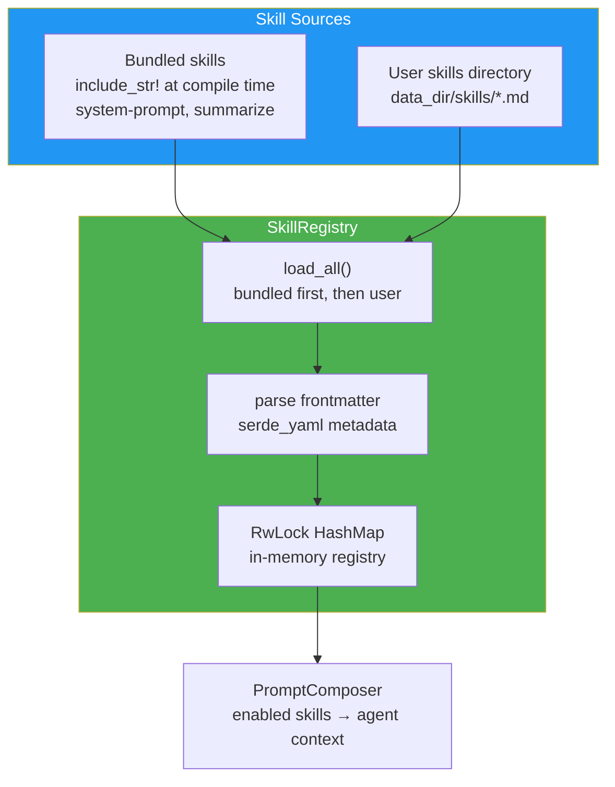

### Skill File Format (Claude Code model)

```markdown
---
name: system-prompt
description: Generates effective system prompts for AI agents
category: meta
---

# System Prompt Generator

When creating system prompts, follow these principles:
...
```

- **No Tera/comrak**: Skills are pure markdown context documents, not parameterized templates
- **2 tiers**: Bundled (compile-time) + User (disk). User skills with same id override bundled.
- **API**: `GET /skills`, `GET /skills/{id}`, `POST /skills`, `PUT /skills/{id}`, `DELETE /skills/{id}`, `POST /skills/reload`
- **Bundled skills cannot be deleted** — only user skills support DELETE

## User Profile + Progressive Learning

Zenii learns user preferences over time via explicit observation API. Observations are stored in SQLite with category-based organization and confidence scoring.

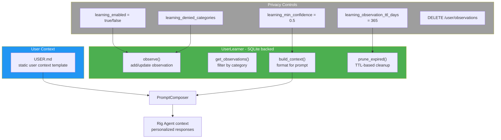

- **USER.md**: static user context template (part of identity system)
- **UserLearner**: SQLite-backed observation store with CRUD operations
- **Observations**: stored in `user_observations` table with category, key, value, confidence, timestamps
- **Privacy**: learning toggled via config, denied categories block specific observation types, TTL auto-expires old observations
- **API**: `GET /user/observations`, `POST /user/observations`, `GET /user/observations/{key}`, `DELETE /user/observations/{key}`, `DELETE /user/observations`, `GET /user/profile`

## Context-Aware Agent System

The context engine provides 3-tier adaptive context injection that reduces token usage while keeping the agent contextually grounded.

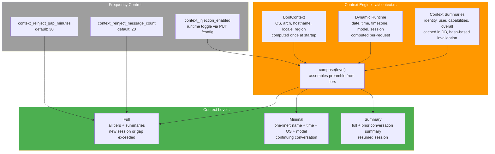

### Context Level Determination

| Condition | Level | Content |
|---|---|---|
| New session (0 messages) | Full | Boot + runtime + identity + user + capabilities |
| Continuing (recent messages, within gap) | Minimal | One-liner: "Zenii — AI assistant \| date \| OS \| model" |
| Gap exceeded (> N minutes since last msg) | Full | Same as new session |
| Message count threshold exceeded | Full | Same as new session |
| Resumed session with prior messages | Summary | Full + prior conversation summary |
| Toggle disabled | Fallback | Config `agent_system_prompt` or default preamble |

### Prompt Strategy System

The prompt strategy system (Phase 8.13) replaces the dual-compose pipeline with a plugin-based architecture that reduces preamble tokens by ~65%:

```
PromptStrategyRegistry (implements PromptStrategy)
  ├── base: CompactStrategy or LegacyStrategy
  │     └── Layers 0 + 1 + 3 (identity, runtime, overrides)
  └── plugins: Vec<Arc<dyn PromptPlugin>>
        ├── MemoryPlugin (always)
        ├── UserObservationsPlugin (always)
        ├── SkillsPlugin (always)
        ├── LearnedRulesPlugin (if self_evolution)
        ├── ChannelContextPlugin (feature: channels)
        └── SchedulerContextPlugin (feature: scheduler)
```

Handlers call `state.prompt_strategy.assemble(&AssemblyRequest)` -- a single entry point that:
1. Base strategy produces Layer 0 (identity), Layer 1 (runtime), Layer 3 (overrides)
2. Plugins contribute Layer 2 fragments with domain filtering and priority
3. Registry merges all fragments and applies token budget trimming

Config: `prompt_compact_identity` (default true) selects CompactStrategy vs LegacyStrategy. `prompt_max_preamble_tokens` (default 1500) controls the overflow budget.

### DB Schema (migration v5)

- `context_summaries` — cached AI-generated summaries with hash-based change detection
- `skill_proposals` — human-in-the-loop skill change approval workflow
- `sessions.summary` — conversation summary column for session resume

## Self-Evolving Framework

The agent can learn user preferences and propose skill changes, all subject to human approval.

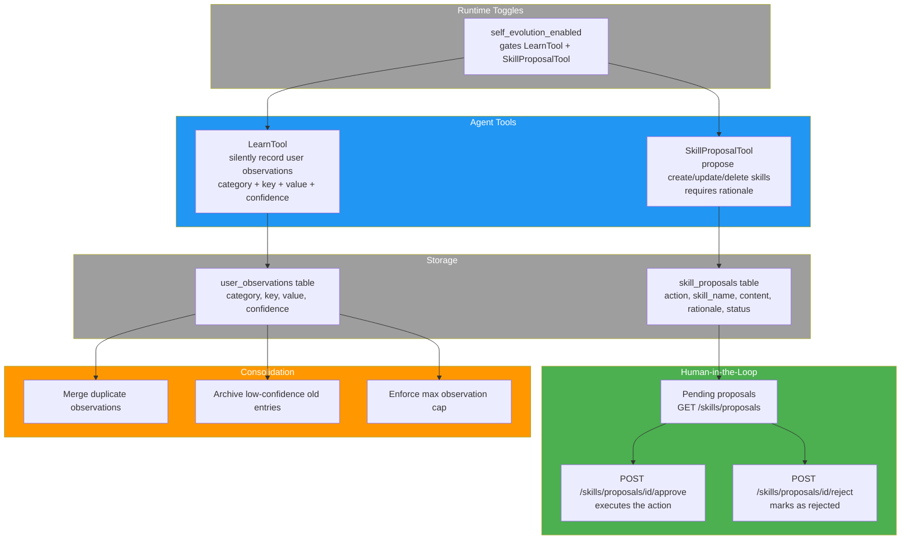

## Gateway Routes

All clients communicate via the HTTP+WebSocket gateway at `localhost:18981`. Routes are grouped by subsystem (79 base + 17 feature-gated = 96 total).

### Health (1 route, no auth)

| Method | Path | Description |
|---|---|---|
| GET | `/health` | Health check |

### Sessions & Chat (9 routes)

| Method | Path | Description |
|---|---|---|
| POST | `/sessions` | Create new chat session |
| GET | `/sessions` | List all sessions |
| GET | `/sessions/{id}` | Get session details |
| PUT | `/sessions/{id}` | Update session |
| DELETE | `/sessions/{id}` | Delete session |
| POST | `/sessions/{id}/generate-title` | Auto-generate session title via AI |
| GET | `/sessions/{id}/messages` | Get messages for a session |
| POST | `/sessions/{id}/messages` | Send message to session |

### Chat (1 route)

| Method | Path | Description |
|---|---|---|
| POST | `/chat` | Chat with AI agent |

### Memory (5 routes)

| Method | Path | Description |
|---|---|---|
| POST | `/memory` | Create memory entry |
| GET | `/memory` | Recall/search memories |
| GET | `/memory/{key}` | Get memory by key |
| PUT | `/memory/{key}` | Update memory by key |
| DELETE | `/memory/{key}` | Delete memory by key |

### Configuration (3 routes)

| Method | Path | Description |
|---|---|---|
| GET | `/config` | Get current configuration (auth token redacted) |
| PUT | `/config` | Update configuration |
| GET | `/config/file` | Get raw config file content |

### Setup / Onboarding (1 route)

| Method | Path | Description |
|---|---|---|
| GET | `/setup/status` | Check if first-run setup is needed (missing location/timezone) |

### Credentials (5 routes)

| Method | Path | Description |
|---|---|---|
| POST | `/credentials` | Set a credential (key + value) |
| GET | `/credentials` | List all credential keys (values hidden) |
| DELETE | `/credentials/{key}` | Delete a credential |
| GET | `/credentials/{key}/value` | Get credential value (explicit retrieval) |
| GET | `/credentials/{key}/exists` | Check if credential exists |

### Providers & Models (12 routes)

| Method | Path | Description |
|---|---|---|
| GET | `/providers` | List all providers |
| POST | `/providers` | Create user-defined provider |
| GET | `/providers/with-key-status` | List providers with API key status |
| GET | `/providers/default` | Get default model |
| PUT | `/providers/default` | Set default model |
| GET | `/providers/{id}` | Get provider details |
| PUT | `/providers/{id}` | Update provider |
| DELETE | `/providers/{id}` | Delete user-defined provider |
| POST | `/providers/{id}/test` | Test provider connection (with latency) |
| POST | `/providers/{id}/models` | Add model to provider |
| DELETE | `/providers/{id}/models/{model_id}` | Delete model from provider |
| GET | `/models` | List all available models across providers |

### Tools (2 routes)

| Method | Path | Description |
|---|---|---|
| GET | `/tools` | List available tools |
| POST | `/tools/{name}/execute` | Execute a tool by name |

### Permissions (4 routes)

| Method | Path | Description |
|---|---|---|
| GET | `/permissions` | List all known surfaces (desktop, cli, tui, telegram, slack, discord) |
| GET | `/permissions/{surface}` | List tool permissions for a surface |
| PUT | `/permissions/{surface}/{tool}` | Set a permission override for a tool on a surface |
| DELETE | `/permissions/{surface}/{tool}` | Remove an override (fall back to risk-level default) |

### System (1 route)

| Method | Path | Description |
|---|---|---|
| GET | `/system/info` | System information |

### WebSocket Channels (1 route)

| Path | Description |
|---|---|
| `/ws/chat` | Streaming chat responses |

### Identity (4 routes)

| Method | Path | Description |
|---|---|---|
| GET | `/identity` | List all identity files |
| GET | `/identity/{name}` | Get identity file content |
| PUT | `/identity/{name}` | Update identity file content |
| POST | `/identity/reload` | Force reload all identity files |

### Skills (6 routes)

| Method | Path | Description |
|---|---|---|
| GET | `/skills` | List all skills (optional `?category=` filter) |
| GET | `/skills/{id}` | Get full skill definition |
| POST | `/skills` | Create user skill |
| PUT | `/skills/{id}` | Update skill content |
| DELETE | `/skills/{id}` | Delete user skill (bundled cannot be deleted) |
| POST | `/skills/reload` | Force reload all skills |

### Skill Proposals (4 routes)

| Method | Path | Description |
|---|---|---|
| GET | `/skills/proposals` | List pending skill proposals |
| POST | `/skills/proposals/{id}/approve` | Approve and execute a proposal |
| POST | `/skills/proposals/{id}/reject` | Reject a proposal |
| DELETE | `/skills/proposals/{id}` | Delete a proposal |

### User Profile + Learning (6 routes)

| Method | Path | Description |
|---|---|---|
| GET | `/user/observations` | List observations (optional `?category=` filter) |
| POST | `/user/observations` | Add observation |
| GET | `/user/observations/{key}` | Get observation by key |
| DELETE | `/user/observations/{key}` | Delete observation by key |
| DELETE | `/user/observations` | Clear all observations |
| GET | `/user/profile` | Get computed user context string |

### Channels (10 routes, 9 feature-gated)

| Method | Path | Feature | Description |
|---|---|---|---|
| POST | `/channels/{name}/test` | always | Test channel credentials |
| GET | `/channels` | `channels` | List registered channels with status |
| GET | `/channels/{name}/status` | `channels` | Get channel status |
| POST | `/channels/{name}/send` | `channels` | Send message via channel |
| POST | `/channels/{name}/connect` | `channels` | Connect channel |
| POST | `/channels/{name}/disconnect` | `channels` | Disconnect channel |
| GET | `/channels/{name}/health` | `channels` | Health check |
| POST | `/channels/{name}/message` | `channels` | Webhook message endpoint |
| GET | `/channels/sessions` | `channels` | List channel sessions |
| GET | `/channels/sessions/{id}/messages` | `channels` | List channel session messages |

### Scheduler (6 routes, feature-gated)

| Method | Path | Description |
|---|---|---|
| POST | `/scheduler/jobs` | Create scheduled job |
| GET | `/scheduler/jobs` | List all jobs |
| DELETE | `/scheduler/jobs/{id}` | Delete job |
| PUT | `/scheduler/jobs/{id}/toggle` | Toggle job enabled/disabled |
| GET | `/scheduler/jobs/{id}/history` | Get job execution history |
| GET | `/scheduler/status` | Scheduler status |

### Embeddings (5 routes)

| Method | Path | Description |
|---|---|---|
| GET | `/embeddings/status` | Current embedding provider and model info |
| POST | `/embeddings/test` | Test embedding generation |
| POST | `/embeddings/embed` | Embed arbitrary text |
| POST | `/embeddings/download` | Download local embedding model |
| POST | `/embeddings/reindex` | Re-embed all stored memories |

### Plugins (8 routes)

| Method | Path | Description |
|---|---|---|
| GET | `/plugins` | List all installed plugins |
| POST | `/plugins/install` | Install plugin from git URL or local path |
| DELETE | `/plugins/{name}` | Remove installed plugin |
| GET | `/plugins/{name}` | Get plugin info and manifest |
| PUT | `/plugins/{name}/toggle` | Enable or disable a plugin |
| POST | `/plugins/{name}/update` | Update plugin to latest version |
| GET | `/plugins/{name}/config` | Get plugin configuration |
| PUT | `/plugins/{name}/config` | Update plugin configuration |

### WebSocket Endpoints (2 routes)

| Path | Feature | Description |
|---|---|---|
| `/ws/chat` | always | Streaming chat responses |
| `/ws/notifications` | `scheduler` | Push scheduler notifications to clients |

### API Docs (2 routes, feature-gated)

| Method | Path | Feature | Description |
|---|---|---|---|
| GET | `/api-docs` | `api-docs` | Scalar interactive documentation UI |
| GET | `/api-docs/openapi.json` | `api-docs` | OpenAPI 3.1 JSON specification |

## Desktop App Architecture

The desktop app is a Tauri 2.10 shell wrapping the SvelteKit SPA frontend. It embeds the gateway server by default, so no separate daemon process is required.

### Tauri Plugins

| Plugin | Version | Purpose |
|---|---|---|
| tray-icon | built-in | System tray with Show/Hide/Quit menu |
| window-state | 2.4.1 | Persist window size, position, maximized state |
| single-instance | 2.4.0 | Enforce single running instance, focus existing |
| opener | 2.5.3 | Open data directory in OS file manager |
| devtools | 2.0.1 | WebView inspector (feature-gated, dev only) |

### IPC Commands

| Command | Description |
|---|---|
| `close_to_tray` | Hide window to system tray |
| `show_window` | Show and focus the main window |
| `get_app_version` | Return app version string |
| `open_data_dir` | Open Zenii data directory in OS file manager |

### Desktop Boot Flow

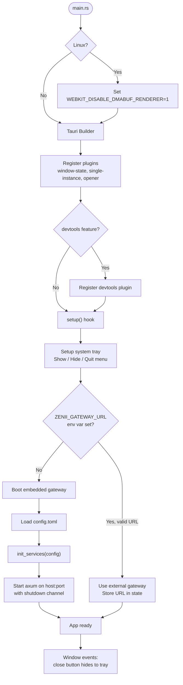

### Hybrid Gateway Architecture

The desktop app supports two gateway modes:

1. **Embedded** (default): The gateway server starts in a background Tokio task during `setup()`. A `oneshot` channel provides graceful shutdown. This is the zero-configuration path -- users launch the desktop app and everything works.

2. **External**: If `ZENII_GATEWAY_URL` is set to a valid URL, the desktop app connects to an external daemon instead of starting its own gateway. Useful for multi-device setups or when running the daemon as a system service.

### Frontend Integration

The frontend detects the Tauri environment via `window.__TAURI__` and provides typed wrappers in `web/src/lib/tauri.ts`:

- `isTauri` -- boolean flag for environment detection
- `closeToTray()` -- invoke `close_to_tray` IPC command
- `showWindow()` -- invoke `show_window` IPC command
- `getAppVersion()` -- invoke `get_app_version` IPC command
- `openDataDir()` -- invoke `open_data_dir` IPC command

All wrappers are no-ops when running in a browser (non-Tauri) context, so the same frontend works for both desktop and web.

## Scheduler Notification Flow (Stage 8.6.1)

The `PayloadExecutor` (`scheduler/payload_executor.rs`) handles 4 payload types dispatched by the scheduler tick loop. The `TokioScheduler` and `AppState` have a circular dependency resolved via `OnceCell` — the scheduler is constructed first, then wired to `AppState` post-construction via `wire()`.

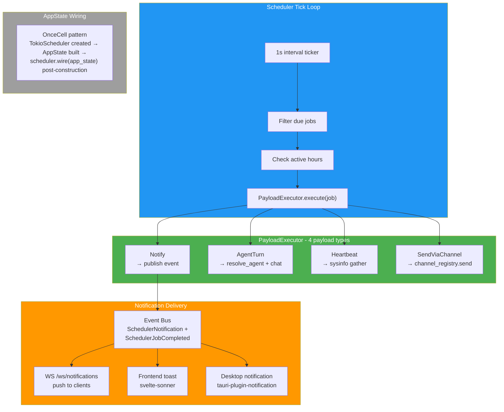

### Key Design Decisions

| Decision | Rationale |
|---|---|
| OnceCell wiring | TokioScheduler needs AppState for agent/channel access, but AppState contains the scheduler — OnceCell breaks the cycle |
| WS `/ws/notifications` | Dedicated endpoint for push notifications, separate from `/ws/chat` |
| svelte-sonner toasts | Frontend subscribes to WS notifications and displays via toast library |
| tauri-plugin-notification | Desktop OS-level notifications when app is in tray |

## Channel Router Pipeline (Stage 8.7)

The `ChannelRouter` struct orchestrates the full message processing pipeline from inbound channel message to outbound response. It runs as a background task with an `mpsc` receiver and `watch` stop signal.

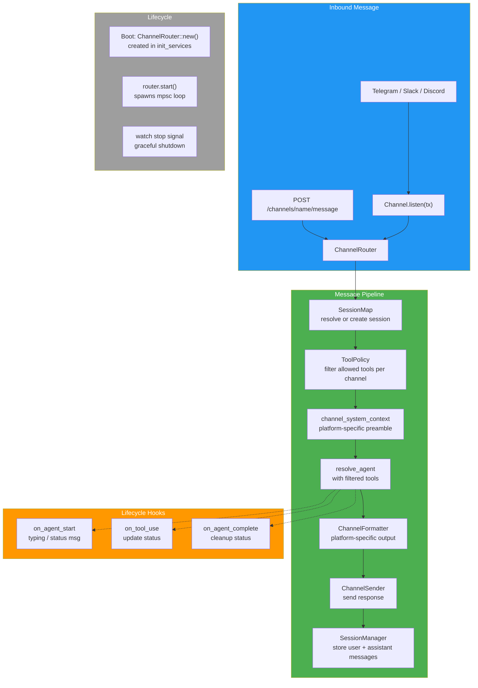

### Gateway Integration

| Route | Description |
|---|---|
| `POST /channels/{name}/message` | Webhook endpoint — injects message into ChannelRouter pipeline |

### Frontend: Session Source

Channel-originated sessions carry a `source` field displayed as a platform badge (Telegram/Slack/Discord icon) in the session list UI.

## Channel Lifecycle Hooks (Stage 8.8)

Lifecycle hooks run at key points in the ChannelRouter pipeline. They are best-effort — failures are logged but do not block the pipeline.

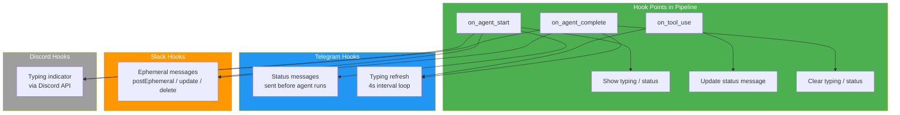

| Platform | on_agent_start | on_tool_use | on_agent_complete |
|---|---|---|---|
| Telegram | Send status message | Refresh typing indicator (4s) | Stop typing refresh |
| Slack | Post ephemeral "thinking..." | Update ephemeral message | Delete ephemeral message |
| Discord | Start typing indicator | (no-op) | (typing auto-expires) |

## Test Debt and Hardening (Stage 8.9)

Stage 8.9 addressed test coverage gaps and hardened critical modules.

### ProcessTool Kill Action

The `ProcessTool` gained a `kill` action using `sysinfo`-based process lookup. Kill requires `Full` autonomy level — lower autonomy levels are denied with `ZeniiError::PolicyDenied`.

### Context Engine Tests (52 tests)

Comprehensive unit test coverage for:
- `ContextEngine` — level determination, compose output, config toggles
- `BootContext` — OS/arch/hostname/locale detection
- Context summaries — hash-based cache invalidation, DB storage/retrieval
- Tier injection — Full/Minimal/Summary content verification

### Agent Tool Loop Tests (5 tests)

Integration tests verifying `RigToolAdapter` dispatch — agent correctly invokes tools during the chat loop and feeds results back to the LLM.

## Agent Action Tools (Phase 8.10)

Four new agent-callable tools give the AI agent direct control over system functions:

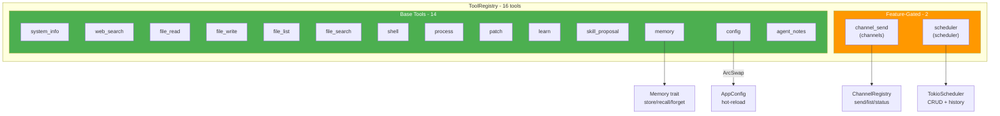

## Autonomous Reasoning Engine (Phase 8.11)

The `ReasoningEngine` provides an extensible pipeline for autonomous multi-step agent operation, with per-request tool call deduplication to prevent redundant API calls:

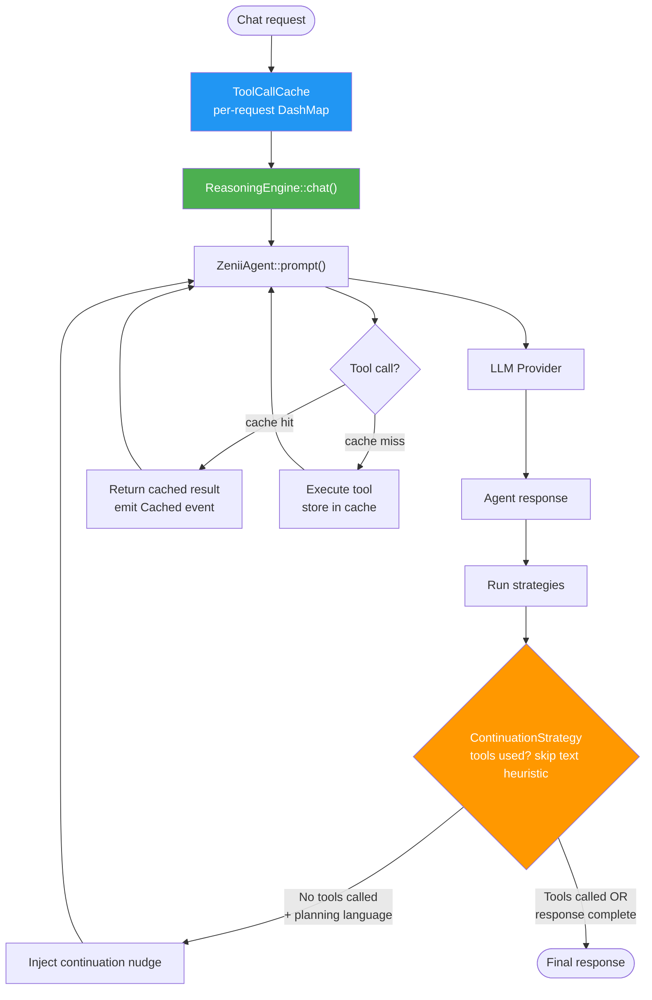

Key components:
- **ReasoningEngine** -- orchestrates agent calls with pluggable strategy pipeline
- **ToolCallCache** -- per-request `DashMap<u64, CachedResult>` keyed by `hash(tool_name + args_json)`. Shared across all `RigToolAdapter`s via `Arc`. Caches both successes and errors. Tracks execution count via `AtomicU32`. Controlled by `tool_dedup_enabled` config (default `true`)
- **ContinuationStrategy** -- tool-aware continuation detection. If `tool_calls_made > 0`, skips the text heuristic entirely (prevents false positives like "Let me tell you about..."). Falls back to planning/refusal language detection only when no tools were called. Respects `agent_max_continuations` limit (default `1`)
- **BootContext** -- system environment discovery (OS, arch, hostname, home dir, desktop, downloads, shell, username)

### Deduplication defaults

| Config | Default | Range | Description |
|--------|---------|-------|-------------|
| `agent_max_turns` | 4 | 1-16 | Max rig-core agentic turns per `agent.chat()` |
| `agent_max_continuations` | 1 | 0-5 | Max ReasoningEngine continuation rounds |
| `tool_dedup_enabled` | true | -- | Enable per-request tool call cache |

## Semantic Memory and Embeddings (Phase 8.11)

Hybrid search combining FTS5 full-text search with vector similarity:

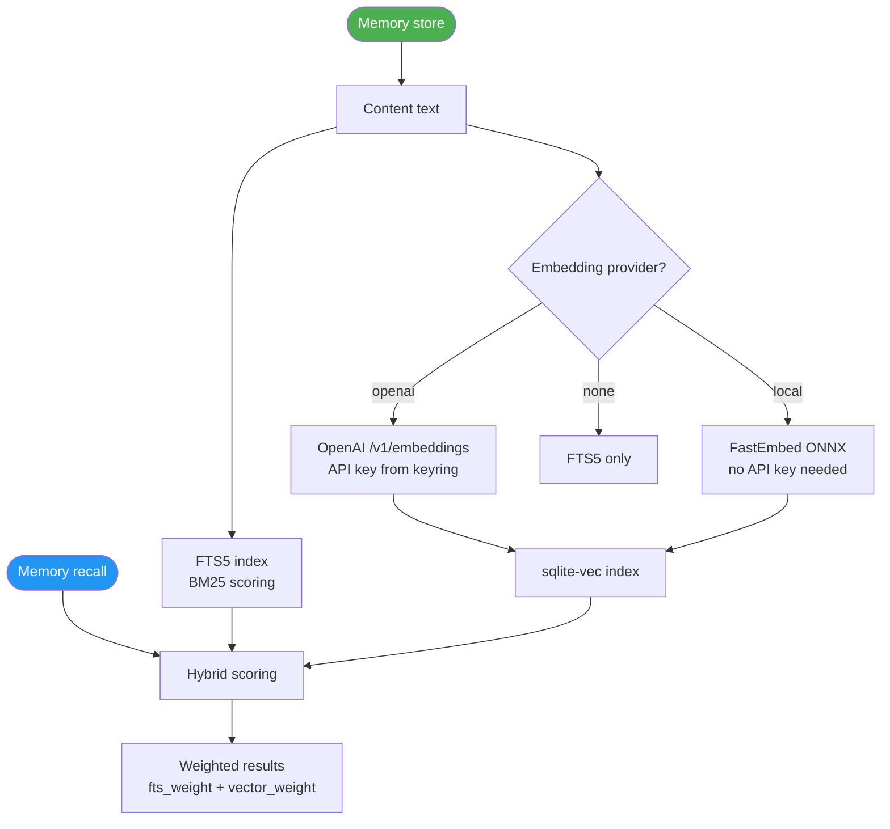

Gateway embedding routes (5):
- `GET /embeddings/status` -- current provider and model info
- `POST /embeddings/test` -- test embedding generation
- `POST /embeddings/embed` -- embed arbitrary text
- `POST /embeddings/download` -- download local model
- `POST /embeddings/reindex` -- re-embed all stored memories

## Phase 18 Hardening

Phase 18 addressed 51 issues from two code audits across 8 parallel work streams:

- **ArcSwap config** -- runtime config hot-reload via `arc_swap::ArcSwap<AppConfig>` replacing manual TOML write + reload
- **Security** -- CORS origin validation improvements, path traversal protection in file tools
- **Concurrency** -- eliminated data races in scheduler, security, and tools modules
- **Channel reliability** -- UTF-8 safe message splitting, Slack echo loop prevention
- **Frontend** -- svelte-check warnings reduced from 19 to 0
- **CI/CD** -- all-features testing added to CI pipeline

## Plugin Architecture (Phase 9)

```mermaid
graph TD
    subgraph PluginSystem["Plugin System"]
        Manifest["PluginManifest<br>TOML metadata + permissions"]
        Registry["PluginRegistry<br>DashMap + JSON persistence"]
        Process["PluginProcess<br>JSON-RPC 2.0 lifecycle"]
        Adapter["PluginToolAdapter<br>Tool trait bridge"]
        Installer["PluginInstaller<br>git + local install"]
    end

    subgraph Integration["Integration Points"]
        ToolReg["ToolRegistry<br>built-in + plugin tools"]
        SkillReg["SkillRegistry<br>bundled + plugin skills"]
        GWHandlers["Gateway Handlers<br>8 REST endpoints"]
        CLICmds["CLI Commands<br>7 subcommands"]
        WebUI["Web/Desktop UI<br>PluginsSettings.svelte"]
        TUIUI["TUI<br>PluginList mode"]
    end

    Installer -->|parses| Manifest
    Installer -->|registers| Registry
    Registry -->|spawns| Process
    Process -->|wraps| Adapter
    Adapter -->|registers| ToolReg
    Installer -->|registers| SkillReg
    GWHandlers -->|queries| Registry
    GWHandlers -->|calls| Installer
    CLICmds -->|HTTP| GWHandlers
    WebUI -->|HTTP| GWHandlers
    TUIUI -->|HTTP| GWHandlers

    style PluginSystem fill:#FF9800,color:#fff
    style Integration fill:#4CAF50,color:#fff
```

### Plugin Lifecycle

- **Discovery**: On boot, `PluginRegistry` scans `plugins_dir` for installed plugins
- **Registration**: Each plugin's tools are wrapped in `PluginToolAdapter` and registered in `ToolRegistry`
- **Execution**: When a tool is called, `PluginProcess` spawns the plugin binary, communicates via JSON-RPC 2.0 over stdio
- **Recovery**: Crashed plugins are automatically restarted up to `plugin_max_restart_attempts` times
- **Idle Shutdown**: Inactive plugin processes are terminated after `plugin_idle_timeout_secs`

### Client Interfaces

Plugin management is available across all interfaces:

- **CLI**: `zenii plugin <cmd>` (list, install, remove, update, enable, disable, info) -- HTTP calls to gateway
- **Web/Desktop**: `PluginsSettings.svelte` component with full install/remove/enable/disable UI via `pluginsStore`
- **TUI**: `PluginList` mode (press `p` from session list) with keybindings: `j`/`k` navigate, `e` toggle enable/disable, `d` remove, `i` install, `r` refresh, `Esc` back

### Plugin Manifest Format (plugin.toml)

```toml
[plugin]
name = "weather"
version = "1.0.0"
description = "Weather forecast tool"
author = "example"

[permissions]
network = true
filesystem = false

[[tools]]
name = "get_weather"
binary = "weather-tool"
description = "Get weather for a location"

[[skills]]
name = "weather-prompt"
file = "skills/weather.md"
```

## Context-Driven Auto-Discovery

The context engine automatically detects which feature domains are relevant to the user's message and injects only pertinent context and agent rules.

### Domain Detection

```mermaid
flowchart TD
    Msg([User message]) --> Detect["detect_relevant_domains#40;message#41;"]
    Detect --> KW{"Keyword matching"}

    KW -->|telegram, slack, discord,<br>channel, notify, dm| ChDom["ContextDomain::Channels"]
    KW -->|schedule, remind, cron,<br>timer, recurring, every day| ScDom["ContextDomain::Scheduler"]
    KW -->|skill, template,<br>prompt, persona| SkDom["ContextDomain::Skills"]
    KW -->|no match| General["General context only"]

    ChDom --> CatMap["Map to rule categories"]
    ScDom --> CatMap
    SkDom --> CatMap
    General --> CatMap

    CatMap --> Load["Load agent_rules<br>WHERE category IN categories"]
    Load --> Inject["Inject into preamble<br>under 'Your Learned Rules'"]

    style ChDom fill:#2196F3,color:#fff
    style ScDom fill:#FF9800,color:#fff
    style SkDom fill:#4CAF50,color:#fff
```

### Domain-to-Category Mapping

| Domain | Agent Rule Category |
|--------|-------------------|
| Channels | `channel` |
| Scheduler | `scheduling` |
| Skills / Tools | `tool_usage` |
| Always included | `general` |

**Key files**: `ai/context.rs` (`ContextDomain` enum, `detect_relevant_domains()`, `domains_to_rule_categories()`)

---

## AgentSelfTool

The `agent_notes` tool allows the agent to learn, recall, and forget behavioral rules that persist across conversations and get auto-injected into context.

### Data Model

- **Table**: `agent_rules` (DB migration v10)
- **Schema**: `id`, `content`, `category`, `created_at`, `active`
- **Categories**: `general`, `channel`, `scheduling`, `user_preference`, `tool_usage`

### Tool Actions

| Action | Description | Required Params |
|--------|-------------|-----------------|
| `learn` | Create a new behavioral rule | `content`, optional `category` |
| `rules` | List active rules | optional `category` filter |
| `forget` | Soft-delete a rule by ID | `id` |

### Integration

```mermaid
flowchart LR
    Agent["Agent calls<br>agent_notes tool"] --> Learn["learn: INSERT rule"]
    Agent --> Rules["rules: SELECT active"]
    Agent --> Forget["forget: SET active=0"]
    Learn --> DB["agent_rules table"]
    Rules --> DB
    Forget --> DB
    DB --> Context["ContextEngine loads<br>rules by category"]
    Context --> Preamble["Injected into<br>system prompt"]
```

**Control**: Gated by `self_evolution_enabled` config flag (runtime toggle via `Arc<AtomicBool>`).

**Key file**: `tools/agent_self_tool.rs`

---

## OpenAPI Documentation

Interactive API documentation via Scalar UI, feature-gated behind `api-docs`.

### Stack

- **utoipa** -- OpenAPI 3.1 spec generation from Rust handler annotations
- **scalar** -- Interactive documentation UI served at `/api-docs`
- **Feature gate**: `api-docs` (enabled by default in daemon and desktop)

### Endpoints

| Path | Description |
|------|-------------|
| `GET /api-docs` | Scalar interactive UI |
| `GET /api-docs/openapi.json` | Raw OpenAPI 3.1 JSON spec |

### Build

The spec is assembled at runtime from `#[utoipa::path]` annotations on handler functions. Feature-gated handlers (channels, scheduler) are conditionally merged into the spec.

**Key file**: `gateway/openapi.rs`

---

## Onboarding Flow

Multi-step onboarding wizard that collects AI provider setup (provider selection, API key, model), optional channel credentials (Telegram, Slack, Discord), and user profile (name, location, timezone). Available across Desktop, CLI, and TUI interfaces.

### SetupStatus

The `check_setup_status()` function (in `onboarding.rs`) determines whether onboarding is needed:

- `needs_setup: bool` -- true if `user_name`, `user_location`, or API key is missing
- `missing: Vec<String>` -- list of missing fields (e.g., `["user_name", "api_key"]`)
- `detected_timezone: Option<String>` -- auto-detected IANA timezone via `iana-time-zone` crate
- `has_usable_model: bool` -- true if at least one provider has a stored API key

### Desktop (OnboardingWizard)

```mermaid
sequenceDiagram
    participant FE as Frontend - AuthGate
    participant WZ as OnboardingWizard
    participant PS as ProvidersSettings
    participant CS as ChannelsSettings
    participant GW as Gateway
    participant Cfg as Config
    participant Cred as Credentials

    FE->>GW: GET /setup/status
    GW->>Cfg: Check user_name + user_location
    GW->>Cred: Check has_any_api_key
    GW-->>FE: SetupStatus

    alt needs_setup = true
        FE->>WZ: Show OnboardingWizard

        Note over WZ: Step 1 -- AI Provider
        WZ->>PS: Embed ProvidersSettings
        PS->>GW: GET /providers/with-key-status
        PS->>PS: User selects provider + enters API key
        PS->>GW: POST /credentials
        PS->>GW: PUT /providers/default

        Note over WZ: Step 2 -- Channels - optional
        WZ->>CS: Embed ChannelsSettings
        CS->>GW: GET /credentials
        CS->>CS: User configures channel tokens
        CS->>GW: POST /credentials

        Note over WZ: Step 3 -- Your Profile
        WZ->>WZ: User enters name, location, timezone
        WZ->>GW: PUT /config
        GW->>Cfg: Update ArcSwap + persist TOML
        GW-->>WZ: 200 OK
        WZ->>FE: oncomplete - dismiss wizard
    else needs_setup = false
        FE->>FE: Proceed to chat
    end
```

### CLI (Interactive Flow)

The `zenii setup` command runs an interactive onboarding:

1. Fetch providers from `GET /providers/with-key-status`
2. User selects provider via `dialoguer::Select`
3. Prompt for API key via `dialoguer::Password`, save to `POST /credentials`
4. Refresh providers to get updated models
5. User selects model, set default via `PUT /providers/default`
6. Optional: `dialoguer::Confirm` to set up a messaging channel (Telegram/Slack/Discord), save credentials to `POST /credentials`
7. Prompt for name, location, timezone (auto-detected default)
8. Save profile to `PUT /config`

### TUI (5-Step Overlay Modal)

Centered ratatui modal (60% x 70%) with step indicator:

1. **ProviderSelect** -- list providers, j/k navigate, Enter select
2. **ApiKey** -- masked password input, Enter save, Esc back
3. **ModelSelect** -- list models for selected provider, Enter select
4. **Channels** (optional) -- Tab to switch between Telegram/Slack/Discord, j/k navigate credential fields, Enter save, s to skip
5. **Profile** -- three text fields (Name/Location/Timezone), Tab switch, Enter save

### Detection

- **Timezone (server)**: `iana-time-zone` crate (Rust) -- returned in `SetupStatus.detected_timezone`
- **Timezone (browser)**: `Intl.DateTimeFormat().resolvedOptions().timeZone` -- fallback in AuthGate
- **Location**: Manual user input (e.g., "Toronto, Canada")

### Config Fields

- `user_name: Option<String>` -- display name for greetings
- `user_timezone: Option<String>` -- IANA format (e.g., "America/New_York")
- `user_location: Option<String>` -- human-readable (e.g., "New York, US")

**Key files**: `onboarding.rs`, `gateway/handlers/config.rs` (`setup_status`), `web/src/lib/components/OnboardingWizard.svelte`, `web/src/lib/components/AuthGate.svelte`, `crates/zenii-cli/src/commands/onboard.rs`, `crates/zenii-tui/src/ui/onboard.rs`

---

## LLM-Based Auto Fact Extraction

Automatically extracts structured facts about the user from conversation exchanges and persists them via `UserLearner::observe()`. Fire-and-forget design -- errors are logged, never propagated to the user.

### Flow

```mermaid
sequenceDiagram
    participant Chat as Chat Handler
    participant CB as ContextBuilder
    participant SM as SessionManager
    participant LLM as Summary LLM
    participant UL as UserLearner

    Chat->>Chat: reasoning_engine.chat completes
    Chat->>CB: extract_facts - prompt, response, session_id

    CB->>CB: Check context_auto_extract enabled
    alt disabled
        CB-->>Chat: Ok - no-op
    end

    CB->>SM: get_context_info - session_id
    SM-->>CB: message count
    CB->>CB: Check count % context_extract_interval == 0
    alt not at interval
        CB-->>Chat: Ok - skip
    end

    CB->>CB: Resolve API key for summary provider
    CB->>LLM: Extraction prompt with conversation
    LLM-->>CB: category pipe key pipe value lines

    loop Each extracted fact
        CB->>UL: observe - category, key, value, confidence
        UL->>UL: Check learning_enabled + category allowed + max not reached
        UL-->>CB: Ok or logged error
    end

    CB-->>Chat: Ok
```

### Extraction Prompt

The LLM receives the user prompt and assistant response, asked to extract facts in `category|key|value` format (one per line). Valid categories: `preference`, `knowledge`, `context`, `workflow`. If no meaningful facts, the LLM outputs `NONE`.

### Config Fields

| Field | Type | Default | Purpose |
|-------|------|---------|---------|
| `context_auto_extract` | bool | `true` | Enable/disable fact extraction |
| `context_extract_interval` | usize | `3` | Extract every N messages |
| `context_summary_provider_id` | String | `"openai"` | LLM provider for extraction |
| `context_summary_model_id` | String | `"gpt-4o-mini"` | LLM model for extraction |

### Integration Points

- **HTTP chat** (`gateway/handlers/chat.rs`): called after `reasoning_engine.chat()`, before storing assistant message
- **WebSocket chat** (`gateway/handlers/ws.rs`): called after streaming completes

**Key files**: `ai/context.rs` (`ContextBuilder::extract_facts`), `user/learner.rs` (`UserLearner::observe`), `config/schema.rs`

---

## Tool Permission System (Phase 19)

Per-surface, risk-based tool permission system. Each tool declares a `RiskLevel` (Low, Medium, High) via the `Tool` trait. Permissions are resolved hierarchically: per-surface per-tool override > risk-level default.

### Risk Level Defaults

| Risk Level | Default | Examples |
|---|---|---|
| Low | Allowed | web_search, system_info |
| Medium | Allowed | config, learn, memory, skill_proposal, agent_self, channel_send, scheduler |
| High | Denied | shell, file_read, file_write, file_list, file_search, patch, process |

### Surface Overrides

Local surfaces (desktop, cli, tui) override all high-risk tools to `Allowed` by default. Remote surfaces (telegram, slack, discord) use risk-level defaults -- high-risk tools are denied unless explicitly overridden.

### Permission States

| State | Behavior |
|---|---|
| `allowed` | Tool can execute |
| `denied` | Tool is blocked |
| `ask_once` | Prompt user once, remember answer (Phase 2) |
| `ask_always` | Prompt user every time (Phase 2) |

### Resolution Flow

```mermaid
graph TD
    A["Tool call on surface"] --> B{"Per-surface override?"}
    B -->|yes| C["Use override state"]
    B -->|no| D{"Check risk level"}
    D --> E["Low: allowed"]
    D --> F["Medium: allowed"]
    D --> G["High: denied"]

    style C fill:#4CAF50,color:#fff
    style E fill:#4CAF50,color:#fff
    style F fill:#FF9800,color:#fff
    style G fill:#F44336,color:#fff
```

### Key Files

| File | Purpose |
|---|---|
| `security/permissions.rs` | `ToolPermissions`, `PermissionResolver`, `PermissionState` |
| `tools/traits.rs` | `risk_level()` method on `Tool` trait |
| `config/schema.rs` | `tool_permissions` field in `AppConfig` |
| `gateway/handlers/permissions.rs` | REST API (4 routes) |
| `web/src/lib/components/settings/PermissionsSettings.svelte` | Settings UI |
| `web/src/lib/stores/permissions.svelte.ts` | Frontend store |

---

## Model Capability Validation

Pre-agent-dispatch check that prevents tool-calling errors with incompatible models.

### Flow

```mermaid
flowchart TD
    Chat([Chat request]) --> Resolve["Resolve provider + model"]
    Resolve --> Lookup["Lookup ModelInfo from ProviderRegistry"]
    Lookup --> Check{"supports_tools?"}
    Check -->|true| Build["Build agent with tools"]
    Check -->|false| Error["Return ZeniiError::ModelCapability<br>HTTP 400"]
    Lookup -->|model not found| Build

    style Error fill:#F44336,color:#fff
    style Build fill:#4CAF50,color:#fff
```

### Data

- **Field**: `ModelInfo.supports_tools: bool` (default `true`)
- **Storage**: `ai_models.supports_tools` column (DB migration v8)
- **API**: `POST /providers/{id}/models` accepts `supports_tools` flag

**Key file**: `ai/agent.rs` (capability check in `get_or_build_agent()`)

---

## Concurrency Rules

These rules are enforced across the entire codebase to prevent async runtime issues.

| Rule | Rationale |
|---|---|
| No `std::sync::Mutex` in async paths | Blocks the tokio runtime; use `tokio::sync::Mutex` or `DashMap` |
| No `block_on()` anywhere | Panics inside tokio runtime; use `tokio::spawn` or `.await` |
| All SQLite ops via `spawn_blocking` | `rusqlite` is synchronous; blocking in async context starves tasks |
| All errors are `ZeniiError` | No `Result<T, String>`; use `thiserror` enum with typed variants |
| `AppState` is `Clone + Arc<T>` | Shared across axum handlers without lifetime issues |
| `EventBus` uses `tokio::sync::broadcast` | Lock-free fan-out to all subscribers |
| Never hold async locks across `.await` | Prevents deadlocks; acquire, use, drop before yielding |

## Lessons Learned from v1

Key architectural mistakes from Zenii v1 and how v2 prevents them.

| v1 Mistake | v2 Prevention |
|---|---|
| `std::sync::Mutex` in async code | `tokio::sync::Mutex` or `DashMap` exclusively |
| `block_on()` in event loop | Zero `block_on()` calls; `tokio::spawn` for sync work |
| `Result<T, String>` everywhere | `ZeniiError` enum with `thiserror` |
| Custom AI layer (1400 LOC) | `rig-core` (battle-tested, 18 providers) |
| 21 Zustand stores | 6 Svelte 5 rune stores ($state), single WS connection |
| 165 IPC commands (Tauri v1) | Gateway-only architecture (~40 HTTP routes) |
| OKLCH color functions in CSS | Pre-computed hex values only |
| useEffect soup (React) | Single `$effect` per Svelte component, reactive stores |
| 13-phase boot sequence | Single `init_services()` in `boot.rs` |