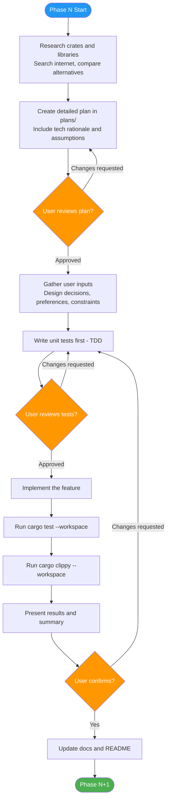

# MesoClaw Implementation Phases

## Table of Contents

- [Phase Gate Protocol](#phase-gate-protocol)
- [Phase Checklist Template](#phase-checklist-template)
- [Phase Timeline](#phase-timeline)
- [Phase Details](#phase-details)
  - [Phase 1: Core Foundation](#phase-1-core-foundation--complete)
  - [Phase 2: AI Integration](#phase-2-ai-integration--complete)
  - [Phase 3: Gateway Server](#phase-3-gateway-server--complete)
  - [Phase 4: Agent Intelligence](#phase-4-agent-intelligence--complete)
  - [Phase 5: Binary Shells + Tools + Memory](#phase-5-binary-shells--tools--memory--complete)
  - [Phase 6: Frontend](#phase-6-frontend--complete)
  - [Phase 7: Desktop App](#phase-7-desktop-app--complete)
  - [Phase 8: Credentials, Channels & Scheduler](#phase-8-credentials-channels--scheduler--in-progress)
  - [Stage 9: Cross-Compilation & Build Hardening](#stage-9-cross-compilation--build-hardening--not-started)
  - [Stage 10: CI/CD Pipeline](#stage-10-cicd-pipeline--not-started)
  - [Stage 11: Quality Gates & Automation](#stage-11-quality-gates--automation--not-started)
  - [Stage 12: CLI Reference Documentation](#stage-12-cli-reference-documentation--not-started)
  - [Stage 13: API & Configuration Reference](#stage-13-api--configuration-reference--not-started)
  - [Stage 14: Architecture & Deployment Docs](#stage-14-architecture--deployment-docs--not-started)
  - [Stage 15: Community & Open Source Readiness](#stage-15-community--open-source-readiness--not-started)
- [Future Release](#future-release)
  - [Stage FR-1: TUI Binary](#stage-fr-1-tui-binary--future-release)
  - [Stage FR-2: Mobile App](#stage-fr-2-mobile-app--future-release)

---

## Phase Gate Protocol

Every implementation phase follows this strict workflow. No phase proceeds without user confirmation at each gate. The protocol enforces three user gates — **Plan**, **Tests**, and **Completion** — ensuring alignment at every stage.



### Step-by-Step Description

1. **Research** — Search the internet for candidate crates and libraries. Compare alternatives on binary size impact, compile time, maintenance activity, dependency tree depth, and feature completeness. Use Explore agents to scan the v1 codebase for portable patterns relevant to the phase.

2. **Create Plan** — Write a detailed plan to `plans/stageN_*.md` covering scope, API signatures, data models, dependencies, and tech selection rationale. Document all assumptions and flag any that need user confirmation.

3. **Gate 1: User Reviews Plan** — Present the plan to the user. If changes are requested, revise and re-present. No code is written until the user explicitly approves the plan.

4. **Gather User Inputs** — Collect design decisions, preferences, and constraints from the user. Document these in the plan file. Never assume — wrong assumptions cost more than a question.

5. **Write Tests (TDD)** — Write unit tests first in `tests/stageN_*.md` and corresponding test code. Cover success paths, failure paths, and edge cases. Tests exist before any implementation code.

6. **Gate 2: User Reviews Tests** — Present the test design to the user. If changes are requested, revise and re-present. No implementation begins until the user approves the test design.

7. **Implement** — Write the implementation code to make all tests pass. Follow existing codebase conventions, keep changes minimal, and avoid over-engineering.

8. **Run Tests** — Execute `cargo test --workspace` and ensure zero failures.

9. **Run Clippy** — Execute `cargo clippy --workspace` and ensure zero warnings.

10. **Present Results** — Provide a phase summary: what was built, what changed, architecture impact, and any new Mermaid diagrams.

11. **Gate 3: User Confirms** — Present the completed work to the user. If changes are requested, loop back to tests/implementation. The user must explicitly confirm before proceeding.

12. **Update Documentation** — After user confirmation, update `docs/architecture.md`, `docs/phases.md`, `README.md`, `no_commit/todo_tracker.md`, and `docs/processes.md` to reflect the changes. This is mandatory — no phase is complete without updated docs.

## Phase Checklist Template

Each phase has **3 user gates** (plan, tests, completion). All must pass before proceeding.

### Gate 1: Planning
- [ ] **Dependency research done** -- searched internet for candidate crates/libraries, compared alternatives
- [ ] **Tech selection rationale documented** -- for each dependency: why chosen, what was rejected, binary size impact, maintenance status
- [ ] **Assumptions logged** -- all assumptions listed with rationale, flagged for user confirmation
- [ ] **Lightweight check** -- verified dependency trees are minimal, no unnecessary bloat
- [ ] **Detailed plan created** -- `plans/stageN_*.md` with scope, API signatures, data models, dependencies, rationale
- [ ] **User inputs gathered** -- design decisions, preferences, constraints documented in plan
- [ ] **User approved plan** -- explicit approval before any code is written

### Gate 2: Tests (TDD)
- [ ] **Unit tests written first** -- test files exist before implementation code
- [ ] **Test coverage plan** -- success paths, failure paths, edge cases identified
- [ ] **User reviewed tests** -- explicit approval of test design before implementation

### Gate 3: Completion
- [ ] **Implementation complete** -- all code for the phase is written
- [ ] **`cargo test --workspace` passes** -- zero failures
- [ ] **`cargo clippy --workspace` passes** -- zero warnings
- [ ] **Phase summary provided** -- what was built, what changed, architecture impact
- [ ] **Documentation updated** -- `docs/` and `README.md` reflect changes with Mermaid diagrams
- [ ] **User confirmation received** -- explicit "proceed" before next phase

## Phase Timeline

```mermaid
gantt
    title MesoClaw Implementation Stages
    dateFormat X
    axisFormat %s

    section Foundation
    Phase 1 - Core Foundation           :done, p1, 0, 1
    section AI
    Phase 2 - AI Integration            :done, p2, after p1, 1
    section Gateway
    Phase 3 - Gateway Server            :done, p3, after p2, 1
    section Intelligence
    Phase 4 - Agent Intelligence         :done, p4, after p3, 1
    section Binaries
    Phase 5 - Binary Shells + Tools + Memory :done, p5, after p4, 1
    section Frontend
    Phase 6 - Frontend                  :done, p6, after p5, 1
    section Desktop
    Phase 7 - Desktop App               :done, p7, after p6, 1
    section Credentials/Channels
    Phase 8 - Credentials, Channels & Scheduler :done, p8, after p7, 1
    section Cross-Compile
    Stage 9 - Cross-Compilation         :s9, after p8, 1
    section CI/CD
    Stage 10 - CI/CD Pipeline           :s10, after s9, 1
    section Quality + Docs
    Stage 11 - Quality Gates            :s11, after s10, 1
    Stage 12 - CLI Reference            :s12, after p8, 1
    Stage 13 - API/Config Reference     :s13, after s12, 1
    section Deploy + Community
    Stage 14 - Architecture/Deployment  :s14, after s13, 1
    Stage 15 - Community                :s15, after s13, 1
    section Future
    FR-1 - TUI Binary                   :milestone, fr1, after s15, 0
    FR-2 - Mobile App                   :milestone, fr2, after s15, 0
```



### Parallel Execution Map

```
Phase 8 (done) ─────┐
                    ├──> [Group A] Stage 9 (Cross-Compile) ──> Stage 10 (CI/CD)
                    │                                              │
                    │                                              ├──> [Group B] Stage 11 (Quality Gates)
                    │                                              │
                    └──> [Group A] Stage 12 (CLI Docs) ──────> [Group B] Stage 13 (API/Config Docs)
                                                                   │
                                                                   ├──> [Group C] Stage 14 (Arch/Deploy)
                                                                   └──> [Group C] Stage 15 (Community)
```

- **Group A**: Stage 9 + Stage 12 run in parallel (independent concerns)
- **Group B**: Stage 11 + Stage 13 run in parallel (after Stage 10/12)
- **Group C**: Stage 14 + Stage 15 run in parallel (after Stage 13)
- Stage 10 depends on Stage 9 (CI needs cross-compilation targets)

## Phase Details

### Phase 1: Core Foundation — `[COMPLETE]`

**Steps 1--4: Scaffold, Error+Config, DB, Event Bus**

- Error types (`MesoError` enum with `thiserror`) -- 16 variants with `From` impls
- Configuration system (TOML-based) -- `directories` crate for OS-specific paths (`com.sprklai.mesoclaw`)
- Database layer (rusqlite + WAL + spawn_blocking) -- 4 tables (sessions, messages, providers, schedule_jobs)
- Event bus (`tokio::sync::broadcast`) -- `EventBus` trait + `TokioBroadcastBus` with 12 event variants
- Daemon wiring -- config loading, tracing init, DB init, migration runner
- **Tests**: 16 unit tests, all passing. Zero clippy warnings.
- **Plan**: [plans/phase1_core_foundation.md](../plans/phase1_core_foundation.md)
- **Test plan**: [tests/phase1_core_foundation.md](../tests/phase1_core_foundation.md)

---

### Phase 2: AI Integration — `[COMPLETE]`

**Step 5: Memory System**
- `Memory` trait + `SqliteMemoryStore` with FTS5 + BM25 ranking + hybrid scoring
- `InMemoryStore` (HashMap-backed) for tests
- `EmbeddingProvider` trait + `MockEmbeddingProvider` + `LruEmbeddingCache`
- `VectorIndex` -- sqlite-vec ANN search with id_map
- Embedding storage and retrieval via sqlite-vec 0.1.6 (stable)

**Step 6: Security + Credentials**
- `SecurityPolicy` with `AutonomyLevel` (ReadOnly/Supervised/Full), `RiskLevel`, `ValidationResult`
- Command risk classification, injection detection, path validation, rate limiting, audit log
- `CredentialStore` trait with `InMemoryCredentialStore` (KeyringStore planned for Phase 3 wiring)

**Step 7: Tool Definitions**
- `Tool` trait + `ToolResult` + `ToolInfo`
- `ShellTool` -- command execution with security policy enforcement
- `FileReadTool` / `FileWriteTool` / `FileListTool` -- filesystem access with policy validation
- `WebSearchTool` -- via `websearch` crate (stub, requires API keys)
- `SystemInfoTool` -- via `sysinfo` crate (os, cpu, memory, hostname, time, env)
- `FileSearchTool` -- via `ignore` crate (gitignore-respecting)
- `PatchTool` -- via `diffy` crate (unified diff apply + dry run)
- `ProcessTool` -- via `sysinfo` crate (list, filter, kill with autonomy gate)

**New dependencies**: sysinfo 0.38.3, ignore 0.4.25, diffy 0.4.2, lru 0.16.3, sqlite-vec 0.1.6
- **Tests**: 121 new tests (137 total), all passing. Zero clippy warnings.
- **Plan**: [plans/phase2_ai_integration.md](../plans/phase2_ai_integration.md)
- **Test plan**: [tests/phase2_ai_integration.md](../tests/phase2_ai_integration.md)

---

### Phase 3: Gateway Server — `[COMPLETE]`

**Step 8: AI Agent + Providers**
- `MesoAgent` — enum-based dispatch for OpenAI and Anthropic via rig-core 0.31
- `RigToolAdapter` — bridges MesoClaw `dyn Tool` to rig's `ToolDyn` interface
- Provider factory — `resolve_api_key`, `build_openai_client`, `build_anthropic_client`
- `SessionManager` — CRUD for sessions and messages (SQLite-backed)

**Step 9: Gateway Server**
- axum HTTP+WS server at `127.0.0.1:18981` with 20 routes
- 11 handler modules: health, sessions, messages, chat, memory, config, providers, tools, system, models, ws
- Bearer token auth middleware (configurable, health bypasses auth)
- CORS support (configurable origins)
- Error mapping — unique MESO_* codes with appropriate HTTP status codes
- WebSocket `/ws/chat` for streaming chat (text chunk + done protocol)
- `AppState` — shared state with Arc<dyn Trait> for all services

**Step 10: Boot Sequence + Daemon**
- `init_services(AppConfig) -> Services` — ordered initialization of all services
- `Services -> AppState` conversion for gateway consumption
- `mesoclaw-daemon` — fully wired: config → tracing → boot → gateway with graceful shutdown

**New dependencies**: rig-core 0.31, tokio-stream 0.1.17, futures 0.3, tower 0.5 (dev)
- **Tests**: 96 new tests (233 total), all passing. Zero clippy warnings.
- **Plan**: [plans/phase3_gateway_server.md](../plans/phase3_gateway_server.md)
- **Test plan**: [tests/phase3_gateway_server.md](../tests/phase3_gateway_server.md)

---

### Phase 4: Agent Intelligence — `[COMPLETE]`

**Step 10a: Soul / Persona System**
- 3 identity files: SOUL.md, IDENTITY.md, USER.md with YAML frontmatter
- `SoulLoader` — read/write/reload identity files from disk with `include_str!` bundled defaults
- `PromptComposer` — assembles dynamic system prompt from identity + skills + observations + config
- Manual reload via API endpoint (no `notify` dependency)

**Step 10b: Skills System (Claude Code model)**
- `SkillRegistry` — load, list, CRUD, reload with bundled + user skill tiers
- 2 bundled skills: `system-prompt`, `summarize` (embedded via `include_str!`)
- Pure markdown context model (no Tera templating — skills are instructional docs loaded into agent context)
- User skills override bundled skills with same id

**Step 10c: User Profile + Progressive Learning**
- `UserLearner` — observe, query, forget, prune, build_context (SQLite-backed)
- `user_observations` table (DB migration v2) with category/confidence indexes
- Privacy controls: `learning_enabled`, `learning_denied_categories`, min confidence threshold, TTL-based expiry
- 16 new gateway routes: identity (4), skills (6), user (6)

**New dependencies**: serde_yaml 0.9
- **Tests**: 94 new tests (327 total), all passing. Zero clippy warnings.
- **Plan**: [plans/phase4_agent_intelligence.md](../plans/phase4_agent_intelligence.md)
- **Test plan**: [tests/phase4_agent_intelligence.md](../tests/phase4_agent_intelligence.md)

---

### Phase 5: Binary Shells + Tools + Memory — `[COMPLETE]`

**Step 11: ToolRegistry + Memory Enhancements**
- `ToolRegistry` — DashMap-backed concurrent tool storage with register/get/list/to_vec
- 9 tools registered at boot: SystemInfoTool, WebSearchTool, FileReadTool, FileWriteTool, FileListTool, FileSearchTool, ShellTool, ProcessTool, PatchTool
- Memory `recall()` extended with `offset` parameter for pagination
- Content validation — empty/whitespace content rejected with `MesoError::Validation`
- `MesoError::Validation(String)` variant mapped to HTTP 400 `MESO_VALIDATION`

**Step 12: CLI Binary**
- clap-based command structure (6 commands):
  - `daemon` -- start/stop/status
  - `chat` -- interactive WS streaming chat
  - `run` -- single prompt via POST /chat
  - `memory` -- search/add/remove memories
  - `config` -- show/set configuration
  - `key` -- set/remove API keys
- `MesoClient` — HTTP/WS client wrapper (reqwest + tokio-tungstenite)
- CLI as thin HTTP client to daemon (no embedded core dependency)

**New dependencies**: dashmap (workspace), tokio-tungstenite (CLI), futures (CLI)
- **Tests**: 20 new tests (347 total), all passing. Zero clippy warnings.
- **Plan**: [plans/phase5_combined.md](../plans/phase5_combined.md)
- **Design**: [plans/phase5_combined_design.md](../plans/phase5_combined_design.md)
- **Test plan**: [tests/phase5_combined.md](../tests/phase5_combined.md)

---

### Phase 6: Frontend — `[COMPLETE]`

**Step 13: Svelte 5 Frontend (SPA)**
- SvelteKit (adapter-static, SPA mode) + Svelte 5 runes + shadcn-svelte + Tailwind CSS v4
- 8 routes: home, chat, chat/[id], memory, settings, settings/providers, settings/persona, schedule
- 6 stores: sessions, messages, memory, config, providers, theme — all Svelte 5 `$state` runes
- svelte-ai-elements: 9 component sets (message, conversation, response, prompt-input, code, reasoning, loader, tool, copy-button)
- shadcn-svelte: 14 UI primitive sets (button, input, card, dialog, sidebar, etc.)
- ChatView with streaming: Conversation + Message + Response (streamdown + shiki) + PromptInput
- paraglide-js v2 i18n (EN only, 24 message keys, Vite plugin)
- WebSocket integration for real-time streaming chat
- Dark/light/system theme with localStorage persistence

**New dependencies**: SvelteKit, svelte 5, shadcn-svelte, tailwindcss v4, paraglide-js, vitest, shiki, streamdown
- **Tests**: 26 unit tests (vitest), build + type-check, 12 manual tests — all passing
- **Plan**: [plans/phase6_frontend.md](../plans/phase6_frontend.md)
- **Design**: [docs/plans/2026-03-06-phase6-frontend-design.md](../docs/plans/2026-03-06-phase6-frontend-design.md)
- **Test plan**: [tests/phase6_frontend.md](../tests/phase6_frontend.md)

---

### Phase 7: Desktop App — `[COMPLETE]`

**Step 14: Desktop Binary (Tauri 2.10)**
- Tauri 2.10.3 shell wrapping the SvelteKit SPA frontend
- 5 plugins: tray-icon (built-in), window-state 2.4.1, single-instance 2.4.0, opener 2.5.3, devtools 2.0.1 (feature-gated)
- 4 IPC commands: `close_to_tray`, `show_window`, `get_app_version`, `open_data_dir`
- Hybrid daemon: embedded gateway by default, external via `MESOCLAW_GATEWAY_URL` env var
- System tray with Show/Hide/Quit menu, left-click toggles visibility
- Close-to-tray behavior (close button hides window, quit via tray menu)
- Window state persistence (size, position, maximized state across restarts)
- Single-instance enforcement (second launch focuses existing window)
- Frontend integration: `@tauri-apps/api` 2.10.1, `web/src/lib/tauri.ts` wrapper with `isTauri` detection
- Linux WebKit DMA-BUF renderer fix in `main.rs`
- Mobile deferred to Future Release

**New dependencies**: tauri 2.10.3, tauri-build 2.5.6, tauri-plugin-window-state 2.4.1, tauri-plugin-single-instance 2.4.0, tauri-plugin-opener 2.5.3, tauri-plugin-devtools 2.0.1, url 2, opener 0.8, @tauri-apps/api 2.10.1, @tauri-apps/cli 2.10.1
- **Tests**: 7 unit tests (gateway mode resolution, data dir, tray menu), 354 total Rust workspace tests. Zero clippy warnings.
- **Plan**: [plans/phase7_desktop.md](../plans/phase7_desktop.md)
- **Test plan**: [tests/phase7_desktop.md](../tests/phase7_desktop.md)

---

### Phase 8: Credentials, Channels & Scheduler — `[COMPLETE]`

**Step 15.1: Credential & Provider Management — `[COMPLETE]`**
- `KeyringStore` -- OS-native credential storage (keyring crate v3) with async probe fallback to InMemoryCredentialStore
- `ProviderRegistry` -- DB-backed multi-provider CRUD with 6 built-in providers (OpenAI, Anthropic, Gemini, OpenRouter, Vercel AI Gateway, Ollama)
- DB migration v3: `ai_providers` + `ai_models` tables
- Gateway routes: 5 credential routes + 11 provider routes (CRUD, connection testing, default model, model management)
- Desktop settings page: provider cards, API key show/hide, model management, connection testing with latency
- CLI: `mesoclaw key set/remove/list`, `mesoclaw provider list/test/add/remove/default`
- Boot: KeyringStore with InMemory fallback, ProviderRegistry seeding, MesoAgent refactor for multi-provider
- Config: `keyring_service_id` field (default "com.sprklai.mesoclaw")
- Default model: stored as special row in `ai_models` with id `_default_model`

**Step 15.2: Channels — `[COMPLETE]`**
- Trait-based messaging: `Channel`, `ChannelLifecycle`, `ChannelSender` async traits with `ChannelStatus` enum
- `ChannelRegistry` -- DashMap-backed concurrent channel management with CRUD + health check (11 tests)
- `ChannelMessage` -- builder pattern message struct (2 tests)
- `ConnectorFrame` -- JSON wire protocol for external connector processes with `ConnectorHandshake` (5 tests)
- Telegram (`channels-telegram`): `TelegramChannel` with DmPolicy (Allowlist/Open/Disabled), `RetryPolicy`, `BotCommand` enum, message splitting, MarkdownV2 escaping (12 tests)
- Slack (`channels-slack`): `SlackChannel` with DM/channel detection, mrkdwn formatting, REST helpers (4 tests)
- Discord (`channels-discord`): `DiscordChannel` with guild/channel allowlists, bot message filtering (8 tests)
- Feature-gated: `channels`, `channels-telegram`, `channels-slack`, `channels-discord`
- 6 gateway routes (feature-gated): list channels, status, send, connect, disconnect, health
- 1 always-available route: `POST /channels/{name}/test` (credential testing)
- Frontend: channels settings page with credential management, connection testing, latency display
- `MesoError::Channel(String)` variant added
- Config: `channels_enabled`, Telegram-specific settings (polling timeout, DM policy, retry, group mention)
- `WebSearchTool` refactored to use `websearch` crate with Tavily → Brave → DuckDuckGo provider cascade

**Step 15.3: Context Management — `[COMPLETE]`**
- Multi-turn context continuity, cross-session memory recall, and adaptive context strategies
- Core context tests implemented as part of Stage 8.9 test debt
- Sub-steps 15.3.1 (Tool Visibility) and 15.3.2 (Web Search refactor) complete
- Plan: [plans/phase8.3_context.md](../plans/phase8.3_context.md), Test plan: [tests/phase8.3_context.md](../tests/phase8.3_context.md)

**Step 15.3.1: Tool Visibility — `[COMPLETE]`**
- Dynamic tool visibility based on context and user preferences
- 25 automated tests passing (adapter, WS protocol, DB persistence, frontend, build verification)
- Test plan: [tests/phase8.3.1_tool_visibility.md](../tests/phase8.3.1_tool_visibility.md)

**Step 15.3.2: Web Search Refactor — `[COMPLETE]`**
- `WebSearchTool` refactored to use `websearch` crate with Tavily → Brave → DuckDuckGo cascade
- 14 automated tests passing (unit, integration, boot, build verification)
- Manual tests M.WS.2-M.WS.3 pending (multi-provider cascade, DuckDuckGo fallback)
- Test plan: [tests/phase8.3.2_web_search.md](../tests/phase8.3.2_web_search.md)

**Step 15.3b: Context-Aware Agent & Self-Evolving Framework — `[COMPLETE]`**
- `ContextEngine` -- 3-tier adaptive context injection (Full / Minimal / Summary) with hash-based cache invalidation
- `BootContext` -- system info computed once at startup (OS, arch, hostname, locale, region)
- Dynamic runtime context per-request (date, time, timezone, model, session)
- Context summaries cached in DB (`context_summaries` table) with hash-based change detection
- Adaptive frequency: configurable gap minutes + message count thresholds for full re-injection
- `LearnTool` -- agent tool for silently recording user observations (gated by `self_evolution_enabled`)
- `SkillProposalTool` -- agent tool for proposing skill create/update/delete with human-in-the-loop approval
- `UserLearner` consolidation -- merge duplicates, archive low-confidence old entries, enforce max observation cap
- Model persistence -- `last_used_model` in AppState (`RwLock<Option<String>>`) for session-consistent model selection
- Session summaries -- `sessions.summary` column for conversation context on resume
- 4 new skill proposal gateway routes (list/approve/reject/delete)
- DB migration v5: `context_summaries` + `skill_proposals` tables + `sessions.summary` column
- Context wired into both REST chat handler and WebSocket chat handler
- Boot-time summary generation via `store_all_summaries()`
- Runtime toggles: `context_injection_enabled` and `self_evolution_enabled` (AtomicBool, mutable via PUT /config)
- Config: `context_reinject_gap_minutes`, `context_reinject_message_count`, `context_summary_model_id`, `context_summary_provider_id`, `skill_max_content_size`, `skill_proposal_expiry_days`

**Step 15.5: Channel Router Components — `[COMPLETE]`**
- `ChannelSessionMap` -- DashMap-backed session mapping for channel threads (creates sessions on first contact)
- `ChannelToolPolicy` -- per-channel tool allowlists from config
- `ChannelFormatter` trait with Telegram/Slack/Discord/Default formatters
- `channel_system_context()` -- platform-specific preamble strings
- `Session.source` field -- tracks origin ("web", "cli", "telegram", etc.)
- DB migration v7: `sessions.source` column
- 32 unit tests passing. Router orchestrator and lifecycle hooks deferred to stages 8.7 and 8.8.
- Plan: [plans/phase8.5_channel_router.md](../plans/phase8.5_channel_router.md), Test plan: [tests/phase8.5_channel_router.md](../tests/phase8.5_channel_router.md)

**Step 16: Scheduler Infrastructure — `[COMPLETE]`**
- `TokioScheduler` -- DashMap+Arc job registry with 1s tick loop, cron/interval schedules, error backoff, active hours gate, one-shot jobs, SQLite persistence, graceful shutdown
- Job payloads: Heartbeat, AgentTurn, Notify, SendViaChannel (execution stubs — wired in 8.6.1)
- 6 gateway routes (feature-gated), Schedule UI page, CLI schedule commands
- Feature-gated behind `scheduler` feature flag
- 52 core tests + 6 CLI tests passing
- Plan: [plans/phase8.6_scheduler.md](../plans/phase8.6_scheduler.md), Test plan: [tests/phase8.6_scheduler.md](../tests/phase8.6_scheduler.md)

**Stage 8.6.1: Scheduler Notification & Payload Execution — `[COMPLETE]`**
- `PayloadExecutor` -- real execution for all 4 scheduler payloads (Notify, AgentTurn, Heartbeat, SendViaChannel)
- OnceCell pattern for TokioScheduler <-> AppState circular dependency
- WebSocket `/ws/notifications` push endpoint for real-time notification delivery
- Frontend toast notifications via `svelte-sonner` with notification store
- Desktop OS notifications via `tauri-plugin-notification` (permission request + send)
- Event bus integration for notification propagation
- Plan: [plans/phase8.6.1_scheduler_notification.md](../plans/phase8.6.1_scheduler_notification.md), Test plan: [tests/phase8.6.1_scheduler_notification.md](../tests/phase8.6.1_scheduler_notification.md)

**Stage 8.7: Channel Router Orchestrator — `[COMPLETE]`**
- `ChannelRouter` -- end-to-end message pipeline: channel -> session -> tools -> context -> agent -> format -> send
- `handle_message()` orchestrates full request lifecycle with tool policy filtering and platform formatting
- Boot integration and AppState wiring via OnceCell
- Channel message webhook endpoint (`POST /channels/{name}/webhook`)
- Frontend channel badges in session sidebar showing message source
- Plan: [plans/phase8.7_channel_router.md](../plans/phase8.7_channel_router.md), Test plan: [tests/phase8.7_channel_router.md](../tests/phase8.7_channel_router.md)

**Stage 8.8: Channel Lifecycle Hooks — `[COMPLETE]`**
- Telegram: `on_agent_start` status messages, `on_tool_use` tool notifications, `on_agent_complete` typing refresh loop
- Slack: ephemeral messages for processing status
- Discord: typing indicator during agent processing
- `ChannelLifecycle` trait hooks wired into ChannelRouter pipeline
- 8 manual tests requiring live bot tokens (documented in test plan)
- Plan: [plans/phase8.8_channel_lifecycle.md](../plans/phase8.8_channel_lifecycle.md), Test plan: [tests/phase8.8_channel_lifecycle.md](../tests/phase8.8_channel_lifecycle.md)

**Stage 8.9: Test Debt & Hardening — `[COMPLETE]`**
- ProcessTool kill action implemented (sysinfo-based, Full autonomy gate)
- Core context unit tests implemented (ContextEngine, BootContext, tiers, cache, summaries)
- Agent tool loop integration tests 4.8-4.12 (mock LLM)
- Hardening across scheduler, channels, and context modules
- Plan: [plans/phase8.9_test_debt.md](../plans/phase8.9_test_debt.md), Test plan: [tests/phase8.9_test_debt.md](../tests/phase8.9_test_debt.md)

**New dependencies (15.1)**: keyring 3, websearch (workspace)
**New dependencies (15.2)**: teloxide 0.13+ (channels-telegram), serenity 0.12+ (channels-discord)
**New dependencies (8.6.1)**: svelte-sonner (web), tauri-plugin-notification v2 (desktop)
- **Tests**: ~340 new tests across all steps (827 total Rust + 33 JS), 5 ignored, 0 failures. Zero clippy warnings.
- **Plans**: [plans/phase8.1_credentials.md](../plans/phase8.1_credentials.md), [plans/phase8.2_channels.md](../plans/phase8.2_channels.md), [plans/phase8.3_context.md](../plans/phase8.3_context.md), [plans/phase8.4_context_agent.md](../plans/phase8.4_context_agent.md), [plans/phase8.5_channel_router.md](../plans/phase8.5_channel_router.md), [plans/phase8.6_scheduler.md](../plans/phase8.6_scheduler.md), [plans/phase8.6.1_scheduler_notification.md](../plans/phase8.6.1_scheduler_notification.md), [plans/phase8.7_channel_router.md](../plans/phase8.7_channel_router.md), [plans/phase8.8_channel_lifecycle.md](../plans/phase8.8_channel_lifecycle.md), [plans/phase8.9_test_debt.md](../plans/phase8.9_test_debt.md)
- **Test plans**: [tests/phase8.1_credentials.md](../tests/phase8.1_credentials.md), [tests/phase8.2_channels.md](../tests/phase8.2_channels.md), [tests/phase8.3_context.md](../tests/phase8.3_context.md), [tests/phase8.3.1_tool_visibility.md](../tests/phase8.3.1_tool_visibility.md), [tests/phase8.3.2_web_search.md](../tests/phase8.3.2_web_search.md), [tests/phase8.4_context_agent.md](../tests/phase8.4_context_agent.md), [tests/phase8.5_channel_router.md](../tests/phase8.5_channel_router.md), [tests/phase8.6_scheduler.md](../tests/phase8.6_scheduler.md), [tests/phase8.6.1_scheduler_notification.md](../tests/phase8.6.1_scheduler_notification.md), [tests/phase8.7_channel_router.md](../tests/phase8.7_channel_router.md), [tests/phase8.8_channel_lifecycle.md](../tests/phase8.8_channel_lifecycle.md), [tests/phase8.9_test_debt.md](../tests/phase8.9_test_debt.md)

---

### Stage 9: Cross-Compilation & Build Hardening — `[NOT STARTED]`

**Scope**: Docker-based cross-compilation, ARM64 Linux (Raspberry Pi), macOS universal binaries, binary size optimization, smoke testing.

- Enhance `scripts/build.sh` with Docker-based cross-compilation (port v1 patterns)
- ARM64 Linux (Raspberry Pi 4/5) -- daemon + CLI binaries
- Additional Linux boards: armv7 (Raspberry Pi 3, Orange Pi), aarch64-musl (Alpine/embedded)
- Windows via mingw-w64 (daemon + CLI)
- macOS universal binary via `lipo` (merge aarch64 + x86_64)
- Cargo workspace profiles: release (lto=true, opt-level="z"), ci-release (lto="thin"), release-fast (debug=true)
- Smoke test script for built binaries
- `Dockerfile.cross-compile` (multi-stage, port v1 pattern)
- CLI installable standalone; desktop bundles are self-contained

- **Plan**: [plans/stage9_cross_compilation.md](../plans/stage9_cross_compilation.md)
- **Test plan**: [tests/stage9_cross_compilation.md](../tests/stage9_cross_compilation.md)

---

### Stage 10: CI/CD Pipeline — `[NOT STARTED]`

**Scope**: GitHub Actions CI/CD, PR checks, release workflow, multi-platform artifact generation.

- PR check workflow (`.github/workflows/ci.yml`): cargo check/test/clippy/fmt, bun build/test, cargo-audit, cross-check
- Release workflow (`.github/workflows/release.yml`): tag-triggered, multi-platform build matrix
- Build targets: Linux x86_64 + ARM64 + armv7, macOS universal, Windows x86_64
- Desktop bundles via tauri-action: deb, AppImage, rpm, msi, nsis, dmg
- Apple code signing with secrets
- `.github/dependabot.yml`, `.github/labeler.yml`, `.github/stale.yml`
- `scripts/release.sh`: version sync across Cargo.toml, package.json, tauri.conf.json

- **Plan**: [plans/stage10_cicd_pipeline.md](../plans/stage10_cicd_pipeline.md)
- **Test plan**: [tests/stage10_cicd_pipeline.md](../tests/stage10_cicd_pipeline.md)

---

### Stage 11: Quality Gates & Automation — `[NOT STARTED]`

**Scope**: Automated quality enforcement, security scanning, code coverage, binary size tracking.

- `cargo-audit` vulnerability scanning with CVE allowlist
- Banned pattern checks: `std::sync::Mutex` in async, `block_on()`, `println!()` in lib, `Result<T, String>`
- Code coverage (cargo-llvm-cov + codecov.io)
- Binary size tracking with regression warnings
- Workspace lints: `unsafe_code = "deny"`, `unwrap_used = "warn"`
- `scripts/quality-check.sh` for local validation

- **Plan**: [plans/stage11_quality_gates.md](../plans/stage11_quality_gates.md)
- **Test plan**: [tests/stage11_quality_gates.md](../tests/stage11_quality_gates.md)

---

### Stage 12: CLI Reference Documentation — `[NOT STARTED]`

**Scope**: Comprehensive CLI command reference, installation guide, recipes, shell completions.

- `docs/cli-reference.md` with all command groups and subcommands
- Installation: binary download, `cargo install mesoclaw-cli`, package managers (future)
- Quick start guide, global options, environment variables, exit codes
- Shell completions via `clap_complete` (`--generate-completions <SHELL>`)
- Recipes: setup from scratch, switch provider, schedule reports, connect Telegram, backup/restore

- **Plan**: [plans/stage12_cli_reference.md](../plans/stage12_cli_reference.md)
- **Test plan**: [tests/stage12_cli_reference.md](../tests/stage12_cli_reference.md)

---

### Stage 13: API & Configuration Reference — `[NOT STARTED]`

**Scope**: Full REST/WS API reference, configuration reference, error codes.

- `docs/api-reference.md`: all 72+ gateway routes with request/response JSON schemas
- Authentication, error codes (all MESO_*), WebSocket protocol
- `docs/configuration.md`: all 55+ AppConfig fields from `schema.rs`
- Grouped by subsystem, environment variable overrides, feature flag impact

- **Plan**: [plans/stage13_api_config_reference.md](../plans/stage13_api_config_reference.md)
- **Test plan**: [tests/stage13_api_config_reference.md](../tests/stage13_api_config_reference.md)

---

### Stage 14: Architecture & Deployment Docs — `[NOT STARTED]`

**Scope**: Deployment guide, development guide, Docker support, architecture finalization.

- Update `docs/architecture.md` with Phase 8 completions
- `docs/deployment.md`: native, Docker, systemd, Raspberry Pi, reverse proxy, SSL, backup, monitoring
- `docs/development.md`: prerequisites, building, testing, contributing workflows, debugging tips
- `Dockerfile` (multi-stage), `docker-compose.yml`

- **Plan**: [plans/stage14_architecture_deployment.md](../plans/stage14_architecture_deployment.md)
- **Test plan**: [tests/stage14_architecture_deployment.md](../tests/stage14_architecture_deployment.md)

---

### Stage 15: Community & Open Source Readiness — `[NOT STARTED]`

**Scope**: Community files, templates, changelog, README polish, badges.

- `CONTRIBUTING.md`, `CODE_OF_CONDUCT.md`, `SECURITY.md`
- `.github/ISSUE_TEMPLATE/bug_report.md`, `.github/ISSUE_TEMPLATE/feature_request.md`
- `.github/PULL_REQUEST_TEMPLATE.md`
- `CHANGELOG.md` (keep-a-changelog format)
- README badges: CI status, license, crate version, coverage
- Final README.md polish with all doc links

- **Plan**: [plans/stage15_community.md](../plans/stage15_community.md)
- **Test plan**: [tests/stage15_community.md](../tests/stage15_community.md)

---

## Future Release

The following stages are planned for a future release cycle and are not part of the current implementation roadmap.

### Stage FR-1: TUI Binary — `[FUTURE RELEASE]`

**Scope**: ratatui + crossterm terminal interface

- Four-pane layout: sessions list, chat, input, status bar
- Vim-style keybindings
- WebSocket streaming integration
- Connects to daemon via HTTP/WS (same as CLI)

This stage was originally Phase 9 Step 17. It has been deferred because the CLI provides adequate terminal interaction, and development priority is on cross-compilation, CI/CD, documentation, and community readiness.

---

### Stage FR-2: Mobile App — `[FUTURE RELEASE]`

**Scope**: Tauri 2 iOS + Android targets

- In-process gateway (no separate daemon needed)
- Responsive layout adapting to mobile screens
- Platform-specific mobile adaptations
- App Store / Play Store distribution

This stage was originally Phase 12. It has been deferred because mobile deployment requires mature CI/CD and cross-compilation infrastructure (Stages 9-10), and the desktop app serves the primary user interface needs.
