# Zenii Process Flows

## Table of Contents

- [Chat Request Flow](#chat-request-flow)
- [Startup Sequence](#startup-sequence)
- [Default Paths by OS](#default-paths-by-os)
- [Error Handling Flow](#error-handling-flow)
- [Database Operation Flow](#database-operation-flow-async-safe)
- [WebSocket Message Flow](#websocket-message-flow)
- [Identity Loading Flow](#identity-loading-flow)
- [Skill Loading Flow](#skill-loading-flow)
- [User Learning Flow](#user-learning-flow)
- [Channel Message Flow](#channel-message-flow)
- [Channel Registration Flow](#channel-registration-flow)
- [Desktop Boot Flow](#desktop-boot-flow)
- [Credential Flow](#credential-flow)
- [Provider Management Flow](#provider-management-flow)
- [Context Injection Flow](#context-injection-flow)
- [Skill Proposal Flow](#skill-proposal-flow)
- [Scheduler Notification Flow](#scheduler-notification-flow)
- [Embedding Flow](#embedding-flow)
- [Reasoning Continuation Flow](#reasoning-continuation-flow)
- [Channel Router Message Pipeline](#channel-router-message-pipeline)
- [Plugin Lifecycle Flow](#plugin-lifecycle-flow)
- [Onboarding / First-Run Setup Flow](#onboarding--first-run-setup-flow)
- [Auto-Discovery Flow](#auto-discovery-flow)
- [Agent Self-Learning Flow](#agent-self-learning-flow)

---

## Chat Request Flow

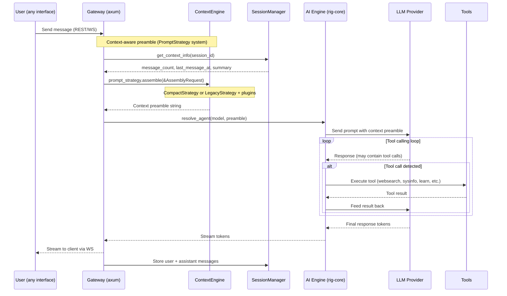
```mermaid
sequenceDiagram
    participant U as User (any interface)
    participant G as Gateway (axum)
    participant CE as ContextEngine
    participant SM as SessionManager
    participant AI as AI Engine (rig-core)
    participant LLM as LLM Provider
    participant T as Tools

    U->>G: Send message (REST/WS)

    Note over G,CE: Context-aware preamble (PromptStrategy system)
    G->>SM: get_context_info(session_id)
    SM-->>G: message_count, last_message_at, summary
    G->>CE: prompt_strategy.assemble(&AssemblyRequest)
    Note over CE: CompactStrategy or LegacyStrategy + plugins
    CE-->>G: Context preamble string

    G->>AI: resolve_agent(model, preamble)
    AI->>LLM: Send prompt with context preamble

    loop Tool calling loop
        LLM-->>AI: Response (may contain tool calls)
        alt Tool call detected
            AI->>T: Execute tool (websearch, sysinfo, learn, etc.)
            T-->>AI: Tool result
            AI->>LLM: Feed result back
        end
    end

    LLM-->>AI: Final response tokens
    AI-->>G: Stream tokens
    G-->>U: Stream to client via WS
    G->>SM: Store user + assistant messages
```

## Startup Sequence

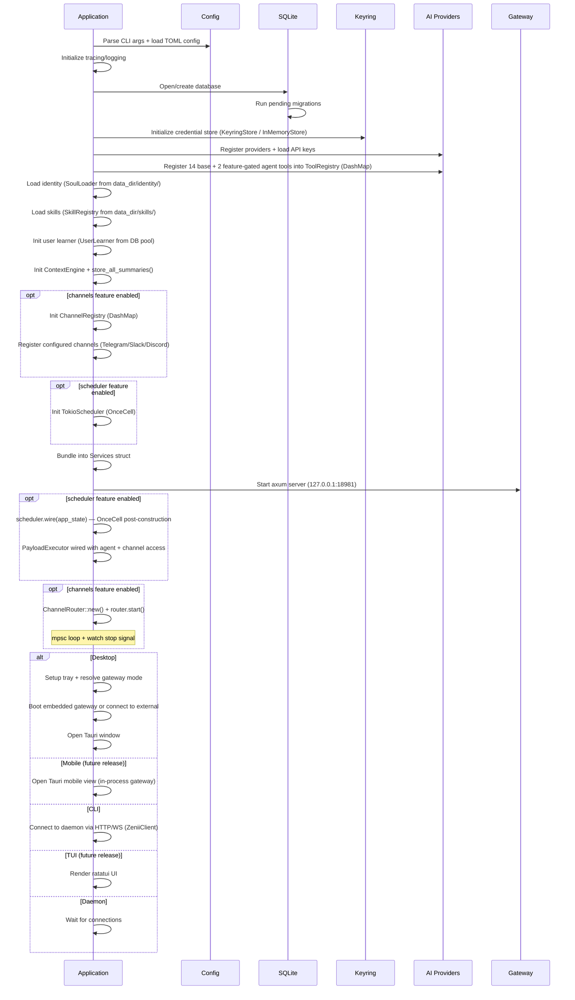
```mermaid
sequenceDiagram
    participant App as Application
    participant Cfg as Config
    participant DB as SQLite
    participant Cred as Keyring
    participant AI as AI Providers
    participant GW as Gateway

    App->>Cfg: Parse CLI args + load TOML config
    App->>App: Initialize tracing/logging
    App->>DB: Open/create database
    DB->>DB: Run pending migrations
    App->>Cred: Initialize credential store (KeyringStore / InMemoryStore)
    App->>AI: Register providers + load API keys
    App->>AI: Register 14 base + 2 feature-gated agent tools into ToolRegistry (DashMap)
    App->>App: Load identity (SoulLoader from data_dir/identity/)
    App->>App: Load skills (SkillRegistry from data_dir/skills/)
    App->>App: Init user learner (UserLearner from DB pool)
    App->>App: Init ContextEngine + store_all_summaries()
    opt channels feature enabled
        App->>App: Init ChannelRegistry (DashMap)
        App->>App: Register configured channels (Telegram/Slack/Discord)
    end
    opt scheduler feature enabled
        App->>App: Init TokioScheduler (OnceCell)
    end
    App->>App: Bundle into Services struct
    App->>GW: Start axum server (127.0.0.1:18981)
    opt scheduler feature enabled
        App->>App: scheduler.wire(app_state) — OnceCell post-construction
        App->>App: PayloadExecutor wired with agent + channel access
    end
    opt channels feature enabled
        App->>App: ChannelRouter::new() + router.start()
        Note over App: mpsc loop + watch stop signal
    end

    alt Desktop
        App->>App: Setup tray + resolve gateway mode
        App->>App: Boot embedded gateway or connect to external
        App->>App: Open Tauri window
    else Mobile (future release)
        App->>App: Open Tauri mobile view (in-process gateway)
    else CLI
        App->>App: Connect to daemon via HTTP/WS (ZeniiClient)
    else TUI (future release)
        App->>App: Render ratatui UI
    else Daemon
        App->>App: Wait for connections
    end
```

## Default Paths by OS

Resolved via `directories::ProjectDirs::from("com", "sprklai", "zenii")`:

| OS | Config Path | Data Dir / DB Path |
|---|---|---|
| **Linux** | `~/.config/zenii/config.toml` | `~/.local/share/zenii/zenii.db` |
| **macOS** | `~/Library/Application Support/com.sprklai.zenii/config.toml` | `~/Library/Application Support/com.sprklai.zenii/zenii.db` |
| **Windows** | `%APPDATA%\sprklai\zenii\config\config.toml` | `%APPDATA%\sprklai\zenii\data\zenii.db` |

Override via `config.toml`:
```toml
data_dir = "/custom/data/path"        # overrides default data directory
db_path = "/custom/path/zenii.db"  # overrides database file directly
```

## Error Handling Flow

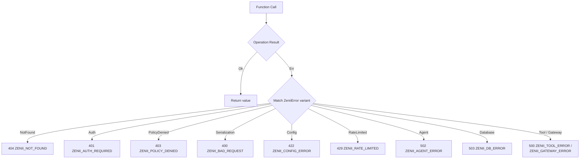
```mermaid
flowchart TD
    Call[Function Call] --> Result{Operation Result}
    Result -->|Ok| ReturnValue[Return value]
    Result -->|Err| Match{Match ZeniiError variant}
    Match -->|NotFound| NF["404 ZENII_NOT_FOUND"]
    Match -->|Auth| Auth["401 ZENII_AUTH_REQUIRED"]
    Match -->|PolicyDenied| PD["403 ZENII_POLICY_DENIED"]
    Match -->|Serialization| Ser["400 ZENII_BAD_REQUEST"]
    Match -->|Config| Cfg["422 ZENII_CONFIG_ERROR"]
    Match -->|RateLimited| RL["429 ZENII_RATE_LIMITED"]
    Match -->|Agent| AI["502 ZENII_AGENT_ERROR"]
    Match -->|Database| DB["503 ZENII_DB_ERROR"]
    Match -->|Tool / Gateway| TG["500 ZENII_TOOL_ERROR /<br>ZENII_GATEWAY_ERROR"]
```

## Database Operation Flow (async-safe)


```mermaid
flowchart TD
    Async[Async Context] --> Spawn["tokio::task::spawn_blocking#40;move || { ... }#41;"]
    Spawn --> SQLite["rusqlite operation<br>#40;runs on blocking thread pool,<br>NOT on async executor#41;"]
    SQLite --> Result["Result of T or ZeniiError"]
    Result --> Await[".await -- resumes async context"]
    Await --> Handle[Handle Result]
```

## WebSocket Message Flow

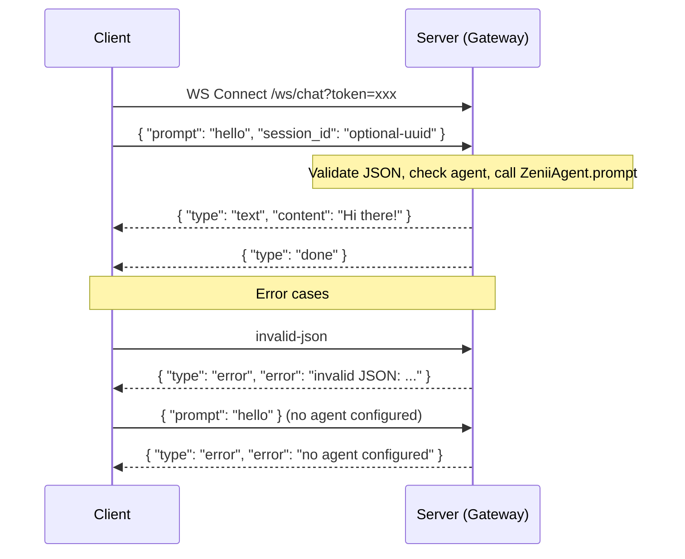
```mermaid
sequenceDiagram
    participant C as Client
    participant S as Server (Gateway)

    C->>S: WS Connect /ws/chat?token=xxx
    C->>S: { "prompt": "hello", "session_id": "optional-uuid" }
    Note over S: Validate JSON, check agent, call ZeniiAgent.prompt
    S-->>C: { "type": "text", "content": "Hi there!" }
    S-->>C: { "type": "done" }
    Note over C,S: Error cases
    C->>S: invalid-json
    S-->>C: { "type": "error", "error": "invalid JSON: ..." }
    C->>S: { "prompt": "hello" } (no agent configured)
    S-->>C: { "type": "error", "error": "no agent configured" }
```

## Identity Loading Flow

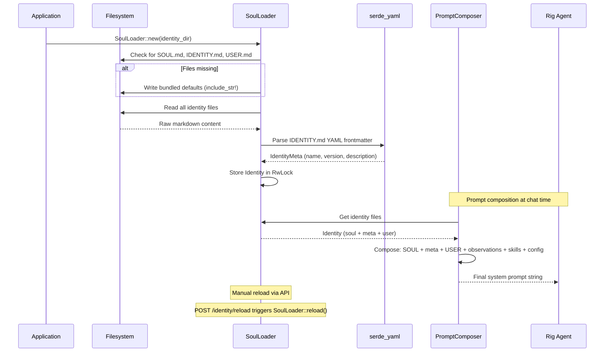
```mermaid
sequenceDiagram
    participant App as Application
    participant FS as Filesystem
    participant SL as SoulLoader
    participant SY as serde_yaml
    participant PC as PromptComposer
    participant AG as Rig Agent

    App->>SL: SoulLoader::new(identity_dir)
    SL->>FS: Check for SOUL.md, IDENTITY.md, USER.md
    alt Files missing
        SL->>FS: Write bundled defaults (include_str!)
    end
    SL->>FS: Read all identity files
    FS-->>SL: Raw markdown content
    SL->>SY: Parse IDENTITY.md YAML frontmatter
    SY-->>SL: IdentityMeta (name, version, description)
    SL->>SL: Store Identity in RwLock

    Note over PC,AG: Prompt composition at chat time
    PC->>SL: Get identity files
    SL-->>PC: Identity (soul + meta + user)
    PC->>PC: Compose: SOUL + meta + USER + observations + skills + config
    PC-->>AG: Final system prompt string

    Note over SL: Manual reload via API
    Note over SL: POST /identity/reload triggers SoulLoader::reload()
```

## Skill Loading Flow

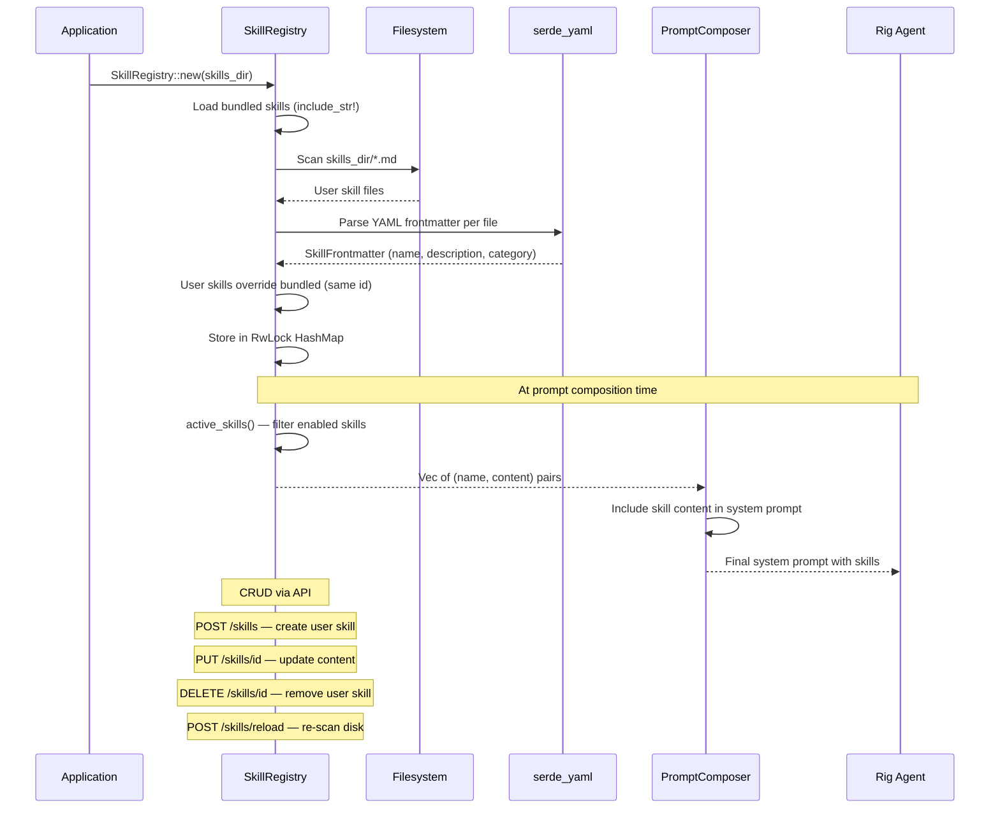
```mermaid
sequenceDiagram
    participant App as Application
    participant SR as SkillRegistry
    participant FS as Filesystem
    participant SY as serde_yaml
    participant PC as PromptComposer
    participant AG as Rig Agent

    App->>SR: SkillRegistry::new(skills_dir)
    SR->>SR: Load bundled skills (include_str!)
    SR->>FS: Scan skills_dir/*.md
    FS-->>SR: User skill files
    SR->>SY: Parse YAML frontmatter per file
    SY-->>SR: SkillFrontmatter (name, description, category)
    SR->>SR: User skills override bundled (same id)
    SR->>SR: Store in RwLock HashMap

    Note over SR,AG: At prompt composition time
    SR->>SR: active_skills() — filter enabled skills
    SR-->>PC: Vec of (name, content) pairs
    PC->>PC: Include skill content in system prompt
    PC-->>AG: Final system prompt with skills

    Note over SR: CRUD via API
    Note over SR: POST /skills — create user skill
    Note over SR: PUT /skills/id — update content
    Note over SR: DELETE /skills/id — remove user skill
    Note over SR: POST /skills/reload — re-scan disk
```

## User Learning Flow

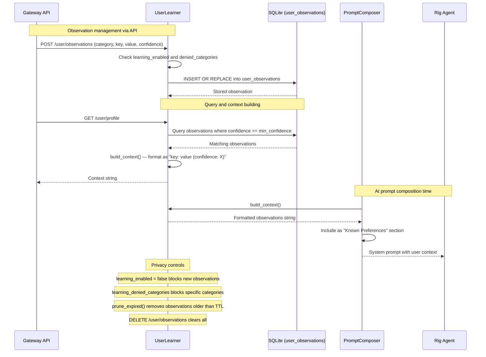
```mermaid
sequenceDiagram
    participant API as Gateway API
    participant UL as UserLearner
    participant DB as SQLite (user_observations)
    participant PC as PromptComposer
    participant AG as Rig Agent

    Note over API,UL: Observation management via API
    API->>UL: POST /user/observations (category, key, value, confidence)
    UL->>UL: Check learning_enabled and denied_categories
    UL->>DB: INSERT OR REPLACE into user_observations
    DB-->>UL: Stored observation

    Note over UL,DB: Query and context building
    API->>UL: GET /user/profile
    UL->>DB: Query observations where confidence >= min_confidence
    DB-->>UL: Matching observations
    UL->>UL: build_context() — format as "key: value (confidence: X)"
    UL-->>API: Context string

    Note over PC,AG: At prompt composition time
    PC->>UL: build_context()
    UL-->>PC: Formatted observations string
    PC->>PC: Include as "Known Preferences" section
    PC-->>AG: System prompt with user context

    Note over UL: Privacy controls
    Note over UL: learning_enabled = false blocks new observations
    Note over UL: learning_denied_categories blocks specific categories
    Note over UL: prune_expired() removes observations older than TTL
    Note over UL: DELETE /user/observations clears all
```

## Channel Message Flow

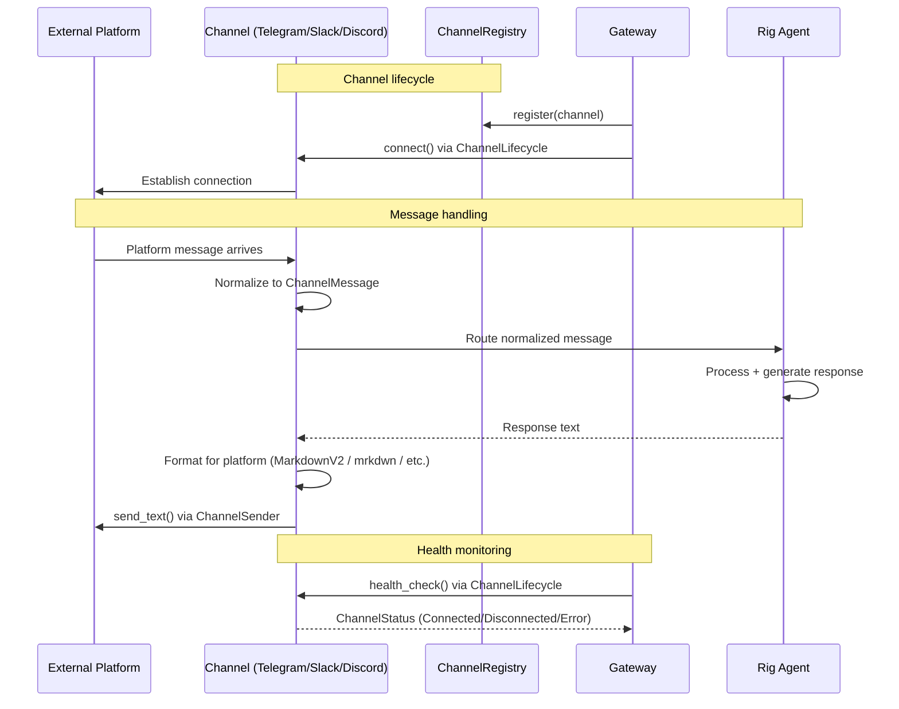
```mermaid
sequenceDiagram
    participant Ext as External Platform
    participant Ch as Channel (Telegram/Slack/Discord)
    participant CR as ChannelRegistry
    participant GW as Gateway
    participant AG as Rig Agent

    Note over Ch,CR: Channel lifecycle
    GW->>CR: register(channel)
    GW->>Ch: connect() via ChannelLifecycle
    Ch->>Ext: Establish connection

    Note over Ext,AG: Message handling
    Ext->>Ch: Platform message arrives
    Ch->>Ch: Normalize to ChannelMessage
    Ch->>AG: Route normalized message
    AG->>AG: Process + generate response
    AG-->>Ch: Response text
    Ch->>Ch: Format for platform (MarkdownV2 / mrkdwn / etc.)
    Ch->>Ext: send_text() via ChannelSender

    Note over GW,Ch: Health monitoring
    GW->>Ch: health_check() via ChannelLifecycle
    Ch-->>GW: ChannelStatus (Connected/Disconnected/Error)
```

## Channel Registration Flow

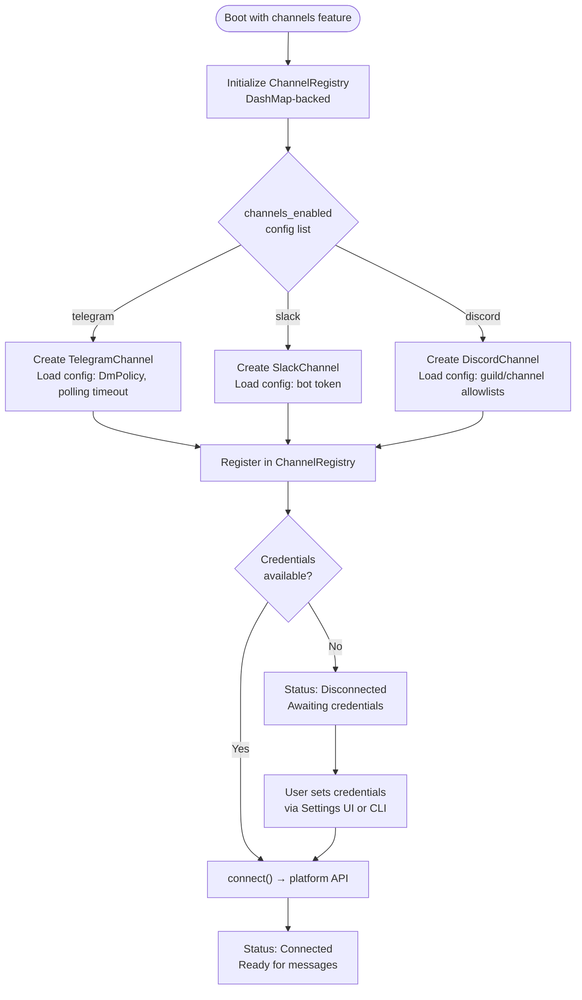
```mermaid
flowchart TD
    Boot([Boot with channels feature]) --> Init["Initialize ChannelRegistry<br>DashMap-backed"]
    Init --> Check{"channels_enabled<br>config list"}

    Check -->|telegram| TG["Create TelegramChannel<br>Load config: DmPolicy, polling timeout"]
    Check -->|slack| SL["Create SlackChannel<br>Load config: bot token"]
    Check -->|discord| DC["Create DiscordChannel<br>Load config: guild/channel allowlists"]

    TG --> Reg["Register in ChannelRegistry"]
    SL --> Reg
    DC --> Reg

    Reg --> Creds{"Credentials<br>available?"}
    Creds -->|Yes| Connect["connect() → platform API"]
    Creds -->|No| Wait["Status: Disconnected<br>Awaiting credentials"]

    Connect --> Ready["Status: Connected<br>Ready for messages"]
    Wait --> UI["User sets credentials<br>via Settings UI or CLI"]
    UI --> Connect
```

## Desktop Boot Flow

The desktop app uses a hybrid gateway model. By default it starts an embedded gateway; if `ZENII_GATEWAY_URL` is set, it connects to an external daemon instead.

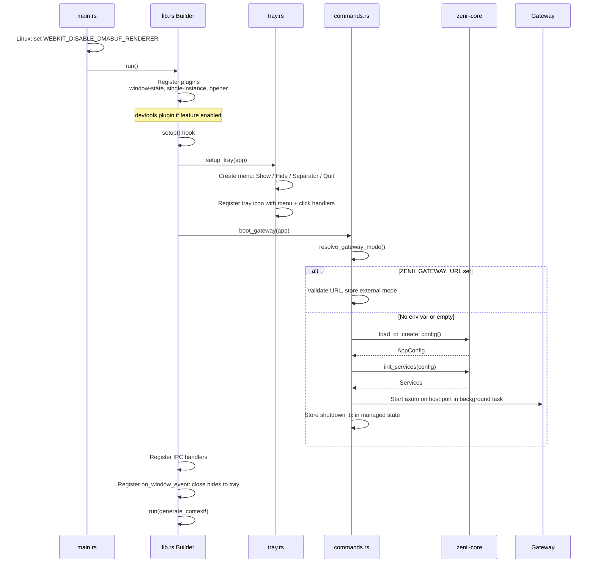
```mermaid
sequenceDiagram
    participant Main as main.rs
    participant Lib as lib.rs Builder
    participant Tray as tray.rs
    participant Cmd as commands.rs
    participant Core as zenii-core
    participant GW as Gateway

    Main->>Main: Linux: set WEBKIT_DISABLE_DMABUF_RENDERER
    Main->>Lib: run#40;#41;

    Lib->>Lib: Register plugins<br>window-state, single-instance, opener
    Note over Lib: devtools plugin if feature enabled

    Lib->>Lib: setup#40;#41; hook
    Lib->>Tray: setup_tray#40;app#41;
    Tray->>Tray: Create menu: Show / Hide / Separator / Quit
    Tray->>Tray: Register tray icon with menu + click handlers

    Lib->>Cmd: boot_gateway#40;app#41;
    Cmd->>Cmd: resolve_gateway_mode#40;#41;

    alt ZENII_GATEWAY_URL set
        Cmd->>Cmd: Validate URL, store external mode
    else No env var or empty
        Cmd->>Core: load_or_create_config#40;#41;
        Core-->>Cmd: AppConfig
        Cmd->>Core: init_services#40;config#41;
        Core-->>Cmd: Services
        Cmd->>GW: Start axum on host:port in background task
        Cmd->>Cmd: Store shutdown_tx in managed state
    end

    Lib->>Lib: Register IPC handlers
    Lib->>Lib: Register on_window_event: close hides to tray
    Lib->>Lib: run#40;generate_context!#41;
```

## Credential Flow

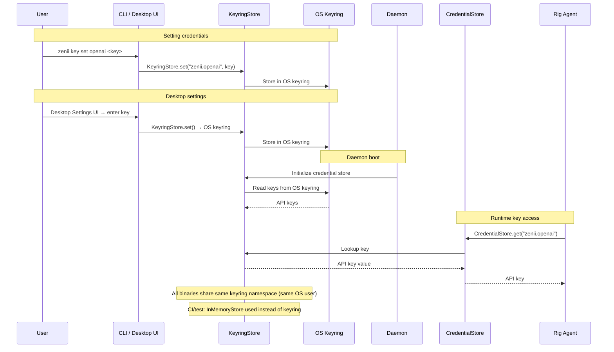
```mermaid
sequenceDiagram
    participant User as User
    participant CLI as CLI / Desktop UI
    participant KS as KeyringStore
    participant KR as OS Keyring
    participant Daemon as Daemon
    participant CS as CredentialStore
    participant AG as Rig Agent

    Note over User,KR: Setting credentials
    User->>CLI: zenii key set openai <key>
    CLI->>KS: KeyringStore.set("zenii.openai", key)
    KS->>KR: Store in OS keyring

    Note over User,KR: Desktop settings
    User->>CLI: Desktop Settings UI → enter key
    CLI->>KS: KeyringStore.set() → OS keyring
    KS->>KR: Store in OS keyring

    Note over Daemon,KR: Daemon boot
    Daemon->>KS: Initialize credential store
    KS->>KR: Read keys from OS keyring
    KR-->>KS: API keys

    Note over AG,CS: Runtime key access
    AG->>CS: CredentialStore.get("zenii.openai")
    CS->>KS: Lookup key
    KS-->>CS: API key value
    CS-->>AG: API key

    Note over KS: All binaries share same keyring namespace (same OS user)
    Note over KS: CI/test: InMemoryStore used instead of keyring
```

## Provider Management Flow

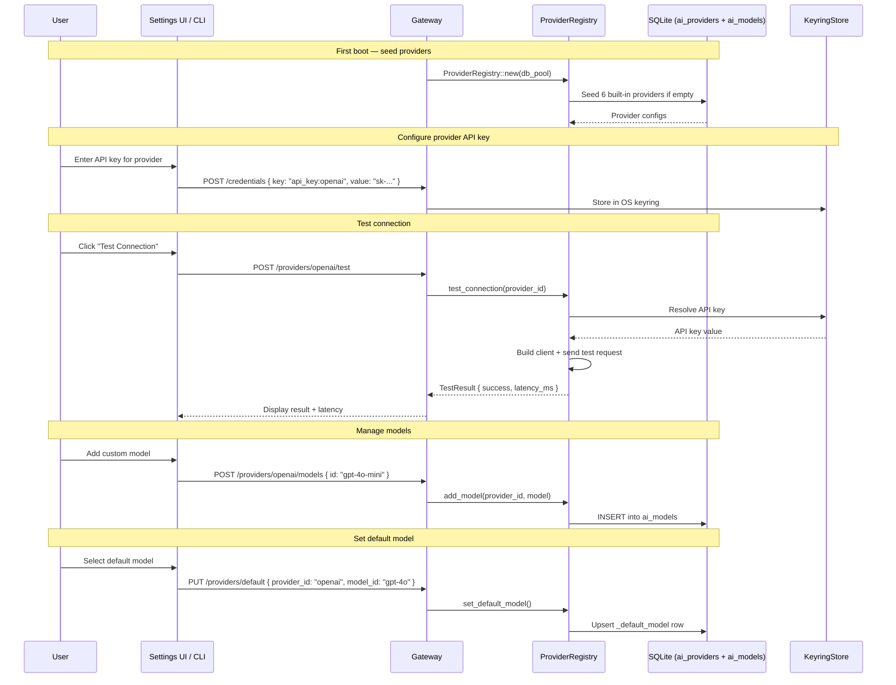
```mermaid
sequenceDiagram
    participant User as User
    participant UI as Settings UI / CLI
    participant GW as Gateway
    participant PR as ProviderRegistry
    participant DB as SQLite (ai_providers + ai_models)
    participant KS as KeyringStore

    Note over User,DB: First boot — seed providers
    GW->>PR: ProviderRegistry::new(db_pool)
    PR->>DB: Seed 6 built-in providers if empty
    DB-->>PR: Provider configs

    Note over User,KS: Configure provider API key
    User->>UI: Enter API key for provider
    UI->>GW: POST /credentials { key: "api_key:openai", value: "sk-..." }
    GW->>KS: Store in OS keyring

    Note over User,DB: Test connection
    User->>UI: Click "Test Connection"
    UI->>GW: POST /providers/openai/test
    GW->>PR: test_connection(provider_id)
    PR->>KS: Resolve API key
    KS-->>PR: API key value
    PR->>PR: Build client + send test request
    PR-->>GW: TestResult { success, latency_ms }
    GW-->>UI: Display result + latency

    Note over User,DB: Manage models
    User->>UI: Add custom model
    UI->>GW: POST /providers/openai/models { id: "gpt-4o-mini" }
    GW->>PR: add_model(provider_id, model)
    PR->>DB: INSERT into ai_models

    Note over User,DB: Set default model
    User->>UI: Select default model
    UI->>GW: PUT /providers/default { provider_id: "openai", model_id: "gpt-4o" }
    GW->>PR: set_default_model()
    PR->>DB: Upsert _default_model row
```

## Context Injection Flow

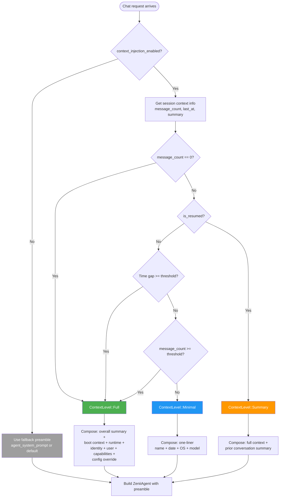
```mermaid
flowchart TD
    Req([Chat request arrives]) --> Enabled{"context_injection_enabled?"}
    Enabled -->|No| Fallback["Use fallback preamble<br>agent_system_prompt or default"]
    Enabled -->|Yes| GetInfo["Get session context info<br>message_count, last_at, summary"]

    GetInfo --> NewSession{"message_count == 0?"}
    NewSession -->|Yes| Full["ContextLevel::Full"]
    NewSession -->|No| Resumed{"is_resumed?"}
    Resumed -->|Yes| SummaryLevel["ContextLevel::Summary"]
    Resumed -->|No| GapCheck{"Time gap >= threshold?"}
    GapCheck -->|Yes| Full
    GapCheck -->|No| CountCheck{"message_count >= threshold?"}
    CountCheck -->|Yes| Full
    CountCheck -->|No| Minimal["ContextLevel::Minimal"]

    Full --> ComposeFull["Compose: overall summary +<br>boot context + runtime +<br>identity + user + capabilities +<br>config override"]
    Minimal --> ComposeMin["Compose: one-liner<br>name + date + OS + model"]
    SummaryLevel --> ComposeSum["Compose: full context +<br>prior conversation summary"]
    Fallback --> Agent["Build ZeniiAgent with preamble"]
    ComposeFull --> Agent
    ComposeMin --> Agent
    ComposeSum --> Agent

    style Full fill:#4CAF50,color:#fff
    style Minimal fill:#2196F3,color:#fff
    style SummaryLevel fill:#FF9800,color:#fff
    style Fallback fill:#9E9E9E,color:#fff
```

## Skill Proposal Flow

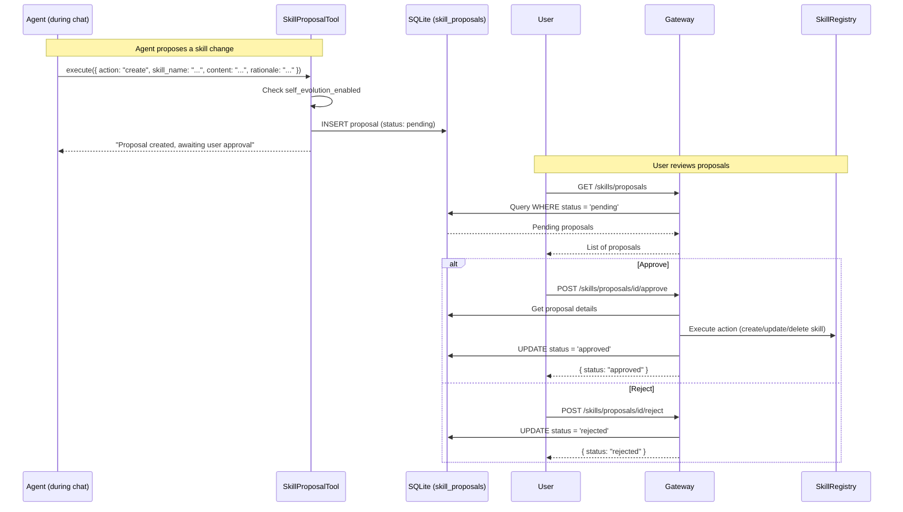
```mermaid
sequenceDiagram
    participant AG as Agent (during chat)
    participant SPT as SkillProposalTool
    participant DB as SQLite (skill_proposals)
    participant User as User
    participant GW as Gateway
    participant SR as SkillRegistry

    Note over AG,SPT: Agent proposes a skill change
    AG->>SPT: execute({ action: "create", skill_name: "...", content: "...", rationale: "..." })
    SPT->>SPT: Check self_evolution_enabled
    SPT->>DB: INSERT proposal (status: pending)
    SPT-->>AG: "Proposal created, awaiting user approval"

    Note over User,SR: User reviews proposals
    User->>GW: GET /skills/proposals
    GW->>DB: Query WHERE status = 'pending'
    DB-->>GW: Pending proposals
    GW-->>User: List of proposals

    alt Approve
        User->>GW: POST /skills/proposals/id/approve
        GW->>DB: Get proposal details
        GW->>SR: Execute action (create/update/delete skill)
        GW->>DB: UPDATE status = 'approved'
        GW-->>User: { status: "approved" }
    else Reject
        User->>GW: POST /skills/proposals/id/reject
        GW->>DB: UPDATE status = 'rejected'
        GW-->>User: { status: "rejected" }
    end
```

## Scheduler Notification Flow

The scheduler tick loop executes payloads via `PayloadExecutor` (`scheduler/payload_executor.rs`) and delivers notifications through multiple channels. The `TokioScheduler` ↔ `AppState` circular dependency is resolved via `OnceCell` post-construction wiring.

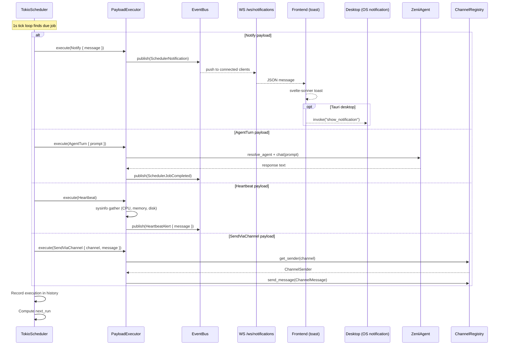
```mermaid
sequenceDiagram
    participant Sched as TokioScheduler
    participant PE as PayloadExecutor
    participant EB as EventBus
    participant WS as WS /ws/notifications
    participant Web as Frontend (toast)
    participant Desk as Desktop (OS notification)
    participant Agent as ZeniiAgent
    participant Chan as ChannelRegistry

    Note over Sched: 1s tick loop finds due job

    alt Notify payload
        Sched->>PE: execute(Notify { message })
        PE->>EB: publish(SchedulerNotification)
        EB-->>WS: push to connected clients
        WS-->>Web: JSON message
        Web-->>Web: svelte-sonner toast
        opt Tauri desktop
            Web-->>Desk: invoke("show_notification")
        end
    else AgentTurn payload
        Sched->>PE: execute(AgentTurn { prompt })
        PE->>Agent: resolve_agent + chat(prompt)
        Agent-->>PE: response text
        PE->>EB: publish(SchedulerJobCompleted)
    else Heartbeat payload
        Sched->>PE: execute(Heartbeat)
        PE->>PE: sysinfo gather (CPU, memory, disk)
        PE->>EB: publish(HeartbeatAlert { message })
    else SendViaChannel payload
        Sched->>PE: execute(SendViaChannel { channel, message })
        PE->>Chan: get_sender(channel)
        Chan-->>PE: ChannelSender
        PE->>Chan: send_message(ChannelMessage)
    end

    Sched->>Sched: Record execution in history
    Sched->>Sched: Compute next_run
```

## Embedding Flow

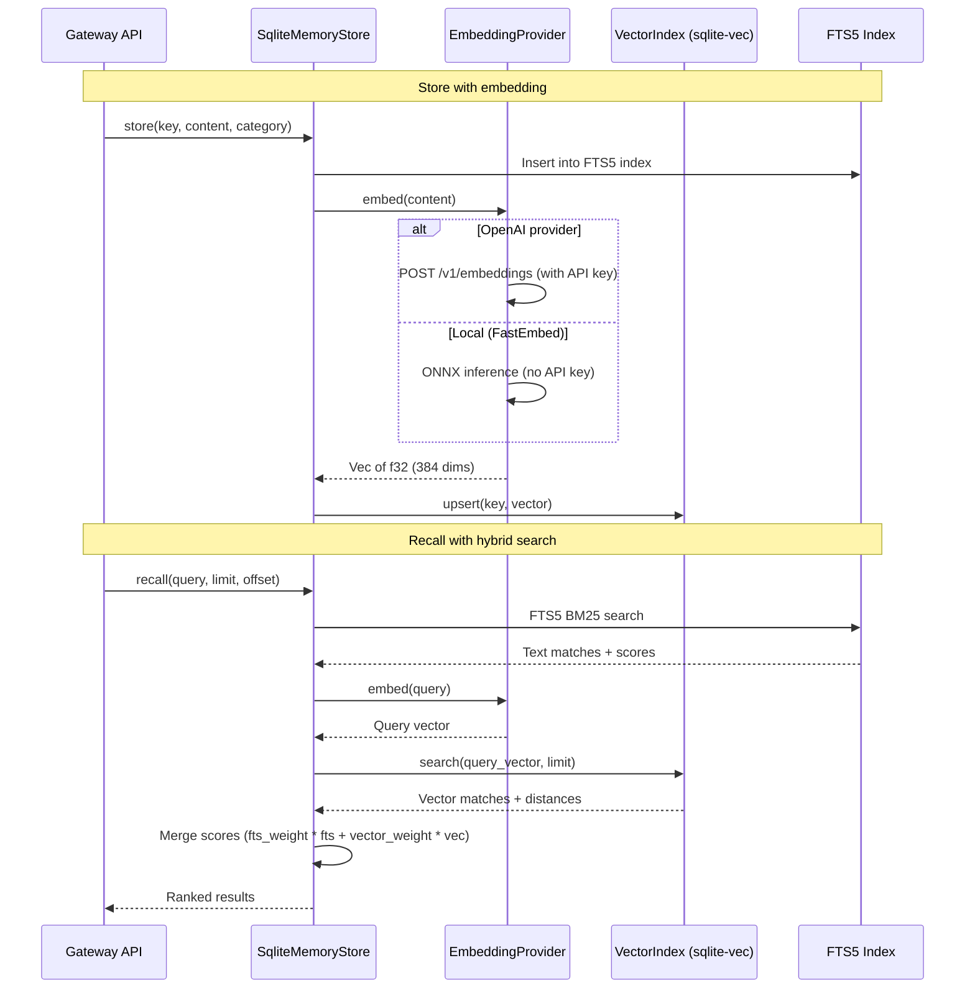
```mermaid
sequenceDiagram
    participant API as Gateway API
    participant MS as SqliteMemoryStore
    participant EP as EmbeddingProvider
    participant VI as VectorIndex (sqlite-vec)
    participant FTS as FTS5 Index

    Note over API,FTS: Store with embedding
    API->>MS: store(key, content, category)
    MS->>FTS: Insert into FTS5 index
    MS->>EP: embed(content)
    alt OpenAI provider
        EP->>EP: POST /v1/embeddings (with API key)
    else Local (FastEmbed)
        EP->>EP: ONNX inference (no API key)
    end
    EP-->>MS: Vec of f32 (384 dims)
    MS->>VI: upsert(key, vector)

    Note over API,FTS: Recall with hybrid search
    API->>MS: recall(query, limit, offset)
    MS->>FTS: FTS5 BM25 search
    FTS-->>MS: Text matches + scores
    MS->>EP: embed(query)
    EP-->>MS: Query vector
    MS->>VI: search(query_vector, limit)
    VI-->>MS: Vector matches + distances
    MS->>MS: Merge scores (fts_weight * fts + vector_weight * vec)
    MS-->>API: Ranked results
```

## Reasoning Continuation Flow

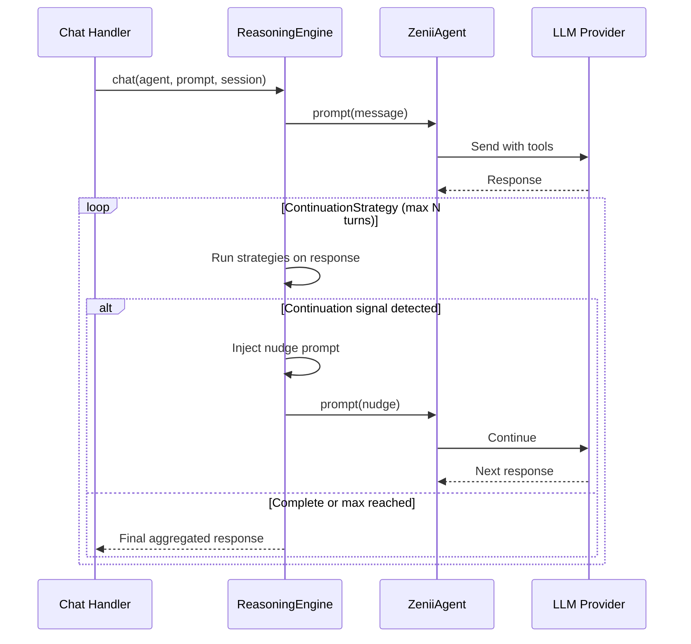
```mermaid
sequenceDiagram
    participant Caller as Chat Handler
    participant RE as ReasoningEngine
    participant Agent as ZeniiAgent
    participant LLM as LLM Provider

    Caller->>RE: chat(agent, prompt, session)
    RE->>Agent: prompt(message)
    Agent->>LLM: Send with tools
    LLM-->>Agent: Response

    loop ContinuationStrategy (max N turns)
        RE->>RE: Run strategies on response
        alt Continuation signal detected
            RE->>RE: Inject nudge prompt
            RE->>Agent: prompt(nudge)
            Agent->>LLM: Continue
            LLM-->>Agent: Next response
        else Complete or max reached
            RE-->>Caller: Final aggregated response
        end
    end
```

## Channel Router Message Pipeline

The `ChannelRouter` orchestrates the full message processing flow from inbound channel message to outbound response. It runs as a background task spawned during `init_services()`, consuming messages from an `mpsc` channel and using a `watch` signal for graceful shutdown. Lifecycle hooks (Stage 8.8) are best-effort — failures are logged but do not block the pipeline.

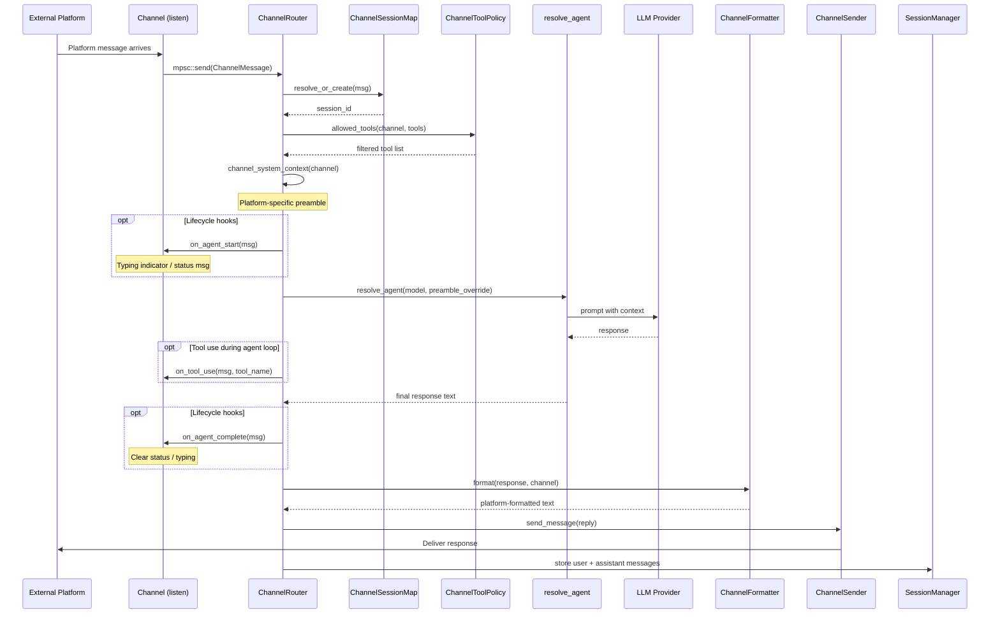
```mermaid
sequenceDiagram
    participant Ext as External Platform
    participant Ch as Channel (listen)
    participant CR as ChannelRouter
    participant SM as ChannelSessionMap
    participant TP as ChannelToolPolicy
    participant AI as resolve_agent
    participant LLM as LLM Provider
    participant Fmt as ChannelFormatter
    participant Send as ChannelSender
    participant DB as SessionManager

    Ext->>Ch: Platform message arrives
    Ch->>CR: mpsc::send(ChannelMessage)

    CR->>SM: resolve_or_create(msg)
    SM-->>CR: session_id

    CR->>TP: allowed_tools(channel, tools)
    TP-->>CR: filtered tool list

    CR->>CR: channel_system_context(channel)
    Note over CR: Platform-specific preamble

    opt Lifecycle hooks
        CR->>Ch: on_agent_start(msg)
        Note over Ch: Typing indicator / status msg
    end

    CR->>AI: resolve_agent(model, preamble_override)
    AI->>LLM: prompt with context
    LLM-->>AI: response

    opt Tool use during agent loop
        CR->>Ch: on_tool_use(msg, tool_name)
    end

    AI-->>CR: final response text

    opt Lifecycle hooks
        CR->>Ch: on_agent_complete(msg)
        Note over Ch: Clear status / typing
    end

    CR->>Fmt: format(response, channel)
    Fmt-->>CR: platform-formatted text

    CR->>Send: send_message(reply)
    Send->>Ext: Deliver response

    CR->>DB: store user + assistant messages
```

## Plugin Lifecycle Flow

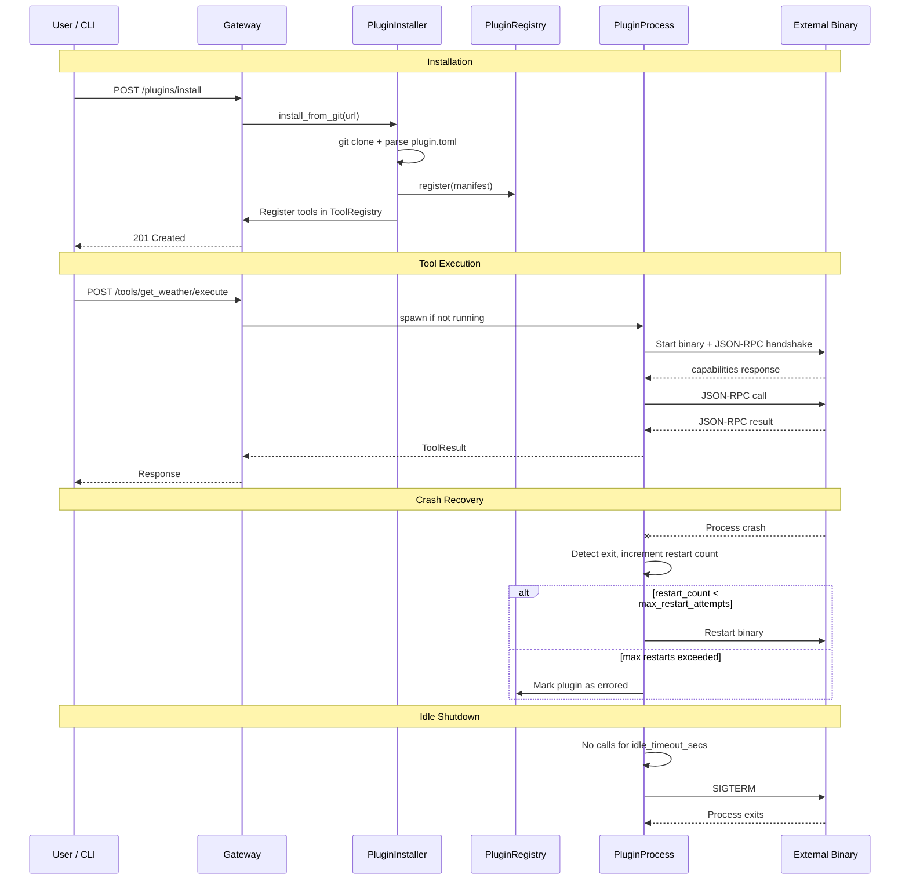
```mermaid
sequenceDiagram
    participant User as User / CLI
    participant GW as Gateway
    participant Inst as PluginInstaller
    participant Reg as PluginRegistry
    participant Proc as PluginProcess
    participant Ext as External Binary

    Note over User,Ext: Installation
    User->>GW: POST /plugins/install
    GW->>Inst: install_from_git(url)
    Inst->>Inst: git clone + parse plugin.toml
    Inst->>Reg: register(manifest)
    Inst->>GW: Register tools in ToolRegistry
    GW-->>User: 201 Created

    Note over User,Ext: Tool Execution
    User->>GW: POST /tools/get_weather/execute
    GW->>Proc: spawn if not running
    Proc->>Ext: Start binary + JSON-RPC handshake
    Ext-->>Proc: capabilities response
    Proc->>Ext: JSON-RPC call
    Ext-->>Proc: JSON-RPC result
    Proc-->>GW: ToolResult
    GW-->>User: Response

    Note over User,Ext: Crash Recovery
    Ext--xProc: Process crash
    Proc->>Proc: Detect exit, increment restart count
    alt restart_count < max_restart_attempts
        Proc->>Ext: Restart binary
    else max restarts exceeded
        Proc->>Reg: Mark plugin as errored
    end

    Note over User,Ext: Idle Shutdown
    Proc->>Proc: No calls for idle_timeout_secs
    Proc->>Ext: SIGTERM
    Ext-->>Proc: Process exits
```

## Onboarding / First-Run Setup Flow

On first launch, the frontend checks if user location and timezone are configured. If not, a setup dialog collects these values for context-aware agent behavior.

```mermaid
sequenceDiagram
    participant FE as Frontend (AuthGate)
    participant SD as SetupDialog
    participant GW as Gateway
    participant Cfg as Config (ArcSwap)

    FE->>GW: GET /setup/status
    GW->>Cfg: Check user_location + user_timezone
    Cfg-->>GW: SetupStatus
    GW-->>FE: { needs_setup: bool, missing: [...] }

    alt needs_setup = true
        FE->>SD: Show SetupDialog
        SD->>SD: Auto-detect timezone via Intl.DateTimeFormat
        Note over SD: Browser IANA timezone (e.g., "America/Toronto")
        SD->>SD: User enters location manually
        SD->>GW: PUT /config { user_location, user_timezone }
        GW->>Cfg: Update ArcSwap config + persist TOML
        GW-->>SD: 200 OK
        SD->>FE: Dismiss dialog, proceed to chat
    else needs_setup = false
        FE->>FE: Proceed directly to chat
    end
```

**Config fields**: `user_timezone: Option<String>` (IANA format), `user_location: Option<String>` (human-readable)

**Key files**: `gateway/handlers/config.rs` (`setup_status`), `web/src/lib/components/SetupDialog.svelte`, `web/src/lib/components/AuthGate.svelte`

## Auto-Discovery Flow

The context engine uses keyword matching to detect which feature domains are relevant to the user's message, then loads only pertinent agent rules and expanded context sections.

```mermaid
flowchart TD
    Msg([User message arrives]) --> Parse["detect_relevant_domains#40;message#41;"]

    Parse --> KW{"Match keywords<br>case-insensitive"}
    KW -->|telegram, slack, discord,<br>channel, notify, dm| Ch["Channels domain"]
    KW -->|schedule, remind, cron,<br>timer, recurring| Sc["Scheduler domain"]
    KW -->|skill, template,<br>prompt, persona| Sk["Skills domain"]

    Ch --> Map["domains_to_rule_categories#40;#41;"]
    Sc --> Map
    Sk --> Map
    KW -->|no match| Map

    Map --> Cats["Categories: general + matched"]
    Cats --> Load["SELECT content FROM agent_rules<br>WHERE active=1 AND category IN #40;...#41;"]
    Load --> Inject["Inject rules under<br>'Your Learned Rules' section"]
    Inject --> Preamble["Final system prompt"]

    style Ch fill:#2196F3,color:#fff
    style Sc fill:#FF9800,color:#fff
    style Sk fill:#4CAF50,color:#fff
```

**Domain-to-category mapping**:
- Channels → `"channel"` rules
- Scheduler → `"scheduling"` rules
- Skills/Tools → `"tool_usage"` rules
- Always included → `"general"` rules

**Key file**: `ai/context.rs` (`ContextDomain`, `detect_relevant_domains()`, `domains_to_rule_categories()`)

## Agent Self-Learning Flow

The agent can record behavioral rules during conversations via the `agent_notes` tool. These rules persist in the database and are automatically injected into future conversations based on domain relevance.

```mermaid
sequenceDiagram
    participant User as User
    participant Agent as Agent (during chat)
    participant AST as AgentSelfTool
    participant DB as SQLite (agent_rules)
    participant CE as ContextEngine

    Note over Agent,AST: Learning a new rule
    Agent->>AST: execute({ action: "learn", content: "...", category: "channel" })
    AST->>AST: Check self_evolution_enabled
    AST->>DB: INSERT INTO agent_rules (content, category, active=1)
    DB-->>AST: rule_id
    AST-->>Agent: "Learned rule #42"

    Note over Agent,AST: Querying existing rules
    Agent->>AST: execute({ action: "rules", category: "channel" })
    AST->>DB: SELECT * FROM agent_rules WHERE active=1 AND category='channel'
    DB-->>AST: [rule1, rule2, ...]
    AST-->>Agent: Formatted rule list

    Note over Agent,AST: Forgetting a rule
    Agent->>AST: execute({ action: "forget", id: 42 })
    AST->>DB: UPDATE agent_rules SET active=0 WHERE id=42
    AST-->>Agent: "Forgot rule #42"

    Note over CE,DB: Context injection in future chats
    CE->>CE: detect_relevant_domains(user_message)
    CE->>DB: Load rules by matched categories
    DB-->>CE: Active rules for relevant categories
    CE->>CE: Inject under "Your Learned Rules" in preamble
```

**Categories**: `general`, `channel`, `scheduling`, `user_preference`, `tool_usage`

**Control**: Gated by `self_evolution_enabled` config flag (runtime toggle via `Arc<AtomicBool>`)

**Key files**: `tools/agent_self_tool.rs`, `ai/context.rs` (`load_agent_rules()`)
